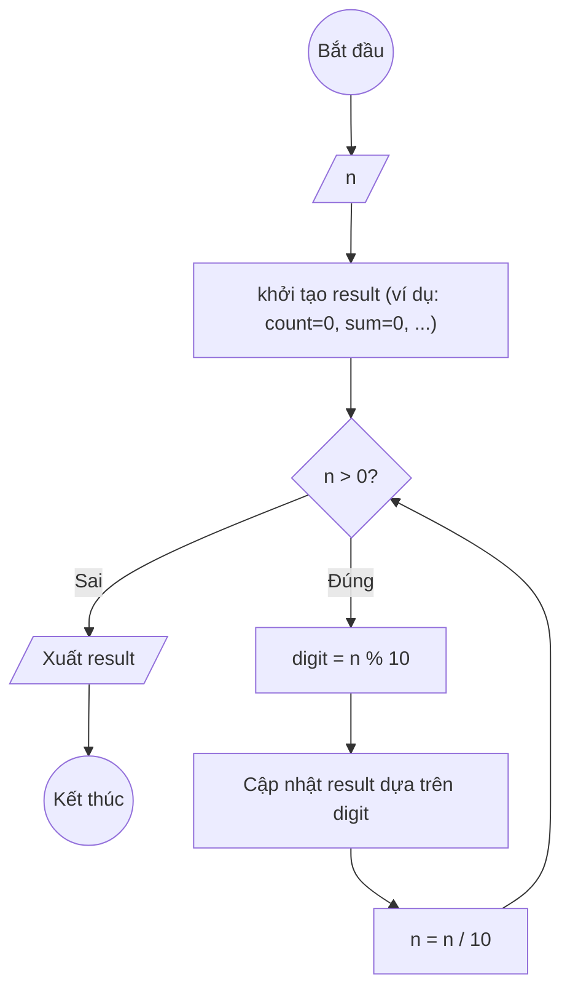
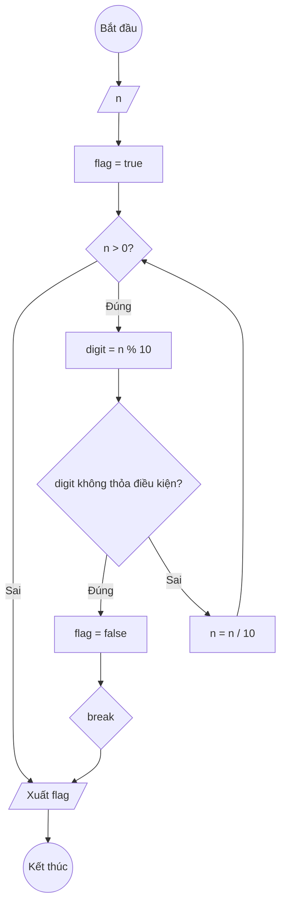
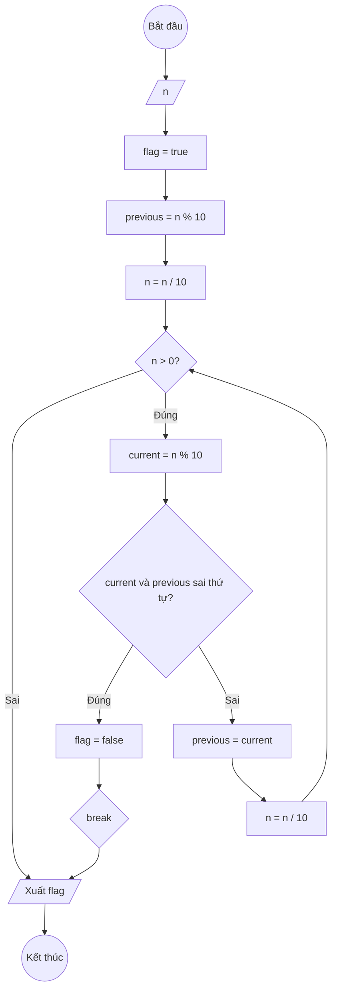
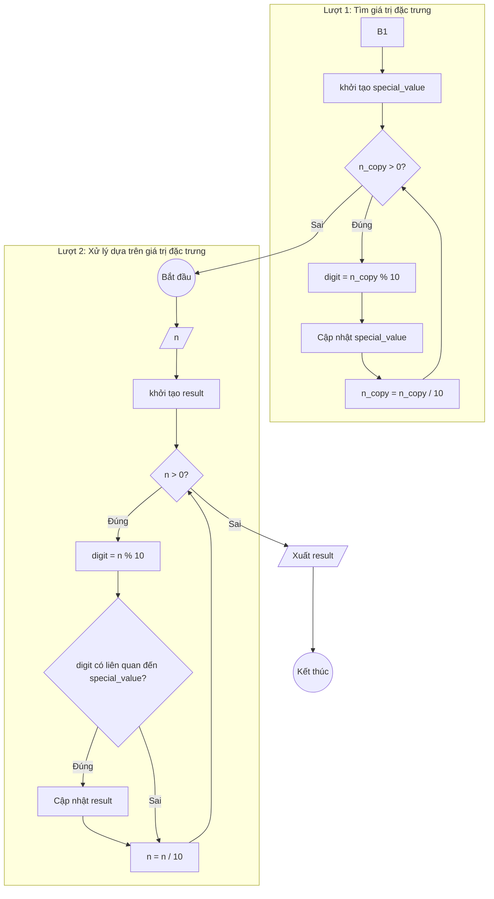

# Tổng hợp các bài tập xử lý chữ số (E43-E61)

Đây là tổng hợp các phương pháp và bài tập liên quan đến việc xử lý các chữ số của một số nguyên dương, bao gồm các bài từ E43 đến E61.

## 1. Mô tả phương pháp thực hiện

Hầu hết các bài toán trong nhóm này đều sử dụng một kỹ thuật chung để duyệt qua từng chữ số của một số nguyên dương `n`. Kỹ thuật này dựa trên hai phép toán cơ bản trong vòng lặp `while`:

1.  **Phép toán chia lấy dư (`% 10`)**: Để lấy ra chữ số cuối cùng (hàng đơn vị) của số `n`.
2.  **Phép toán chia lấy phần nguyên (`/ 10`)**: Để loại bỏ chữ số cuối cùng vừa được xử lý, giảm `n` xuống cho lần lặp tiếp theo.

Vòng lặp sẽ tiếp tục cho đến khi `n` bằng 0, tức là đã duyệt qua tất cả các chữ số.

**Ví dụ cơ bản:**

```python
n = 123
while n > 0:
    digit = n % 10  # Lấy chữ số cuối (3, 2, 1)
    # ... xử lý chữ số ở đây ...
    n = n // 10   # Loại bỏ chữ số cuối (n = 12, 1, 0)
```

Từ kỹ thuật nền tảng này, chúng ta có thể phát triển thành các mẫu lưu đồ (template) cụ thể cho từng dạng bài toán.

## 2. Các mẫu lưu đồ chung

Dưới đây là các mẫu lưu đồ (template) chính được sử dụng để giải quyết các bài toán từ E43 đến E61.

### Mẫu 1: Xử lý và Tích lũy (Đếm, Tổng, Tích)

Mẫu này được sử dụng khi cần duyệt qua tất cả các chữ số để tính toán một giá trị tổng hợp (như đếm, tính tổng, tính tích, tìm max/min).

- **Bài tập áp dụng:** E43, E44, E45, E46, E47, E48, E51, E52.



### Mẫu 2: Kiểm tra Tính chất (Sử dụng cờ)

Mẫu này dùng để kiểm tra xem tất cả các chữ số có thỏa mãn một điều kiện nào đó hay không. Nếu một chữ số không thỏa, ta đặt cờ `flag = false` và thoát khỏi vòng lặp ngay lập tức.

- **Bài tập áp dụng:** E56, E57.



### Mẫu 3: So sánh Tuần tự (Tăng/Giảm dần)

Mẫu này dùng để kiểm tra thứ tự của các chữ số. Ta so sánh chữ số `current` với chữ số `previous` (chữ số đứng ngay bên phải nó).

- **Bài tập áp dụng:** E60, E61.



### Mẫu 4: Xử lý hai lượt

Mẫu này yêu cầu duyệt qua các chữ số hai lần. Lần đầu để tìm một giá trị đặc trưng (ví dụ: chữ số lớn nhất), lần hai để thực hiện một tác vụ khác dựa trên giá trị đó (ví dụ: đếm số lần nó xuất hiện).

- **Bài tập áp dụng:** E53, E54, E55.



## 3. Danh sách bài tập

Dưới đây là danh sách các bài tập và liên kết đến file chi tiết của từng bài.

- [Bài 43: Hãy đếm số lượng chữ số của số nguyên dương n](./DigitManipulation/E43.md)
- [Bài 44: Hãy tính tổng các chữ số của số nguyên dương n](./DigitManipulation/E44.md)
- [Bài 45: Hãy tính tích các chữ số của số nguyên dương n](./DigitManipulation/E45.md)
- [Bài 46: Hãy đếm số lượng chữ số lẻ của số nguyên dương n](./DigitManipulation/E46.md)
- [Bài 47: Hãy tính tổng các chữ số chẵn của số nguyên dương n](./DigitManipulation/E47.md)
- [Bài 48: Hãy tính tích các chữ số lẻ của số nguyên dương n](./DigitManipulation/E48.md)
- [Bài 49: Cho số nguyên dương n. Hãy tìm chữ số đầu tiên của n](./DigitManipulation/E49.md)
- [Bài 50: Hãy tìm chữ số đảo ngược của số nguyên dương n](./DigitManipulation/E50.md)
- [Bài 51: Tìm chữ số lớn nhất của số nguyên dương n](./DigitManipulation/E51.md)
- [Bài 52: Tìm chữ số nhỏ nhất của số nguyên dương n](./DigitManipulation/E52.md)
- [Bài 53: Hãy đếm số lượng chữ số lớn nhất của số nguyên dương n](./DigitManipulation/E53.md)
- [Bài 54: Hãy đếm số lượng chữ số nhỏ nhất của số nguyên dương n](./DigitManipulation/E54.md)
- [Bài 55: Hãy đếm số lượng chữ số đầu tiên của số nguyên dương n](./DigitManipulation/E55.md)
- [Bài 56: Kiểm tra số nguyên dương n có toàn chữ số lẻ hay không?](./DigitManipulation/E56.md)
- [Bài 57: Kiểm tra số nguyên dương n có toàn chữ số chẵn hay không?](./DigitManipulation/E57.md)
- [Bài 59: Kiểm tra số nguyên dương n có phải số đối xứng hay không?](./DigitManipulation/E59.md)
- [Bài 60: Kiểm tra các chữ số của số nguyên dương n có tăng dần từ trái sang phải hay không?](./DigitManipulation/E60.md)
- [Bài 61: Hãy kiểm tra các chữ số của số nguyên dương n có giảm dần từ trái sang phải hay không?](./DigitManipulation/E61.md)
