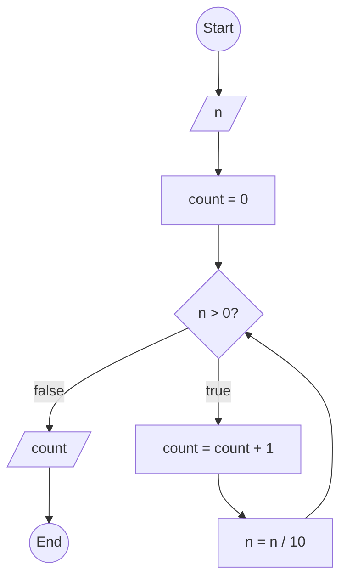

### Bài 43: Hãy đếm số lượng chữ số của số nguyên dương $n$

---

### **1. Lưu đồ**



---

### **2. Test Case**

- **Đầu vào (Input):** `n = 12345`

- **Kết quả mong đợi (Expected Result):** `5`


**Mô phỏng (Simulation):**

```python
n = 12345
count = 0
n = 12345 > 0 true: 
	count =  count + 1 = 0 + 1 = 1
	n = n / 10 = 12345 / 10 = 1234
n = 1234 > 0 true: 
	count =  count + 1 = 1 + 1 = 2
	n = n / 10 = 1234 / 10 = 123
n = 123 > 0 true: 
	count =  count + 1 = 2 + 1 = 3
	n = n / 10 = 123 / 10 = 12
n = 12 > 0 true:
	count =  count + 1 = 3 + 1 = 4
	n = n / 10 = 12 / 10 = 1
n = 1 > 0 true:
	count =  count + 1 = 4 + 1 = 5
	n = n / 10 = 1 / 10 = 0
n = 0 > 0 false: 
Xuất count = 5
End.
```


---

### **3. Code**

#### **Python**

```python
def count_digits(n):
    # Khởi tạo biến đếm
    count = 0
    # Đếm số chữ số
    while n > 0:
        count = count + 1  # Tăng biến đếm
        n = n // 10  # Chia lấy phần nguyên để loại bỏ chữ số cuối
    return count

# Chương trình chính
n = int(input("Nhập vào số nguyên dương n: "))
if n < 0:
    print("Vui lòng nhập số nguyên dương")
else:
    result = count_digits(n)
    print(f"Số lượng chữ số của {n} là: {result}")
```

#### **JavaScript**

```javascript
function countDigits(n) {
    // Khởi tạo biến đếm
    let count = 0;
    // Đếm số chữ số
    while (n > 0) {
        count = count + 1;  // Tăng biến đếm
        n = Math.floor(n / 10);  // Chia lấy phần nguyên để loại bỏ chữ số cuối
    }
    return count;
}

// Chương trình chính
let n = parseInt(prompt("Nhập vào số nguyên dương n:"));
if (n < 0) {
    alert("Vui lòng nhập số nguyên dương");
} else {
    let result = countDigits(n);
    console.log(`Số lượng chữ số của ${n} là: ${result}`);
    alert(`Số lượng chữ số của ${n} là: ${result}`);
}
```
