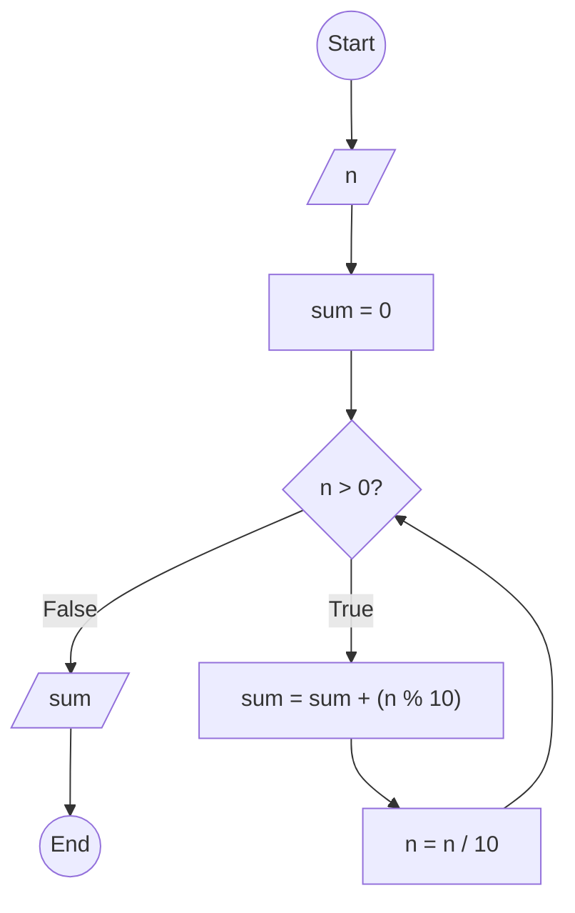

### Bài 44: Hãy tính tổng các chữ số của số nguyên dương $n$

---

### **1. Lưu đồ**



---

### **2. Test Case**

- **Đầu vào (Input):** `n = 12345`

- **Kết quả mong đợi (Expected Result):** `15`


**Mô phỏng (Simulation):**

`n = 12345`
`sum = 0`
`n = 12345 > 0` True:
	`sum = sum + (n % 10) = 0 + (12345 % 10) = 0 + 5 = 5`
	`n = n / 10 = 12345 / 10 = 1234`
`n = 1234 > 0` True:
	`sum = sum + (n % 10) = 5 + (1234 % 10) = 5 + 4 = 9`
	`n = n / 10 = 1234 / 10 = 123`
`n = 123 > 0` True:
	`sum = sum + (n % 10) = 9 + (123 % 10) = 9 + 3 = 12`
	`n = n / 10 = 123 / 10 = 12`
`n = 12 > 0` True:
	`sum = sum + (n % 10) = 12 + (12 % 10) = 12 + 2 = 14`
	`n = n / 10 = 12 / 10 = 1`
`n = 1 > 0` True:
	`sum = sum + (n % 10) = 14 + (1 % 10) = 14 + 1 = 15`
	`n = n / 10 = 1 / 10 = 0`
`n = 0 > 0` False:
Xuất `sum = 15`
Kết thúc.

---

### **3. Code**

#### **Python**

```python
def sum_of_digits(n):
    # Khởi tạo biến tổng
    sum = 0
    # Tính tổng các chữ số
    while n > 0:
        sum = sum + (n % 10)  # Lấy chữ số cuối cộng vào tổng
        n = n // 10  # Chia lấy phần nguyên để loại bỏ chữ số cuối
    return sum

# Chương trình chính
n = int(input("Nhập vào số nguyên dương n: "))
if n < 0:
    print("Vui lòng nhập số nguyên dương")
else:
    result = sum_of_digits(n)
    print(f"Tổng các chữ số của {n} là: {result}")
```

#### **JavaScript**

```javascript
function sumOfDigits(n) {
    // Khởi tạo biến tổng
    let sum = 0;
    // Tính tổng các chữ số
    while (n > 0) {
        sum = sum + (n % 10);  // Lấy chữ số cuối cộng vào tổng
        n = Math.floor(n / 10);  // Chia lấy phần nguyên để loại bỏ chữ số cuối
    }
    return sum;
}

// Chương trình chính
let n = parseInt(prompt("Nhập vào số nguyên dương n:"));
if (n < 0) {
    alert("Vui lòng nhập số nguyên dương");
} else {
    let result = sumOfDigits(n);
    console.log(`Tổng các chữ số của ${n} là: ${result}`);
    alert(`Tổng các chữ số của ${n} là: ${result}`);
}
```
