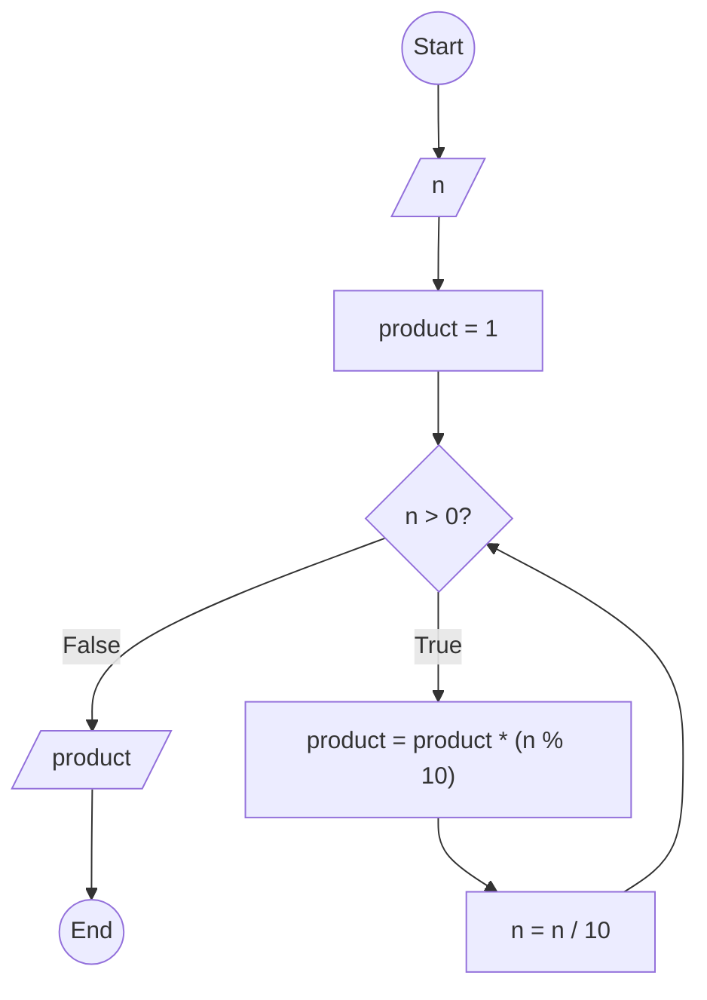

### Bài 45: Hãy tính tích các chữ số của số nguyên dương $n$

---

### **1. Lưu đồ**



---

### **2. Test Case**

- **Đầu vào (Input):** `n = 12345`

- **Kết quả mong đợi (Expected Result):** `120`


**Mô phỏng (Simulation):**

`n = 12345`
`product = 1`
`n = 12345 > 0` True:
	`product = product * (n % 10) = 1 * (12345 % 10) = 1 * 5 = 5`
	`n = n / 10 = 12345 / 10 = 1234`
`n = 1234 > 0` True:
	`product = product * (n % 10) = 5 * (1234 % 10) = 5 * 4 = 20`
	`n = n / 10 = 1234 / 10 = 123`
`n = 123 > 0` True:
	`product = product * (n % 10) = 20 * (123 % 10) = 20 * 3 = 60`
	`n = n / 10 = 123 / 10 = 12`
`n = 12 > 0` True:
	`product = product * (n % 10) = 60 * (12 % 10) = 60 * 2 = 120`
	`n = n / 10 = 12 / 10 = 1`
`n = 1 > 0` True:
	`product = product * (n % 10) = 120 * (1 % 10) = 120 * 1 = 120`
	`n = n / 10 = 1 / 10 = 0`
`n = 0 > 0` False:
Xuất `product = 120`
Kết thúc.

---

### **3. Code**

#### **Python**

```python
def product_of_digits(n):
    # Khởi tạo biến tích
    product = 1
    # Tính tích các chữ số
    while n > 0:
        product = product * (n % 10)  # Lấy chữ số cuối nhân với tích
        n = n // 10  # Chia lấy phần nguyên để loại bỏ chữ số cuối
    return product

# Chương trình chính
n = int(input("Nhập vào số nguyên dương n: "))
if n < 0:
    print("Vui lòng nhập số nguyên dương")
else:
    result = product_of_digits(n)
    print(f"Tích các chữ số của {n} là: {result}")
```

#### **JavaScript**

```javascript
function productOfDigits(n) {
    // Khởi tạo biến tích
    let product = 1;
    // Tính tích các chữ số
    while (n > 0) {
        product = product * (n % 10);  // Lấy chữ số cuối nhân với tích
        n = Math.floor(n / 10);  // Chia lấy phần nguyên để loại bỏ chữ số cuối
    }
    return product;
}

// Chương trình chính
let n = parseInt(prompt("Nhập vào số nguyên dương n:"));
if (n < 0) {
    alert("Vui lòng nhập số nguyên dương");
} else {
    let result = productOfDigits(n);
    console.log(`Tích các chữ số của ${n} là: ${result}`);
    alert(`Tích các chữ số của ${n} là: ${result}`);
}
```
