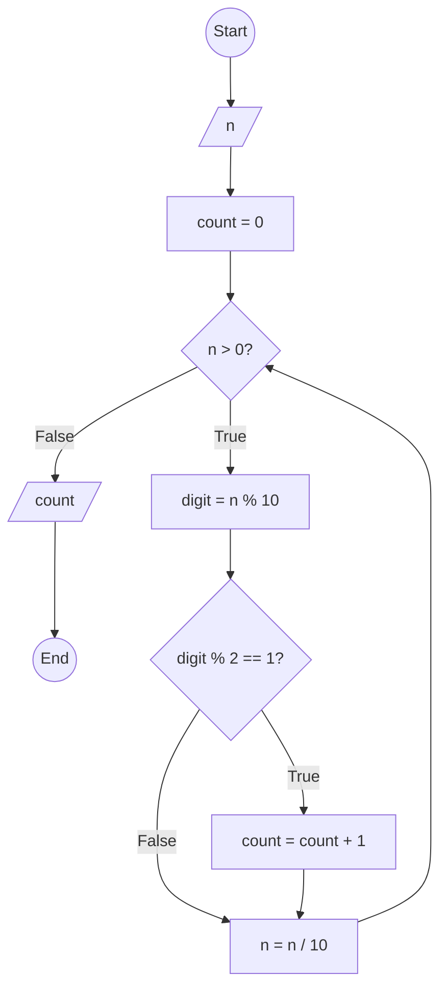

### Bài 46: Hãy đếm số lượng chữ số lẻ của số nguyên dương $n$

---

### **1. Lưu đồ**



---

### **2. Test Case**

- **Đầu vào (Input):** `n = 12345`

- **Kết quả mong đợi (Expected Result):** `3`


**Mô phỏng (Simulation):**

`n = 12345`
`count = 0`
`n = 12345 > 0` True:
	`digit = n % 10 = 12345 % 10 = 5`
	Điều kiện `digit % 2 == 1` (5 % 2 == 1) là **True**
		`count = count + 1 = 0 + 1 = 1`
	`n = n / 10 = 12345 / 10 = 1234`
`n = 1234 > 0` True:
	`digit = n % 10 = 1234 % 10 = 4`
	Điều kiện `digit % 2 == 1` (4 % 2 == 1) là **False**
	`n = n / 10 = 1234 / 10 = 123`
`n = 123 > 0` True:
	`digit = n % 10 = 123 % 10 = 3`
	Điều kiện `digit % 2 == 1` (3 % 2 == 1) là **True**
		`count = count + 1 = 1 + 1 = 2`
	`n = n / 10 = 123 / 10 = 12`
`n = 12 > 0` True:
	`digit = n % 10 = 12 % 10 = 2`
	Điều kiện `digit % 2 == 1` (2 % 2 == 1) là **False**
	`n = n / 10 = 12 / 10 = 1`
`n = 1 > 0` True:
	`digit = n % 10 = 1 % 10 = 1`
	Điều kiện `digit % 2 == 1` (1 % 2 == 1) là **True**
		`count = count + 1 = 2 + 1 = 3`
	`n = n / 10 = 1 / 10 = 0`
`n = 0 > 0` False:
Xuất `count = 3`
Kết thúc.

---

### **3. Code**

#### **Python**

```python
def count_odd_digits(n):
    # Khởi tạo biến đếm
    count = 0
    # Đếm số chữ số lẻ
    while n > 0:
        digit = n % 10  # Lấy chữ số cuối
        if digit % 2 == 1:  # Kiểm tra chữ số lẻ
            count = count + 1
        n = n // 10  # Chia lấy phần nguyên để loại bỏ chữ số cuối
    return count

# Chương trình chính
n = int(input("Nhập vào số nguyên dương n: "))
if n < 0:
    print("Vui lòng nhập số nguyên dương")
else:
    result = count_odd_digits(n)
    print(f"Số lượng chữ số lẻ của {n} là: {result}")
```

#### **JavaScript**

```javascript
function countOddDigits(n) {
    // Khởi tạo biến đếm
    let count = 0;
    // Đếm số chữ số lẻ
    while (n > 0) {
        let digit = n % 10;  // Lấy chữ số cuối
        if (digit % 2 === 1) {  // Kiểm tra chữ số lẻ
            count = count + 1;
        }
        n = Math.floor(n / 10);  // Chia lấy phần nguyên để loại bỏ chữ số cuối
    }
    return count;
}

// Chương trình chính
let n = parseInt(prompt("Nhập vào số nguyên dương n:"));
if (n < 0) {
    alert("Vui lòng nhập số nguyên dương");
} else {
    let result = countOddDigits(n);
    console.log(`Số lượng chữ số lẻ của ${n} là: ${result}`);
    alert(`Số lượng chữ số lẻ của ${n} là: ${result}`);
}
```
