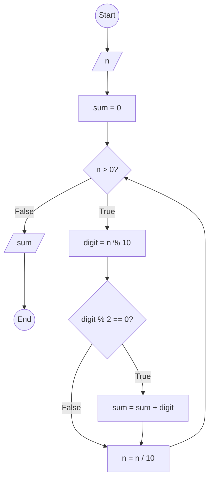

### Bài 47: Hãy tính tổng các chữ số chẵn của số nguyên dương $n$

---

### **1. Lưu đồ**



---

### **2. Test Case**

- **Đầu vào (Input):** `n = 12345`

- **Kết quả mong đợi (Expected Result):** `6`


**Mô phỏng (Simulation):**

```python
n = 12345
sum = 0
n = 12345 > 0 True:
	digit = n % 10 = 12345 % 10 = 5
	Điều kiện digit % 2 == 0 (5 % 2 == 0) là **False**
	n = n / 10 = 12345 / 10 = 1234
n = 1234 > 0 True:
	digit = n % 10 = 1234 % 10 = 4
	Điều kiện digit % 2 == 0 (4 % 2 == 0) là **True**
		sum = sum + digit = 0 + 4 = 4
	n = n / 10 = 1234 / 10 = 123
n = 123 > 0 True:
	digit = n % 10 = 123 % 10 = 3
	Điều kiện digit % 2 == 0 (3 % 2 == 0) là **False**
	n = n / 10 = 123 / 10 = 12
n = 12 > 0 True:
	digit = n % 10 = 12 % 10 = 2
	Điều kiện digit % 2 == 0 (2 % 2 == 0) là **True**
		sum = sum + digit = 4 + 2 = 6
	n = n / 10 = 12 / 10 = 1
n = 1 > 0 True:
	digit = n % 10 = 1 % 10 = 1
	Điều kiện digit % 2 == 0 (1 % 2 == 0) là **False**
	n = n / 10 = 1 / 10 = 0
n = 0 > 0 False:
Xuất sum = 6
Kết thúc.
```

---

### **3. Code**

#### **Python**

```python
def sum_of_even_digits(n):
    # Khởi tạo biến tổng
    sum = 0
    # Tính tổng các chữ số chẵn
    while n > 0:
        digit = n % 10  # Lấy chữ số cuối
        if digit % 2 == 0:  # Kiểm tra chữ số chẵn
            sum = sum + digit
        n = n // 10  # Chia lấy phần nguyên để loại bỏ chữ số cuối
    return sum

# Chương trình chính
n = int(input("Nhập vào số nguyên dương n: "))
if n < 0:
    print("Vui lòng nhập số nguyên dương")
else:
    result = sum_of_even_digits(n)
    print(f"Tổng các chữ số chẵn của {n} là: {result}")
```

#### **JavaScript**

```javascript
function sumOfEvenDigits(n) {
    // Khởi tạo biến tổng
    let sum = 0;
    // Tính tổng các chữ số chẵn
    while (n > 0) {
        let digit = n % 10;  // Lấy chữ số cuối
        if (digit % 2 === 0) {  // Kiểm tra chữ số chẵn
            sum = sum + digit;
        }
        n = Math.floor(n / 10);  // Chia lấy phần nguyên để loại bỏ chữ số cuối
    }
    return sum;
}

// Chương trình chính
let n = parseInt(prompt("Nhập vào số nguyên dương n:"));
if (n < 0) {
    alert("Vui lòng nhập số nguyên dương");
} else {
    let result = sumOfEvenDigits(n);
    console.log(`Tổng các chữ số chẵn của ${n} là: ${result}`);
    alert(`Tổng các chữ số chẵn của ${n} là: ${result}`);
}
```
