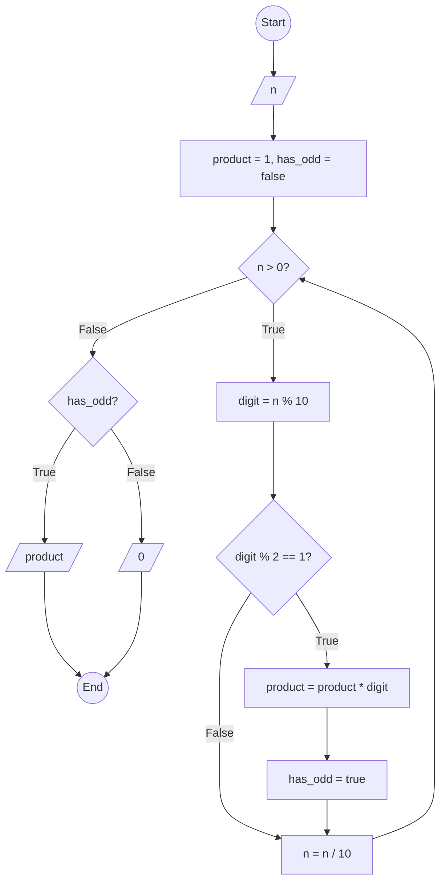

### Bài 48: Hãy tính tích các chữ số lẻ của số nguyên dương $n$. Trường hợp không có chữ số lẻ, trả kết quả = 0

---

### **1. Lưu đồ**



---

### **2. Test Case**

- **Đầu vào (Input):** `n = 12345`

- **Kết quả mong đợi (Expected Result):** `15`


**Mô phỏng (Simulation):**

```python
n = 12345
product = 1
has_odd = false
n = 12345 > 0 True:
	digit = n % 10 = 12345 % 10 = 5
	Điều kiện digit % 2 == 1 (5 % 2 == 1) là **True**
		product = product * digit = 1 * 5 = 5
		has_odd = true
	n = n / 10 = 12345 / 10 = 1234
n = 1234 > 0 True:
	digit = n % 10 = 1234 % 10 = 4
	Điều kiện digit % 2 == 1 (4 % 2 == 1) là **False**
	n = n / 10 = 1234 / 10 = 123
n = 123 > 0 True:
	digit = n % 10 = 123 % 10 = 3
	Điều kiện digit % 2 == 1 (3 % 2 == 1) là **True**
		product = product * digit = 5 * 3 = 15
		has_odd = true
	n = n / 10 = 123 / 10 = 12
n = 12 > 0 True:
	digit = n % 10 = 12 % 10 = 2
	Điều kiện digit % 2 == 1 (2 % 2 == 1) là **False**
	n = n / 10 = 12 / 10 = 1
n = 1 > 0 True:
	digit = n % 10 = 1 % 10 = 1
	Điều kiện digit % 2 == 1 (1 % 2 == 1) là **True**
		product = product * digit = 15 * 1 = 15
		has_odd = true
	n = n / 10 = 1 / 10 = 0
n = 0 > 0 False:
Điều kiện has_odd là **True**
Xuất product = 15
Kết thúc.
```
---

### **3. Code**

#### **Python**

```python
def product_of_odd_digits(n):
    # Khởi tạo biến tích và cờ kiểm tra có chữ số lẻ
    product = 1
    has_odd_digit = False
    # Tính tích các chữ số lẻ
    while n > 0:
        digit = n % 10  # Lấy chữ số cuối
        if digit % 2 == 1:  # Kiểm tra chữ số lẻ
            product = product * digit
            has_odd_digit = True
        n = n // 10  # Chia lấy phần nguyên để loại bỏ chữ số cuối
    # Trả về 0 nếu không có chữ số lẻ nào
    return product if has_odd_digit else 0

# Chương trình chính
n = int(input("Nhập vào số nguyên dương n: "))
if n < 0:
    print("Vui lòng nhập số nguyên dương")
else:
    result = product_of_odd_digits(n)
    print(f"Tích các chữ số lẻ của {n} là: {result}")
```

#### **JavaScript**

```javascript
function productOfOddDigits(n) {
    // Khởi tạo biến tích và cờ kiểm tra có chữ số lẻ
    let product = 1;
    let hasOddDigit = false;
    // Tính tích các chữ số lẻ
    while (n > 0) {
        let digit = n % 10;  // Lấy chữ số cuối
        if (digit % 2 === 1) {  // Kiểm tra chữ số lẻ
            product = product * digit;
            hasOddDigit = true;
        }
        n = Math.floor(n / 10);  // Chia lấy phần nguyên để loại bỏ chữ số cuối
    }
    // Trả về 0 nếu không có chữ số lẻ nào
    return hasOddDigit ? product : 0;
}

// Chương trình chính
let n = parseInt(prompt("Nhập vào số nguyên dương n:"));
if (n < 0) {
    alert("Vui lòng nhập số nguyên dương");
} else {
    let result = productOfOddDigits(n);
    console.log(`Tích các chữ số lẻ của ${n} là: ${result}`);
    alert(`Tích các chữ số lẻ của ${n} là: ${result}`);
}
```
