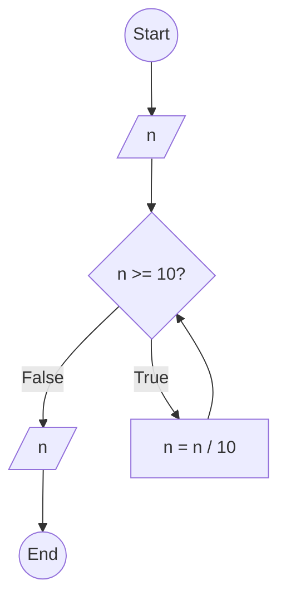

### Bài 49: Cho số nguyên dương $n$. Hãy tìm chữ số đầu tiên của $n$

---

### **1. Lưu đồ**



---

### **2. Test Case**

- **Đầu vào (Input):** `n = 12345`

- **Kết quả mong đợi (Expected Result):** `1`


**Mô phỏng (Simulation):**

`n = 12345`
`n = 12345 >= 10` True:
	`n = n / 10 = 12345 / 10 = 1234`
`n = 1234 >= 10` True:
	`n = n / 10 = 1234 / 10 = 123`
`n = 123 >= 10` True:
	`n = n / 10 = 123 / 10 = 12`
`n = 12 >= 10` True:
	`n = n / 10 = 12 / 10 = 1`
`n = 1 >= 10` False:
Xuất `n = 1`
Kết thúc.

---

### **3. Code**

#### **Python**

```python
def find_first_digit(n):
    # Chia liên tục cho 10 cho đến khi n < 10
    while n >= 10:
        n = n // 10  # Chia lấy phần nguyên để loại bỏ chữ số cuối
    return n

# Chương trình chính
n = int(input("Nhập vào số nguyên dương n: "))
if n <= 0:
    print("Vui lòng nhập số nguyên dương")
else:
    result = find_first_digit(n)
    print(f"Chữ số đầu tiên của {n} là: {result}")
```

#### **JavaScript**

```javascript
function findFirstDigit(n) {
    // Chia liên tục cho 10 cho đến khi n < 10
    while (n >= 10) {
        n = Math.floor(n / 10);  // Chia lấy phần nguyên để loại bỏ chữ số cuối
    }
    return n;
}

// Chương trình chính
let n = parseInt(prompt("Nhập vào số nguyên dương n:"));
if (n <= 0) {
    alert("Vui lòng nhập số nguyên dương");
} else {
    let result = findFirstDigit(n);
    console.log(`Chữ số đầu tiên của ${n} là: ${result}`);
    alert(`Chữ số đầu tiên của ${n} là: ${result}`);
}
```
