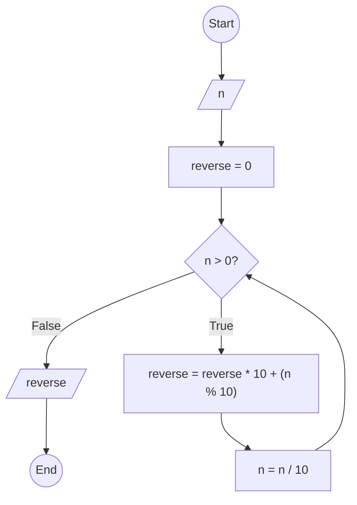

### Bài 50: Hãy tìm chữ số đảo ngược của số nguyên dương $n$

---

### **1. Lưu đồ**



---

### **2. Test Case**

- **Đầu vào (Input):** `n = 12345`

- **Kết quả mong đợi (Expected Result):** `54321`


**Mô phỏng (Simulation):**

```python
n = 12345
reverse = 0
n = 12345 > 0 True:
	reverse = reverse * 10 + (n % 10) = 0 * 10 + (12345 % 10) = 0 + 5 = 5
	n = n / 10 = 12345 / 10 = 1234
n = 1234 > 0 True:
	reverse = reverse * 10 + (n % 10) = 5 * 10 + (1234 % 10) = 50 + 4 = 54
	n = n / 10 = 1234 / 10 = 123
n = 123 > 0 True:
	reverse = reverse * 10 + (n % 10) = 54 * 10 + (123 % 10) = 540 + 3 = 543
	n = n / 10 = 123 / 10 = 12
n = 12 > 0 True:
	reverse = reverse * 10 + (n % 10) = 543 * 10 + (12 % 10) = 5430 + 2 = 5432
	n = n / 10 = 12 / 10 = 1
n = 1 > 0 True:
	reverse = reverse * 10 + (n % 10) = 5432 * 10 + (1 % 10) = 54320 + 1 = 54321
	n = n / 10 = 1 / 10 = 0
n = 0 > 0 False:
Xuất reverse = 54321
Kết thúc.
```

---

### **3. Code**

#### **Python**

```python
def find_reverse_number(n):
    # Khởi tạo số đảo ngược
    reverse = 0
    # Tạo số đảo ngược
    while n > 0:
        reverse = reverse * 10 + (n % 10)  # Thêm chữ số cuối vào đầu số đảo ngược
        n = n // 10  # Chia lấy phần nguyên để loại bỏ chữ số cuối
    return reverse

# Chương trình chính
n = int(input("Nhập vào số nguyên dương n: "))
if n < 0:
    print("Vui lòng nhập số nguyên dương")
else:
    result = find_reverse_number(n)
    print(f"Số đảo ngược của {n} là: {result}")
```

#### **JavaScript**

```javascript
function findReverseNumber(n) {
    // Khởi tạo số đảo ngược
    let reverse = 0;
    // Tạo số đảo ngược
    while (n > 0) {
        reverse = reverse * 10 + (n % 10);  // Thêm chữ số cuối vào đầu số đảo ngược
        n = Math.floor(n / 10);  // Chia lấy phần nguyên để loại bỏ chữ số cuối
    }
    return reverse;
}

// Chương trình chính
let n = parseInt(prompt("Nhập vào số nguyên dương n:"));
if (n < 0) {
    alert("Vui lòng nhập số nguyên dương");
} else {
    let result = findReverseNumber(n);
    console.log(`Số đảo ngược của ${n} là: ${result}`);
    alert(`Số đảo ngược của ${n} là: ${result}`);
}
```
