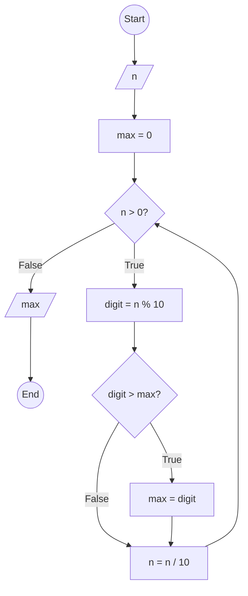

### Bài 51: Tìm chữ số lớn nhất của số nguyên dương $n$

---

### **1. Lưu đồ**



---

### **2. Test Case**

- **Đầu vào (Input):** `n = 12345`

- **Kết quả mong đợi (Expected Result):** `5`


**Mô phỏng (Simulation):**

`n = 12345`
`max = 0`
`n = 12345 > 0` True:
	`digit = n % 10 = 12345 % 10 = 5`
	Điều kiện `digit > max` (5 > 0) là **True**
		`max = digit = 5`
	`n = n / 10 = 12345 / 10 = 1234`
`n = 1234 > 0` True:
	`digit = n % 10 = 1234 % 10 = 4`
	Điều kiện `digit > max` (4 > 5) là **False**
	`n = n / 10 = 1234 / 10 = 123`
`n = 123 > 0` True:
	`digit = n % 10 = 123 % 10 = 3`
	Điều kiện `digit > max` (3 > 5) là **False**
	`n = n / 10 = 123 / 10 = 12`
`n = 12 > 0` True:
	`digit = n % 10 = 12 % 10 = 2`
	Điều kiện `digit > max` (2 > 5) là **False**
	`n = n / 10 = 12 / 10 = 1`
`n = 1 > 0` True:
	`digit = n % 10 = 1 % 10 = 1`
	Điều kiện `digit > max` (1 > 5) là **False**
	`n = n / 10 = 1 / 10 = 0`
`n = 0 > 0` False:
Xuất `max = 5`
Kết thúc.

---

### **3. Code**

#### **Python**

```python
def find_max_digit(n):
    # Khởi tạo giá trị lớn nhất
    max = 0
    # Tìm chữ số lớn nhất
    while n > 0:
        digit = n % 10  # Lấy chữ số cuối
        if digit > max:  # So sánh với giá trị lớn nhất hiện tại
            max = digit
        n = n // 10  # Chia lấy phần nguyên để loại bỏ chữ số cuối
    return max

# Chương trình chính
n = int(input("Nhập vào số nguyên dương n: "))
if n < 0:
    print("Vui lòng nhập số nguyên dương")
else:
    result = find_max_digit(n)
    print(f"Chữ số lớn nhất của {n} là: {result}")
```

#### **JavaScript**

```javascript
function findMaxDigit(n) {
    // Khởi tạo giá trị lớn nhất
    let max = 0;
    // Tìm chữ số lớn nhất
    while (n > 0) {
        let digit = n % 10;  // Lấy chữ số cuối
        if (digit > max) {  // So sánh với giá trị lớn nhất hiện tại
            max = digit;
        }
        n = Math.floor(n / 10);  // Chia lấy phần nguyên để loại bỏ chữ số cuối
    }
    return max;
}

// Chương trình chính
let n = parseInt(prompt("Nhập vào số nguyên dương n:"));
if (n < 0) {
    alert("Vui lòng nhập số nguyên dương");
} else {
    let result = findMaxDigit(n);
    console.log(`Chữ số lớn nhất của ${n} là: ${result}`);
    alert(`Chữ số lớn nhất của ${n} là: ${result}`);
}
```
