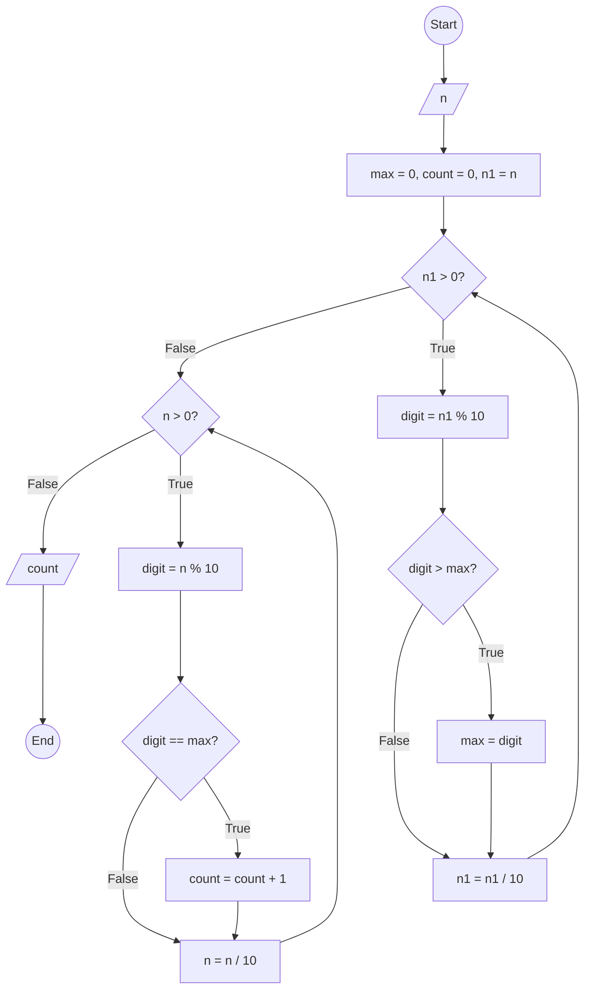

### Bài 53: Hãy đếm số lượng chữ số lớn nhất của số nguyên dương $n$

---

### **1. Lưu đồ**



---

### **2. Test Case**

- **Đầu vào (Input):** `n = 122355`

- **Kết quả mong đợi (Expected Result):** `2`


**Mô phỏng (Simulation):**

**Vòng lặp 1: Tìm chữ số lớn nhất**

`n = 122355`
`max = 0, count = 0, n1 = n = 122355`
`n1 = 122355 > 0` True:
	`digit = n1 % 10 = 122355 % 10 = 5`
	Điều kiện `digit > max` (5 > 0) là **True**
		`max = digit = 5`
	`n1 = n1 / 10 = 122355 / 10 = 12235`
`n1 = 12235 > 0` True:
	`digit = n1 % 10 = 12235 % 10 = 5`
	Điều kiện `digit > max` (5 > 5) là **False**
	`n1 = n1 / 10 = 12235 / 10 = 1223`
`n1 = 1223 > 0` True:
	`digit = n1 % 10 = 1223 % 10 = 3`
	Điều kiện `digit > max` (3 > 5) là **False**
	`n1 = n1 / 10 = 1223 / 10 = 122`
`n1 = 122 > 0` True:
	`digit = n1 % 10 = 122 % 10 = 2`
	Điều kiện `digit > max` (2 > 5) là **False**
	`n1 = n1 / 10 = 122 / 10 = 12`
`n1 = 12 > 0` True:
	`digit = n1 % 10 = 12 % 10 = 2`
	Điều kiện `digit > max` (2 > 5) là **False**
	`n1 = n1 / 10 = 12 / 10 = 1`
`n1 = 1 > 0` True:
	`digit = n1 % 10 = 1 % 10 = 1`
	Điều kiện `digit > max` (1 > 5) là **False**
	`n1 = n1 / 10 = 1 / 10 = 0`
`n1 = 0 > 0` False:
(tại bước này đã xác định được max = 5)
**Vòng lặp 2: Đếm số lần xuất hiện của max**

`n = 122355 > 0` True:
	`digit = n % 10 = 122355 % 10 = 5`
	Điều kiện `digit == max` (5 == 5) là **True**
		`count = count + 1 = 0 + 1 = 1`
	`n = n / 10 = 122355 / 10 = 12235`
`n = 12235 > 0` True:
	`digit = n % 10 = 12235 % 10 = 5`
	Điều kiện `digit == max` (5 == 5) là **True**
		`count = count + 1 = 1 + 1 = 2`
	`n = n / 10 = 12235 / 10 = 1223`
`n = 1223 > 0` True:
	`digit = n % 10 = 1223 % 10 = 3`
	Điều kiện `digit == max` (3 == 5) là **False**
	`n = n / 10 = 1223 / 10 = 122`
`n = 122 > 0` True:
	`digit = n % 10 = 122 % 10 = 2`
	Điều kiện `digit == max` (2 == 5) là **False**
	`n = n / 10 = 122 / 10 = 12`
`n = 12 > 0` True:
	`digit = n % 10 = 12 % 10 = 2`
	Điều kiện `digit == max` (2 == 5) là **False**
	`n = n / 10 = 12 / 10 = 1`
`n = 1 > 0` True:
	`digit = n % 10 = 1 % 10 = 1`
	Điều kiện `digit == max` (1 == 5) là **False**
	`n = n / 10 = 1 / 10 = 0`
`n = 0 > 0` False:
Xuất `count = 2`
Kết thúc.

---

### **3. Code**

#### **Python**

```python
def count_max_digits(n):
    # Khởi tạo giá trị lớn nhất, bộ đếm và biến phụ n1
    max = 0
    count = 0
    n1 = n

    # Vòng lặp 1: Tìm chữ số lớn nhất
    while n1 > 0:
        digit = n1 % 10  # Lấy chữ số cuối
        if digit > max:  # Tìm thấy chữ số lớn hơn
            max = digit
        n1 = n1 // 10  # Chia lấy phần nguyên để loại bỏ chữ số cuối

    # Vòng lặp 2: Đếm số lần xuất hiện của chữ số lớn nhất
    while n > 0:
        digit = n % 10  # Lấy chữ số cuối
        if digit == max:  # Nếu bằng chữ số lớn nhất
            count = count + 1
        n = n // 10  # Chia lấy phần nguyên để loại bỏ chữ số cuối

    return count

# Chương trình chính
n = int(input("Nhập vào số nguyên dương n: "))
if n < 0:
    print("Vui lòng nhập số nguyên dương")
else:
    result = count_max_digits(n)
    print(f"Số lượng chữ số lớn nhất của {n} là: {result}")
```

#### **JavaScript**

```javascript
function countMaxDigits(n) {
    // Khởi tạo giá trị lớn nhất, bộ đếm và biến phụ n1
    let max = 0;
    let count = 0;
    let n1 = n;

    // Vòng lặp 1: Tìm chữ số lớn nhất
    while (n1 > 0) {
        let digit = n1 % 10;  // Lấy chữ số cuối
        if (digit > max) {  // Tìm thấy chữ số lớn hơn
            max = digit;
        }
        n1 = Math.floor(n1 / 10);  // Chia lấy phần nguyên để loại bỏ chữ số cuối
    }

    // Vòng lặp 2: Đếm số lần xuất hiện của chữ số lớn nhất
    while (n > 0) {
        let digit = n % 10;  // Lấy chữ số cuối
        if (digit === max) {  // Nếu bằng chữ số lớn nhất
            count = count + 1;
        }
        n = Math.floor(n / 10);  // Chia lấy phần nguyên để loại bỏ chữ số cuối
    }

    return count;
}

// Chương trình chính
let n = parseInt(prompt("Nhập vào số nguyên dương n:"));
if (n < 0) {
    alert("Vui lòng nhập số nguyên dương");
} else {
    let result = countMaxDigits(n);
    console.log(`Số lượng chữ số lớn nhất của ${n} là: ${result}`);
    alert(`Số lượng chữ số lớn nhất của ${n} là: ${result}`);
}
```
