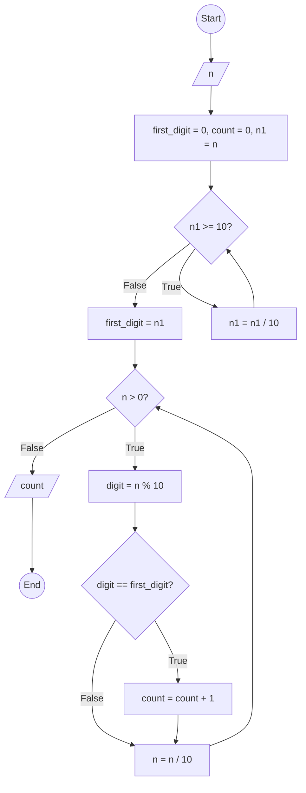

### Bài 55: Hãy đếm số lượng chữ số đầu tiên của số nguyên dương $n$

---

### **1. Lưu đồ**



---

### **2. Test Case**

- **Đầu vào (Input):** `n = 12131`

- **Kết quả mong đợi (Expected Result):** `3`


**Mô phỏng (Simulation):**

**Vòng lặp 1: Tìm chữ số đầu tiên**

`n = 12131`
`first_digit = 0, count = 0, n1 = n = 12131`
`n1 = 12131 >= 10` True:
	`n1 = n1 / 10 = 12131 / 10 = 1213`
`n1 = 1213 >= 10` True:
	`n1 = n1 / 10 = 1213 / 10 = 121`
`n1 = 121 >= 10` True:
	`n1 = n1 / 10 = 121 / 10 = 12`
`n1 = 12 >= 10` True:
	`n1 = n1 / 10 = 12 / 10 = 1`
`n1 = 1 >= 10` False:
	`first_digit = n1 = 1`

**Vòng lặp 2: Đếm số lần xuất hiện của chữ số đầu tiên**

`n = 12131 > 0` True:
	`digit = n % 10 = 12131 % 10 = 1`
	Điều kiện `digit == first_digit` (1 == 1) là **True**
		`count = count + 1 = 0 + 1 = 1`
	`n = n / 10 = 12131 / 10 = 1213`
`n = 1213 > 0` True:
	`digit = n % 10 = 1213 % 10 = 3`
	Điều kiện `digit == first_digit` (3 == 1) là **False**
	`n = n / 10 = 1213 / 10 = 121`
`n = 121 > 0` True:
	`digit = n % 10 = 121 % 10 = 1`
	Điều kiện `digit == first_digit` (1 == 1) là **True**
		`count = count + 1 = 1 + 1 = 2`
	`n = n / 10 = 121 / 10 = 12`
`n = 12 > 0` True:
	`digit = n % 10 = 12 % 10 = 2`
	Điều kiện `digit == first_digit` (2 == 1) là **False**
	`n = n / 10 = 12 / 10 = 1`
`n = 1 > 0` True:
	`digit = n % 10 = 1 % 10 = 1`
	Điều kiện `digit == first_digit` (1 == 1) là **True**
		`count = count + 1 = 2 + 1 = 3`
	`n = n / 10 = 1 / 10 = 0`
`n = 0 > 0` False:
Xuất `count = 3`
Kết thúc.

---

### **3. Code**

#### **Python**

```python
def count_first_digits(n):
    # Khởi tạo chữ số đầu tiên, bộ đếm và biến phụ n1
    first_digit = 0
    count = 0
    n1 = n

    # Vòng lặp 1: Tìm chữ số đầu tiên
    while n1 >= 10:
        n1 = n1 // 10  # Chia lấy phần nguyên để loại bỏ chữ số cuối
    first_digit = n1

    # Vòng lặp 2: Đếm số lần xuất hiện của chữ số đầu tiên
    while n > 0:
        digit = n % 10  # Lấy chữ số cuối
        if digit == first_digit:  # Nếu bằng chữ số đầu tiên
            count = count + 1
        n = n // 10  # Chia lấy phần nguyên để loại bỏ chữ số cuối

    return count

# Chương trình chính
n = int(input("Nhập vào số nguyên dương n: "))
if n < 0:
    print("Vui lòng nhập số nguyên dương")
else:
    result = count_first_digits(n)
    print(f"Số lượng chữ số đầu tiên của {n} là: {result}")
```

#### **JavaScript**

```javascript
function countFirstDigits(n) {
    // Khởi tạo chữ số đầu tiên, bộ đếm và biến phụ n1
    let firstDigit = 0;
    let count = 0;
    let n1 = n;

    // Vòng lặp 1: Tìm chữ số đầu tiên
    while (n1 >= 10) {
        n1 = Math.floor(n1 / 10);  // Chia lấy phần nguyên để loại bỏ chữ số cuối
    }
    firstDigit = n1;

    // Vòng lặp 2: Đếm số lần xuất hiện của chữ số đầu tiên
    while (n > 0) {
        let digit = n % 10;  // Lấy chữ số cuối
        if (digit === firstDigit) {  // Nếu bằng chữ số đầu tiên
            count = count + 1;
        }
        n = Math.floor(n / 10);  // Chia lấy phần nguyên để loại bỏ chữ số cuối
    }

    return count;
}

// Chương trình chính
let n = parseInt(prompt("Nhập vào số nguyên dương n:"));
if (n < 0) {
    alert("Vui lòng nhập số nguyên dương");
} else {
    let result = countFirstDigits(n);
    console.log(`Số lượng chữ số đầu tiên của ${n} là: ${result}`);
    alert(`Số lượng chữ số đầu tiên của ${n} là: ${result}`);
}
```
