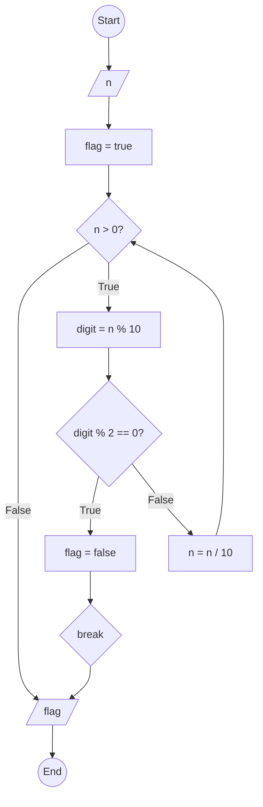

### Bài 56: Kiểm tra số nguyên dương $n$ có toàn chữ số lẻ hay không?

---

### **1. Lưu đồ**



---

### **2. Test Case**

- **Đầu vào (Input):** `n = 1357`

- **Kết quả mong đợi (Expected Result):** `true`


**Mô phỏng (Simulation):**

`n = 1357`
`flag = true`
`n = 1357 > 0` True:
	`digit = n % 10 = 1357 % 10 = 7`
	Điều kiện `digit % 2 == 0` (7 % 2 == 0) là **False**
	`n = n / 10 = 1357 / 10 = 135`
`n = 135 > 0` True:
	`digit = n % 10 = 135 % 10 = 5`
	Điều kiện `digit % 2 == 0` (5 % 2 == 0) là **False**
	`n = n / 10 = 135 / 10 = 13`
`n = 13 > 0` True:
	`digit = n % 10 = 13 % 10 = 3`
	Điều kiện `digit % 2 == 0` (3 % 2 == 0) là **False**
	`n = n / 10 = 13 / 10 = 1`
`n = 1 > 0` True:
	`digit = n % 10 = 1 % 10 = 1`
	Điều kiện `digit % 2 == 0` (1 % 2 == 0) là **False**
	`n = n / 10 = 1 / 10 = 0`
`n = 0 > 0` False:
Xuất `flag = true`
Kết thúc.

**Test Case 2:**

- **Đầu vào (Input):** `n = 1358`

- **Kết quả mong đợi (Expected Result):** `false`

**Mô phỏng (Simulation):**

`n = 1358`
`flag = true`
`n = 1358 > 0` True:
	`digit = n % 10 = 1358 % 10 = 8`
	Điều kiện `digit % 2 == 0` (8 % 2 == 0) là **True**
		`flag = false`
		break
Xuất `flag = false`
Kết thúc.

---

### **3. Code**

#### **Python**

```python
def is_all_odd_digits(n):
    # Khởi tạo cờ kiểm tra
    flag = True

    # Kiểm tra từng chữ số
    while n > 0:
        digit = n % 10  # Lấy chữ số cuối
        if digit % 2 == 0:  # Nếu chữ số chẵn
            flag = False
            break  # Thoát vòng lặp ngay lập tức
        n = n // 10  # Chia lấy phần nguyên để loại bỏ chữ số cuối

    return flag

# Chương trình chính
n = int(input("Nhập vào số nguyên dương n: "))
if n < 0:
    print("Vui lòng nhập số nguyên dương")
else:
    result = is_all_odd_digits(n)
    if result:
        print(f"Số {n} có toàn chữ số lẻ")
    else:
        print(f"Số {n} không có toàn chữ số lẻ")
```

#### **JavaScript**

```javascript
function isAllOddDigits(n) {
    // Khởi tạo cờ kiểm tra
    let flag = true;

    // Kiểm tra từng chữ số
    while (n > 0) {
        let digit = n % 10;  // Lấy chữ số cuối
        if (digit % 2 === 0) {  // Nếu chữ số chẵn
            flag = false;
            break;  // Thoát vòng lặp ngay lập tức
        }
        n = Math.floor(n / 10);  // Chia lấy phần nguyên để loại bỏ chữ số cuối
    }

    return flag;
}

// Chương trình chính
let n = parseInt(prompt("Nhập vào số nguyên dương n:"));
if (n < 0) {
    alert("Vui lòng nhập số nguyên dương");
} else {
    let result = isAllOddDigits(n);
    if (result) {
        console.log(`Số ${n} có toàn chữ số lẻ`);
        alert(`Số ${n} có toàn chữ số lẻ`);
    } else {
        console.log(`Số ${n} không có toàn chữ số lẻ`);
        alert(`Số ${n} không có toàn chữ số lẻ`);
    }
}
```