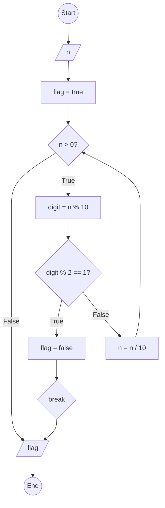

### Bài 57: Kiểm tra số nguyên dương $n$ có toàn chữ số chẵn hay không?

---

### **1. Lưu đồ**



---

### **2. Test Case**

- **Đầu vào (Input):** `n = 2468`

- **Kết quả mong đợi (Expected Result):** `true`


**Mô phỏng (Simulation):**

```python
n = 2468
flag = true
n = 2468 > 0 True:
	digit = n % 10 = 2468 % 10 = 8
	Điều kiện digit % 2 == 1 (8 % 2 == 1) là **False**
	n = n / 10 = 2468 / 10 = 246
n = 246 > 0 True:
	digit = n % 10 = 246 % 10 = 6
	Điều kiện digit % 2 == 1 (6 % 2 == 1) là **False**
	n = n / 10 = 246 / 10 = 24
n = 24 > 0 True:
	digit = n % 10 = 24 % 10 = 4
	Điều kiện digit % 2 == 1 (4 % 2 == 1) là **False**
	n = n / 10 = 24 / 10 = 2
n = 2 > 0 True:
	digit = n % 10 = 2 % 10 = 2
	Điều kiện digit % 2 == 1 (2 % 2 == 1) là **False**
	n = n / 10 = 2 / 10 = 0
n = 0 > 0 False:
Xuất flag = true
Kết thúc.
```

**Test Case 2:**

- **Đầu vào (Input):** `n = 2465`

- **Kết quả mong đợi (Expected Result):** `false`

**Mô phỏng (Simulation):**

```python
n = 2465
flag = true
n = 2465 > 0 True:
	digit = n % 10 = 2465 % 10 = 5
	Điều kiện digit % 2 == 1 (5 % 2 == 1) là **True**
		flag = false
		Break
Xuất flag = false
Kết thúc.
```

---

### **3. Code**

#### **Python**

```python
def is_all_even_digits(n):
    # Khởi tạo cờ kiểm tra
    flag = True

    # Kiểm tra từng chữ số
    while n > 0:
        digit = n % 10  # Lấy chữ số cuối
        if digit % 2 == 1:  # Nếu chữ số lẻ
            flag = False
            break  # Thoát vòng lặp ngay lập tức
        n = n // 10  # Chia lấy phần nguyên để loại bỏ chữ số cuối

    return flag

# Chương trình chính
n = int(input("Nhập vào số nguyên dương n: "))
if n < 0:
    print("Vui lòng nhập số nguyên dương")
else:
    result = is_all_even_digits(n)
    if result:
        print(f"Số {n} có toàn chữ số chẵn")
    else:
        print(f"Số {n} không có toàn chữ số chẵn")
```

#### **JavaScript**

```javascript
function isAllEvenDigits(n) {
    // Khởi tạo cờ kiểm tra
    let flag = true;

    // Kiểm tra từng chữ số
    while (n > 0) {
        let digit = n % 10;  // Lấy chữ số cuối
        if (digit % 2 === 1) {  // Nếu chữ số lẻ
            flag = false;
            break;  // Thoát vòng lặp ngay lập tức
        }
        n = Math.floor(n / 10);  // Chia lấy phần nguyên để loại bỏ chữ số cuối
    }

    return flag;
}

// Chương trình chính
let n = parseInt(prompt("Nhập vào số nguyên dương n:"));
if (n < 0) {
    alert("Vui lòng nhập số nguyên dương");
} else {
    let result = isAllEvenDigits(n);
    if (result) {
        console.log(`Số ${n} có toàn chữ số chẵn`);
        alert(`Số ${n} có toàn chữ số chẵn`);
    } else {
        console.log(`Số ${n} không có toàn chữ số chẵn`);
        alert(`Số ${n} không có toàn chữ số chẵn`);
    }
}
```