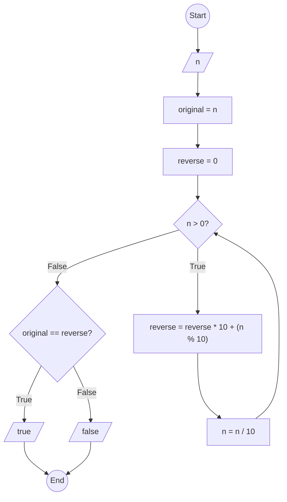

### Bài 59: Kiểm tra số nguyên dương $n$ có phải số đối xứng hay không?

---

### **1. Lưu đồ**



---

### **2. Test Case**

- **Đầu vào (Input):** `n = 12321`

- **Kết quả mong đợi (Expected Result):** `true`


**Mô phỏng (Simulation):**

`n = 12321`
`original = 12321`
`reverse = 0`
`n = 12321 > 0` True:
	`reverse = reverse * 10 + (n % 10) = 0 * 10 + (12321 % 10) = 0 + 1 = 1`
	`n = n / 10 = 12321 / 10 = 1232`
`n = 1232 > 0` True:
	`reverse = reverse * 10 + (n % 10) = 1 * 10 + (1232 % 10) = 10 + 2 = 12`
	`n = n / 10 = 1232 / 10 = 123`
`n = 123 > 0` True:
	`reverse = reverse * 10 + (n % 10) = 12 * 10 + (123 % 10) = 120 + 3 = 123`
	`n = n / 10 = 123 / 10 = 12`
`n = 12 > 0` True:
	`reverse = reverse * 10 + (n % 10) = 123 * 10 + (12 % 10) = 1230 + 2 = 1232`
	`n = n / 10 = 12 / 10 = 1`
`n = 1 > 0` True:
	`reverse = reverse * 10 + (n % 10) = 1232 * 10 + (1 % 10) = 12320 + 1 = 12321`
	`n = n / 10 = 1 / 10 = 0`
`n = 0 > 0` False:
Điều kiện `original == reverse` (12321 == 12321) là **True**
Xuất `true`
Kết thúc.

**Test Case 2:**

- **Đầu vào (Input):** `n = 12345`

- **Kết quả mong đợi (Expected Result):** `false`

**Mô phỏng (Simulation):**

`n = 12345`
`original = 12345`
`reverse = 0`
`n = 12345 > 0` True:
	`reverse = reverse * 10 + (n % 10) = 0 * 10 + (12345 % 10) = 0 + 5 = 5`
	`n = n / 10 = 12345 / 10 = 1234`
`n = 1234 > 0` True:
	`reverse = reverse * 10 + (n % 10) = 5 * 10 + (1234 % 10) = 50 + 4 = 54`
	`n = n / 10 = 1234 / 10 = 123`
`n = 123 > 0` True:
	`reverse = reverse * 10 + (n % 10) = 54 * 10 + (123 % 10) = 540 + 3 = 543`
	`n = n / 10 = 123 / 10 = 12`
`n = 12 > 0` True:
	`reverse = reverse * 10 + (n % 10) = 543 * 10 + (12 % 10) = 5430 + 2 = 5432`
	`n = n / 10 = 12 / 10 = 1`
`n = 1 > 0` True:
	`reverse = reverse * 10 + (n % 10) = 5432 * 10 + (1 % 10) = 54320 + 1 = 54321`
	`n = n / 10 = 1 / 10 = 0`
`n = 0 > 0` False:
Điều kiện `original == reverse` (12345 == 54321) là **False**
Xuất `false`
Kết thúc.

---

### **3. Code**

#### **Python**

```python
def is_symmetrical_number(n):
    # Lưu giá trị gốc
    original = n
    reverse = 0

    # Tạo số đảo ngược (tương tự bài 50)
    while n > 0:
        reverse = reverse * 10 + (n % 10)  # Thêm chữ số cuối vào đầu số đảo ngược
        n = n // 10  # Chia lấy phần nguyên để loại bỏ chữ số cuối

    # So sánh số gốc với số đảo ngược
    return original == reverse

# Chương trình chính
n = int(input("Nhập vào số nguyên dương n: "))
if n < 0:
    print("Vui lòng nhập số nguyên dương")
else:
    result = is_symmetrical_number(n)
    if result:
        print(f"Số {n} là số đối xứng")
    else:
        print(f"Số {n} không là số đối xứng")
```

#### **JavaScript**

```javascript
function isSymmetricalNumber(n) {
    // Lưu giá trị gốc
    let original = n;
    let reverse = 0;

    // Tạo số đảo ngược (tương tự bài 50)
    while (n > 0) {
        reverse = reverse * 10 + (n % 10);  // Thêm chữ số cuối vào đầu số đảo ngược
        n = Math.floor(n / 10);  // Chia lấy phần nguyên để loại bỏ chữ số cuối
    }

    // So sánh số gốc với số đảo ngược
    return original === reverse;
}

// Chương trình chính
let n = parseInt(prompt("Nhập vào số nguyên dương n:"));
if (n < 0) {
    alert("Vui lòng nhập số nguyên dương");
} else {
    let result = isSymmetricalNumber(n);
    if (result) {
        console.log(`Số ${n} là số đối xứng`);
        alert(`Số ${n} là số đối xứng`);
    } else {
        console.log(`Số ${n} không là số đối xứng`);
        alert(`Số ${n} không là số đối xứng`);
    }
}
```