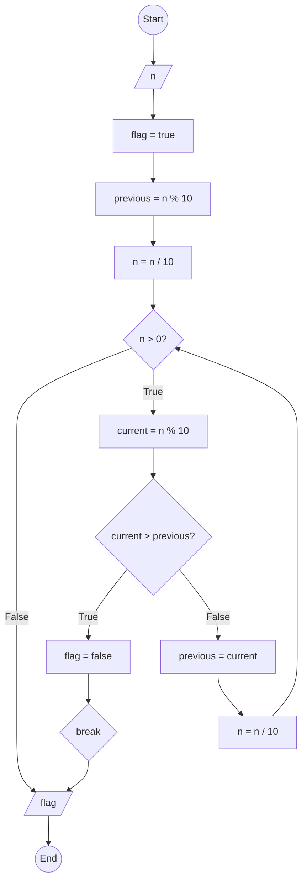

### Bài 60: Kiểm tra các chữ số của số nguyên dương $n$ có tăng dần từ trái sang phải hay không?

---

### **1. Lưu đồ**



---

### **2. Test Case**

- **Đầu vào (Input):** `n = 12345`

- **Kết quả mong đợi (Expected Result):** `true`


**Mô phỏng (Simulation):**

```python
n = 12345
flag = true
previous = n % 10 = 12345 % 10 = 5
n = n / 10 = 12345 / 10 = 1234
n = 1234 > 0 True:
	current = n % 10 = 1234 % 10 = 4
	Điều kiện current > previous (4 > 5) là **False**
	previous = current = 4
	n = n / 10 = 1234 / 10 = 123
n = 123 > 0 True:
	current = n % 10 = 123 % 10 = 3
	Điều kiện current > previous (3 > 4) là **False**
	previous = current = 3
	n = n / 10 = 123 / 10 = 12
n = 12 > 0 True:
	current = n % 10 = 12 % 10 = 2
	Điều kiện current > previous (2 > 3) là **False**
	previous = current = 2
	n = n / 10 = 12 / 10 = 1
n = 1 > 0 True:
	current = n % 10 = 1 % 10 = 1
	Điều kiện current > previous (1 > 2) là **False**
	previous = current = 1
	n = n / 10 = 1 / 10 = 0
n = 0 > 0 False:
Xuất flag = true
Kết thúc.
```

**Test Case 2:**

- **Đầu vào (Input):** `n = 12354`

- **Kết quả mong đợi (Expected Result):** `false`

**Mô phỏng (Simulation):**

```python
n = 12354
flag = true
previous = n % 10 = 12354 % 10 = 4
n = n / 10 = 12354 / 10 = 1235
n = 1235 > 0 True:
	current = n % 10 = 1235 % 10 = 5
	Điều kiện current > previous (5 > 4) là **True**
		flag = false
		Break
Xuất flag = false
Kết thúc.
```

---

### **3. Code**

#### **Python**

```python
def is_increasing_digits(n):
    # Khởi tạo cờ kiểm tra
    flag = True
    # Lấy chữ số cuối làm chữ số trước
    previous = n % 10
    n = n // 10

    # Kiểm tra từng chữ số từ phải sang trái
    while n > 0:
        current = n % 10  # Lấy chữ số cuối hiện tại
        if current > previous:  # Nếu không tăng dần
            flag = False
            break  # Thoát vòng lặp ngay lập tức
        previous = current  # Cập nhật chữ số trước
        n = n // 10  # Chia lấy phần nguyên để loại bỏ chữ số cuối

    return flag

# Chương trình chính
n = int(input("Nhập vào số nguyên dương n: "))
if n < 0:
    print("Vui lòng nhập số nguyên dương")
else:
    result = is_increasing_digits(n)
    if result:
        print(f"Các chữ số của {n} tăng dần từ trái sang phải")
    else:
        print(f"Các chữ số của {n} không tăng dần từ trái sang phải")
```

#### **JavaScript**

```javascript
function isIncreasingDigits(n) {
    // Khởi tạo cờ kiểm tra
    let flag = true;
    // Lấy chữ số cuối làm chữ số trước
    let previous = n % 10;
    n = Math.floor(n / 10);

    // Kiểm tra từng chữ số từ phải sang trái
    while (n > 0) {
        let current = n % 10;  // Lấy chữ số cuối hiện tại
        if (current > previous) {  // Nếu không tăng dần
            flag = false;
            break;  // Thoát vòng lặp ngay lập tức
        }
        previous = current;  // Cập nhật chữ số trước
        n = Math.floor(n / 10);  // Chia lấy phần nguyên để loại bỏ chữ số cuối
    }

    return flag;
}

// Chương trình chính
let n = parseInt(prompt("Nhập vào số nguyên dương n:"));
if (n < 0) {
    alert("Vui lòng nhập số nguyên dương");
} else {
    let result = isIncreasingDigits(n);
    if (result) {
        console.log(`Các chữ số của ${n} tăng dần từ trái sang phải`);
        alert(`Các chữ số của ${n} tăng dần từ trái sang phải`);
    } else {
        console.log(`Các chữ số của ${n} không tăng dần từ trái sang phải`);
        alert(`Các chữ số của ${n} không tăng dần từ trái sang phải`);
    }
}
```