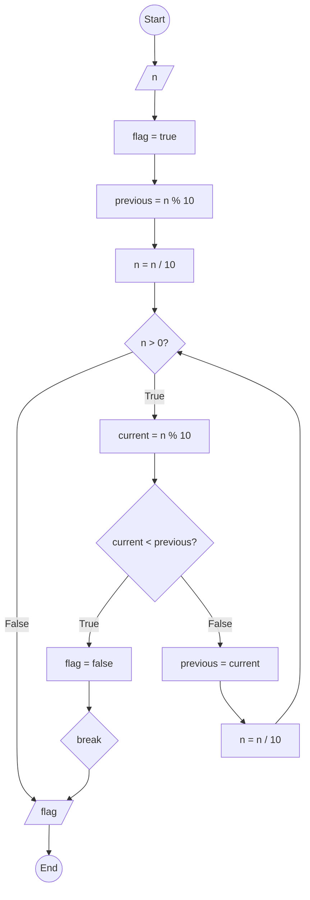

### Bài 61: Hãy kiểm tra các chữ số của số nguyên dương $n$ có giảm dần từ trái sang phải hay không?

---

### **1. Lưu đồ**



---

### **2. Test Case**

- **Đầu vào (Input):** `n = 54321`

- **Kết quả mong đợi (Expected Result):** `true`


**Mô phỏng (Simulation):**
```python
n = 54321
flag = true
previous = n % 10 = 54321 % 10 = 1
n = n / 10 = 54321 / 10 = 5432
n = 5432 > 0 True:
	current = n % 10 = 5432 % 10 = 2
	Điều kiện current < previous (2 < 1) là **False**
	previous = current = 2
	n = n / 10 = 5432 / 10 = 543
n = 543 > 0 True:
	current = n % 10 = 543 % 10 = 3
	Điều kiện current < previous (3 < 2) là **False**
	previous = current = 3
	n = n / 10 = 543 / 10 = 54
n = 54 > 0 True:
	current = n % 10 = 54 % 10 = 4
	Điều kiện current < previous (4 < 3) là **False**
	previous = current = 4
	n = n / 10 = 54 / 10 = 5
n = 5 > 0 True:
	current = n % 10 = 5 % 10 = 5
	Điều kiện current < previous (5 < 4) là **False**
	previous = current = 5
	n = n / 10 = 5 / 10 = 0
n = 0 > 0 False:
Xuất flag = true
Kết thúc.
```

**Test Case 2:**

- **Đầu vào (Input):** `n = 54123`

- **Kết quả mong đợi (Expected Result):** `false`

**Mô phỏng (Simulation):**

```python
n = 54123
flag = true
previous = n % 10 = 54123 % 10 = 3
n = n / 10 = 54123 / 10 = 5412
n = 5412 > 0 True:
	current = n % 10 = 5412 % 10 = 2
	Điều kiện current < previous (2 < 3) là **True**
		flag = false
		Break
Xuất flag = false
Kết thúc.
```
---

### **3. Code**

#### **Python**

```python
def is_decreasing_digits(n):
    # Khởi tạo cờ kiểm tra
    flag = True
    # Lấy chữ số cuối làm chữ số trước
    previous = n % 10
    n = n // 10

    # Kiểm tra từng chữ số từ phải sang trái
    while n > 0:
        current = n % 10  # Lấy chữ số cuối hiện tại
        if current < previous:  # Nếu không giảm dần
            flag = False
            break  # Thoát vòng lặp ngay lập tức
        previous = current  # Cập nhật chữ số trước
        n = n // 10  # Chia lấy phần nguyên để loại bỏ chữ số cuối

    return flag

# Chương trình chính
n = int(input("Nhập vào số nguyên dương n: "))
if n < 0:
    print("Vui lòng nhập số nguyên dương")
else:
    result = is_decreasing_digits(n)
    if result:
        print(f"Các chữ số của {n} giảm dần từ trái sang phải")
    else:
        print(f"Các chữ số của {n} không giảm dần từ trái sang phải")
```

#### **JavaScript**

```javascript
function isDecreasingDigits(n) {
    // Khởi tạo cờ kiểm tra
    let flag = true;
    // Lấy chữ số cuối làm chữ số trước
    let previous = n % 10;
    n = Math.floor(n / 10);

    // Kiểm tra từng chữ số từ phải sang trái
    while (n > 0) {
        let current = n % 10;  // Lấy chữ số cuối hiện tại
        if (current < previous) {  // Nếu không giảm dần
            flag = false;
            break;  // Thoát vòng lặp ngay lập tức
        }
        previous = current;  // Cập nhật chữ số trước
        n = Math.floor(n / 10);  // Chia lấy phần nguyên để loại bỏ chữ số cuối
    }

    return flag;
}

// Chương trình chính
let n = parseInt(prompt("Nhập vào số nguyên dương n:"));
if (n < 0) {
    alert("Vui lòng nhập số nguyên dương");
} else {
    let result = isDecreasingDigits(n);
    if (result) {
        console.log(`Các chữ số của ${n} giảm dần từ trái sang phải`);
        alert(`Các chữ số của ${n} giảm dần từ trái sang phải`);
    } else {
        console.log(`Các chữ số của ${n} không giảm dần từ trái sang phải`);
        alert(`Các chữ số của ${n} không giảm dần từ trái sang phải`);
    }
}
```
