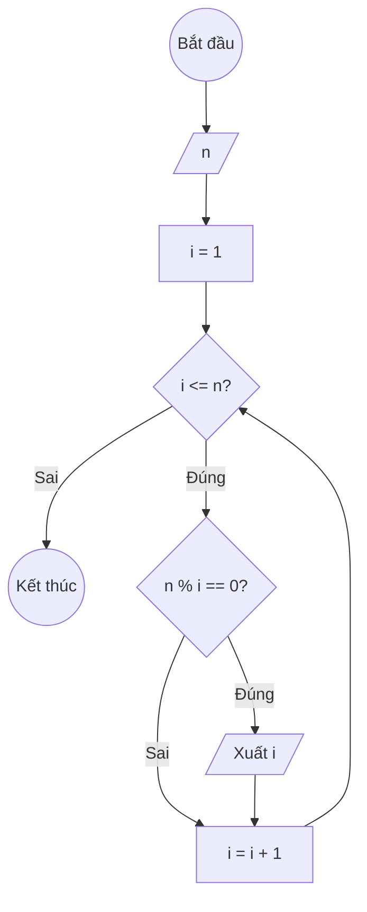

### Bài 20: Liệt kê tất cả "ước số" của số nguyên dương n

---

### **1. Lưu đồ**



---

### **2. Test Case**

- **Đầu vào (Input):** `n = 12`

- **Kết quả mong đợi (Expected Result):** `Các ước số của 12 là: 1, 2, 3, 4, 6, 12`


**Mô phỏng (Simulation):**

`n = 12`
`i = 1`
Điều kiện `i <= n` (1 <= 12) là **Đúng**
    Điều kiện `n % i == 0` (12 % 1 == 0) là **Đúng**
        Xuất `i = 1`
    `i = i + 1 = 1 + 1 = 2`
Điều kiện `i <= n` (2 <= 12) là **Đúng**
    Điều kiện `n % i == 0` (12 % 2 == 0) là **Đúng**
        Xuất `i = 2`
    `i = i + 1 = 2 + 1 = 3`
Điều kiện `i <= n` (3 <= 12) là **Đúng**
    Điều kiện `n % i == 0` (12 % 3 == 0) là **Đúng**
        Xuất `i = 3`
    `i = i + 1 = 3 + 1 = 4`
Điều kiện `i <= n` (4 <= 12) là **Đúng**
    Điều kiện `n % i == 0` (12 % 4 == 0) là **Đúng**
        Xuất `i = 4`
    `i = i + 1 = 4 + 1 = 5`
Điều kiện `i <= n` (5 <= 12) là **Đúng**
    Điều kiện `n % i == 0` (12 % 5 == 0) là **Sai**
    `i = i + 1 = 5 + 1 = 6`
Điều kiện `i <= n` (6 <= 12) là **Đúng**
    Điều kiện `n % i == 0` (12 % 6 == 0) là **Đúng**
        Xuất `i = 6`
    `i = i + 1 = 6 + 1 = 7`
Điều kiện `i <= n` (7 <= 12) là **Đúng**
    Điều kiện `n % i == 0` (12 % 7 == 0) là **Sai**
    `i = i + 1 = 7 + 1 = 8`
...tương tự cho i = 8, 9, 10, 11 (đều không chia hết)...
Điều kiện `i <= n` (12 <= 12) là **Đúng**
    Điều kiện `n % i == 0` (12 % 12 == 0) là **Đúng**
        Xuất `i = 12`
    `i = i + 1 = 12 + 1 = 13`
Điều kiện `i <= n` (13 <= 12) là **Sai**
Kết thúc.

---

### **3. Code**

#### **Python**

```python
def liet_ke_uoc_so(n):
    # Khởi tạo biến đếm i bắt đầu từ 1
    i = 1
    # Vòng lặp while sẽ chạy khi i còn nhỏ hơn hoặc bằng n
    while i <= n:
        # Kiểm tra nếu i là ước số của n
        if n % i == 0:
            # Thêm i vào danh sách ước số
            print(i)
        # Tăng biến đếm i lên 1 đơn vị
        i = i + 1

# Chương trình chính
n = int(input("Nhập vào số nguyên dương n: "))
print(f"Các ước số của {n} là:")
liet_ke_uoc_so(n)
```

#### **JavaScript**

```javascript
function lietKeUocSo(n) { 
    // Khởi tạo biến đếm i bắt đầu từ 1
    let i = 1;
    // Vòng lặp while sẽ chạy khi i còn nhỏ hơn hoặc bằng n
    while (i <= n) {
        // Kiểm tra nếu i là ước số của n
        if (n % i === 0) {
            // Thêm i vào mảng ước số
            console.log(i);
        }
        // Tăng biến đếm i lên 1 đơn vị
        i = i + 1;
    }
}

// Chương trình chính
let n = parseInt(prompt("Nhập vào số nguyên dương n:"));
console.log(`Các ước số của ${n} là:`);
lietKeUocSo(n);
```