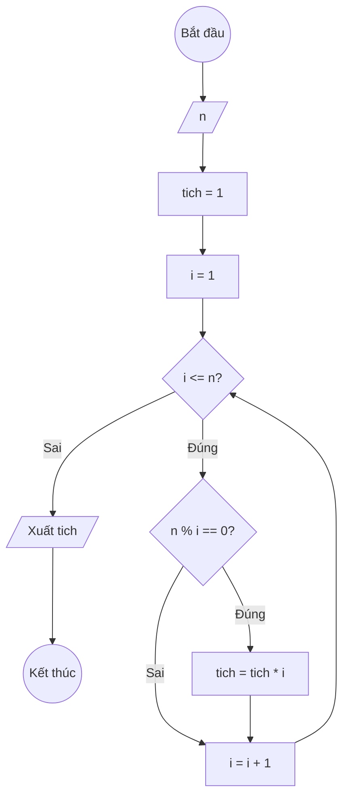

### Bài 22: Tính tích tất cả "ước số" của số nguyên dương $n$

---

### **1. Lưu đồ**



---

### **2. Test Case**

- **Đầu vào (Input):** `n = 6`

- **Kết quả mong đợi (Expected Result):** `Tích các ước số của 6 là: 1 × 2 × 3 × 6 = 36`


**Mô phỏng (Simulation):**

`n = 6`
`tich = 1`
`i = 1`
Điều kiện `i <= n` (1 <= 6) là **Đúng**
    Điều kiện `n % i == 0` (6 % 1 == 0) là **Đúng**
        `tich = tich * i = 1 * 1 = 1`
    `i = i + 1 = 1 + 1 = 2`
Điều kiện `i <= n` (2 <= 6) là **Đúng**
    Điều kiện `n % i == 0` (6 % 2 == 0) là **Đúng**
        `tich = tich * i = 1 * 2 = 2`
    `i = i + 1 = 2 + 1 = 3`
Điều kiện `i <= n` (3 <= 6) là **Đúng**
    Điều kiện `n % i == 0` (6 % 3 == 0) là **Đúng**
        `tich = tich * i = 2 * 3 = 6`
    `i = i + 1 = 3 + 1 = 4`
Điều kiện `i <= n` (4 <= 6) là **Đúng**
    Điều kiện `n % i == 0` (6 % 4 == 0) là **Sai**
    `i = i + 1 = 4 + 1 = 5`
Điều kiện `i <= n` (5 <= 6) là **Đúng**
    Điều kiện `n % i == 0` (6 % 5 == 0) là **Sai**
    `i = i + 1 = 5 + 1 = 6`
Điều kiện `i <= n` (6 <= 6) là **Đúng**
    Điều kiện `n % i == 0` (6 % 6 == 0) là **Đúng**
        `tich = tich * i = 6 * 6 = 36`
    `i = i + 1 = 6 + 1 = 7`
Điều kiện `i <= n` (7 <= 6) là **Sai**
Xuất `tich = 36`.

---

### **3. Code**

#### **Python**

```python
def tich_uoc_so(n):
    # Khởi tạo tích ban đầu bằng 1
    tich = 1
    # Khởi tạo biến đếm i bắt đầu từ 1
    i = 1
    # Vòng lặp while sẽ chạy khi i còn nhỏ hơn hoặc bằng n
    while i <= n:
        # Kiểm tra nếu i là ước số của n
        if n % i == 0:
            # Nhân dồn i vào tích
            tich = tich * i
        # Tăng biến đếm i lên 1 đơn vị
        i = i + 1
    return tich

# Chương trình chính
n = int(input("Nhập vào số nguyên dương n: "))
ket_qua = tich_uoc_so(n)
print(f"Tích các ước số của {n} là: {ket_qua}")
```

#### **JavaScript**

```javascript
function tichUocSo(n) {
    // Khởi tạo tích ban đầu bằng 1
    let tich = 1;
    // Khởi tạo biến đếm i bắt đầu từ 1
    let i = 1;
    // Vòng lặp while sẽ chạy khi i còn nhỏ hơn hoặc bằng n
    while (i <= n) {
        // Kiểm tra nếu i là ước số của n
        if (n % i === 0) {
            // Nhân dồn i vào tích
            tich = tich * i;
        }
        // Tăng biến đếm i lên 1 đơn vị
        i = i + 1;
    }
    return tich;
}

// Chương trình chính
let n = parseInt(prompt("Nhập vào số nguyên dương n:"));
let ketQua = tichUocSo(n);
console.log(`Tích các ước số của ${n} là: ${ketQua}`);
alert(`Tích các ước số của ${n} là: ${ketQua}`);
```