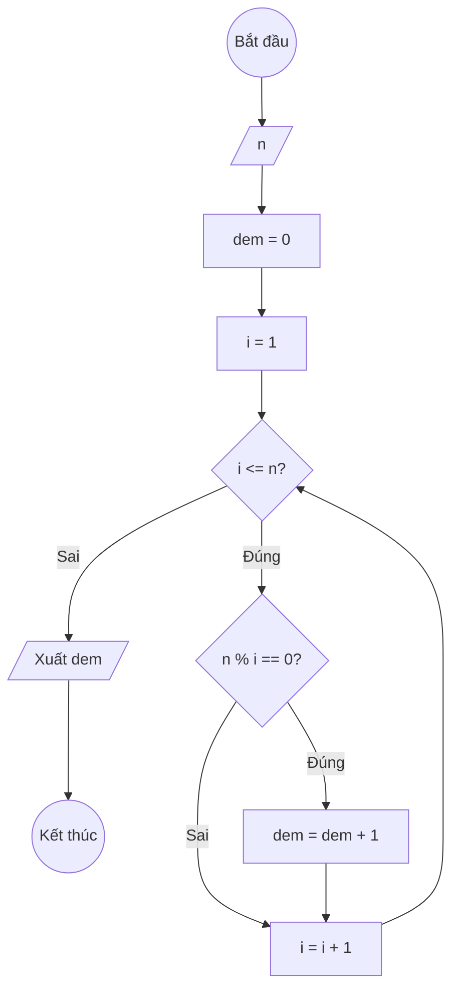

### Bài 23: Đếm số lượng "ước số" của số nguyên dương $n$

---

### **1. Lưu đồ**



---

### **2. Test Case**

- **Đầu vào (Input):** `n = 12`

- **Kết quả mong đợi (Expected Result):** `Số lượng ước số của 12 là: 6 bao gồm (1,2,3,4,6,12)`


**Mô phỏng (Simulation):**

`n = 12`
`dem = 0`
`i = 1`
Điều kiện `i <= n` (1 <= 12) là **Đúng**
    Điều kiện `n % i == 0` (12 % 1 == 0) là **Đúng**
        `dem = dem + 1 = 0 + 1 = 1`
    `i = i + 1 = 1 + 1 = 2`
Điều kiện `i <= n` (2 <= 12) là **Đúng**
    Điều kiện `n % i == 0` (12 % 2 == 0) là **Đúng**
        `dem = dem + 1 = 1 + 1 = 2`
    `i = i + 1 = 2 + 1 = 3`
...tương tự cho các ước số 3, 4, 6, 12...
Điều kiện `i <= n` (13 <= 12) là **Sai**
Xuất `dem = 6`.

---

### **3. Code**

#### **Python**

```python
def dem_uoc_so(n):
    # Khởi tạo biến đếm ban đầu bằng 0
    dem = 0
    # Khởi tạo biến đếm i bắt đầu từ 1
    i = 1
    # Vòng lặp while sẽ chạy khi i còn nhỏ hơn hoặc bằng n
    while i <= n:
        # Kiểm tra nếu i là ước số của n
        if n % i == 0:
            # Tăng biến đếm lên 1
            dem = dem + 1
        # Tăng biến đếm i lên 1 đơn vị
        i = i + 1
    return dem

# Chương trình chính
n = int(input("Nhập vào số nguyên dương n: "))
ket_qua = dem_uoc_so(n)
print(f"Số lượng ước số của {n} là: {ket_qua}")
```

#### **JavaScript**

```javascript
function demUocSo(n) {
    // Khởi tạo biến đếm ban đầu bằng 0
    let dem = 0;
    // Khởi tạo biến đếm i bắt đầu từ 1
    let i = 1;
    // Vòng lặp while sẽ chạy khi i còn nhỏ hơn hoặc bằng n
    while (i <= n) {
        // Kiểm tra nếu i là ước số của n
        if (n % i === 0) {
            // Tăng biến đếm lên 1
            dem = dem + 1;
        }
        // Tăng biến đếm i lên 1 đơn vị
        i = i + 1;
    }
    return dem;
}

// Chương trình chính
let n = parseInt(prompt("Nhập vào số nguyên dương n:"));
let ketQua = demUocSo(n);
console.log(`Số lượng ước số của ${n} là: ${ketQua}`);
alert(`Số lượng ước số của ${n} là: ${ketQua}`);
```