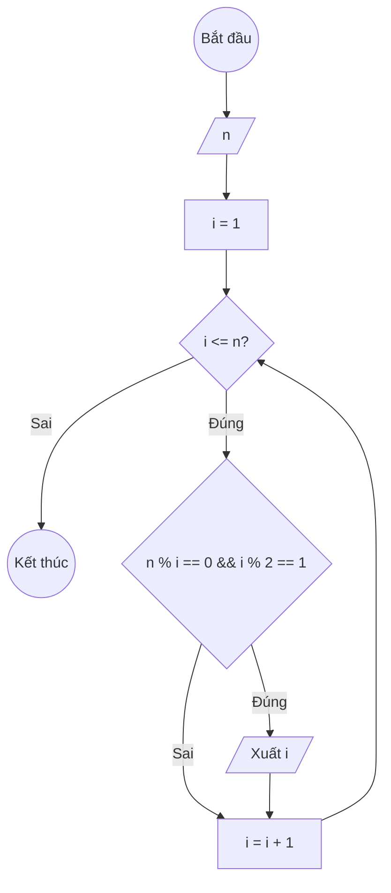

### Bài 24: Liệt kê tất cả "ước số lẻ" của số nguyên dương $n$

---

### **1. Lưu đồ**



---

### **2. Test Case**

- **Đầu vào (Input):** `n = 12`

- **Kết quả mong đợi (Expected Result):** `Các ước số lẻ của 12 là: 1, 3`


**Mô phỏng (Simulation):**

`n = 12`
`i = 1`
Điều kiện `i <= n` (1 <= 12) là **Đúng**
    Điều kiện `n % i == 0 && i % 2 == 1` (12 % 1 == 0 Đ &&  1 % 2 == 1 Đ) là **Đúng**
		Xuất `i = 1`
    `i = i + 1 = 1 + 1 = 2`
Điều kiện `i <= n` (2 <= 12) là **Đúng**
    Điều kiện `n % i == 0 && i % 2 == 1` (12 % 2 == 0 Đ &&  2 % 2 == 1 S) là **Sai**
    `i = i + 1 = 2 + 1 = 3`
Điều kiện `i <= n` (3 <= 12) là **Đúng**
    Điều kiện `n % i == 0 && i % 2 == 1` (12 % 3 == 0 Đ &&  3 % 2 == 1 Đ) là **Đúng**
		Xuất `i = 3`
    `i = i + 1 = 3 + 1 = 4`
...tiếp tục cho đến i = 13...
Kết thúc.

---

### **3. Code**

#### **Python**

```python
def liet_ke_uoc_so_le(n):
    # Khởi tạo biến đếm i bắt đầu từ 1
    i = 1
    # Vòng lặp while sẽ chạy khi i còn nhỏ hơn hoặc bằng n
    while i <= n:
        # Kiểm tra nếu i là ước số của n && i là số lẻ
        if n % i == 0 and i % 2 == 1:
		   print(i)
        # Tăng biến đếm i lên 1 đơn vị
        i = i + 1

# Chương trình chính
n = int(input("Nhập vào số nguyên dương n: "))
print(f"Các ước số lẻ của {n} là:")
liet_ke_uoc_so_le(n)

```

#### **JavaScript**

```javascript
function lietKeUocSoLe(n) {
    // Khởi tạo biến đếm i bắt đầu từ 1
    let i = 1;
    // Vòng lặp while sẽ chạy khi i còn nhỏ hơn hoặc bằng n
    while (i <= n) {
        // Kiểm tra nếu i là ước số của n và i là số lẻ
        if (n % i === 0 && i % 2 === 1) {
            console.log(i)
        }
        // Tăng biến đếm i lên 1 đơn vị
        i = i + 1;
    }
}

// Chương trình chính
let n = parseInt(prompt("Nhập vào số nguyên dương n:"));
console.log(`Các ước số lẻ của ${n} là: `);
lietKeUocSoLe(n);
```