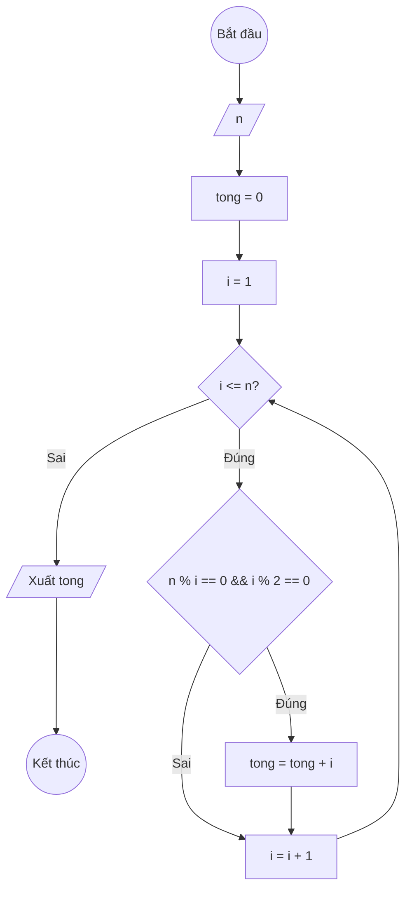

### Bài 25: Tính tổng tất cả "ước số chẵn" của số nguyên dương $n$

---

### **1. Lưu đồ**



---

### **2. Test Case**

- **Đầu vào (Input):** `n = 12`

- **Kết quả mong đợi (Expected Result):** `Tổng các ước số chẵn của 12 là: 2 + 4 + 6 + 12 = 24`


**Mô phỏng (Simulation):**

`n = 12`
`tong = 0`
`i = 1`
Điều kiện `i <= n` (1 <= 12) là **Đúng**
    Điều kiện `n % i == 0 && i % 2 == 0` (12 % 1 == 0 Đ && 1 % 2 == 0 S) là **Sai**
    `i = i + 1 = 1 + 1 = 2`
Điều kiện `i <= n` (2 <= 12) là **Đúng**
    Điều kiện `n % i == 0 && i % 2 == 0` (12 % 2 == 0 Đ && 2 % 2 == 0 Đ) là **Đúng**
		`tong = tong + i = 0 + 2 = 2`
    `i = i + 1 = 2 + 1 = 3`
...tiếp tục cho đến khi tìm được tất cả ước số chẵn: 2, 4, 6, 12...
Xuất `tong = 24`.

---

### **3. Code**

#### **Python**

```python
def tong_uoc_so_chan(n):
    # Khởi tạo tổng ban đầu bằng 0
    tong = 0
    # Khởi tạo biến đếm i bắt đầu từ 1
    i = 1
    # Vòng lặp while sẽ chạy khi i còn nhỏ hơn hoặc bằng n
    while i <= n:
        # Kiểm tra nếu i là ước số của n & i là số chẵn
        if n % i == 0 and i % 2 == 0:
			# Cộng dồn i vào tổng
			tong = tong + i
        # Tăng biến đếm i lên 1 đơn vị
        i = i + 1
    return tong

# Chương trình chính
n = int(input("Nhập vào số nguyên dương n: "))
ket_qua = tong_uoc_so_chan(n)
print(f"Tổng các ước số chẵn của {n} là: {ket_qua}")
```

#### **JavaScript**

```javascript
function tongUocSoChan(n) {
    // Khởi tạo tổng ban đầu bằng 0
    let tong = 0;
    // Khởi tạo biến đếm i bắt đầu từ 1
    let i = 1;
    // Vòng lặp while sẽ chạy khi i còn nhỏ hơn hoặc bằng n
    while (i <= n) {
        // Kiểm tra nếu i là ước số của n và i là số chẵn
        if (n % i === 0 && i % 2 === 0) {
			// Cộng dồn i vào tổng
			tong = tong + i;
        }
        // Tăng biến đếm i lên 1 đơn vị
        i = i + 1;
    }
    return tong;
}

// Chương trình chính
let n = parseInt(prompt("Nhập vào số nguyên dương n:"));
let ketQua = tongUocSoChan(n);
console.log(`Tổng các ước số chẵn của ${n} là: ${ketQua}`);
alert(`Tổng các ước số chẵn của ${n} là: ${ketQua}`);
```