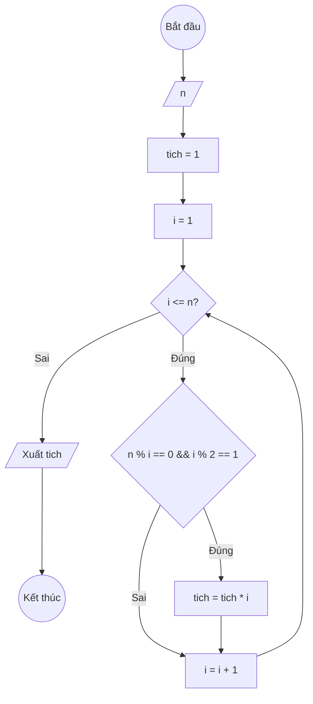

### Bài 26: Tính tích tất cả "ước số lẻ" của số nguyên dương $n$

---

### **1. Lưu đồ**



---

### **2. Test Case**
- **Đầu vào (Input):** `n = 15`

- **Kết quả mong đợi (Expected Result):** `Tích các ước số lẻ của 15 là: 1 × 3 × 5 × 15 = 225`


**Mô phỏng (Simulation):**

`n = 15`
`tich = 1`
`i = 1`
Điều kiện `i <= n` (1 <= 15) là **Đúng**
    Điều kiện `n % i == 0 && i % 2 == 1` (15 % 1 == 0 Đ && 1 % 2 == 1 Đ) là **Đúng**
		`tich = tich * i = 1 * 1 = 1`
    `i = i + 1 = 1 + 1 = 2`
...tiếp tục cho đến khi tìm được tất cả ước số lẻ: 1, 3, 5, 15...
Xuất `tich = 225`.

---

### **3. Code**

#### **Python**

```python
def tich_uoc_so_le(n):
    # Khởi tạo tích ban đầu bằng 1
    tich = 1
    # Khởi tạo biến đếm i bắt đầu từ 1
    i = 1
    # Vòng lặp while sẽ chạy khi i còn nhỏ hơn hoặc bằng n
    while i <= n:
        # Kiểm tra nếu i là ước số của n và i là số lẻ
        if n % i == 0 && i % 2 == 1:
			# Nhân dồn i vào tích
			tich = tich * i
        # Tăng biến đếm i lên 1 đơn vị
        i = i + 1
    return tich

# Chương trình chính
n = int(input("Nhập vào số nguyên dương n: "))
ket_qua = tich_uoc_so_le(n)
print(f"Tích các ước số lẻ của {n} là: {ket_qua}")
```

#### **JavaScript**

```javascript
function tichUocSoLe(n) {
    // Khởi tạo tích ban đầu bằng 1
    let tich = 1;
    // Khởi tạo biến đếm i bắt đầu từ 1
    let i = 1;
    // Vòng lặp while sẽ chạy khi i còn nhỏ hơn hoặc bằng n
    while (i <= n) {
        // Kiểm tra nếu i là ước số của n và  i là số lẻ
        if (n % i === 0 && i % 2 === 1) {
			// Nhân dồn i vào tích
			tich = tich * i;
        }
        // Tăng biến đếm i lên 1 đơn vị
        i = i + 1;
    }
    return tich;
}

// Chương trình chính
let n = parseInt(prompt("Nhập vào số nguyên dương n:"));
let ketQua = tichUocSoLe(n);
console.log(`Tích các ước số lẻ của ${n} là: ${ketQua}`);
alert(`Tích các ước số lẻ của ${n} là: ${ketQua}`);
```