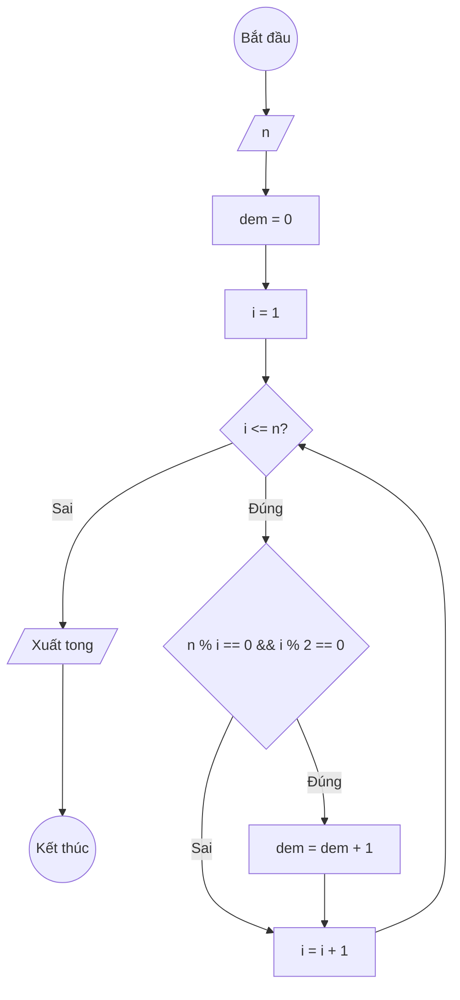

### Bài 27: Đếm số lượng "ước số chẵn" của số nguyên dương $n$

---

### **1. Lưu đồ**



---

### **2. Test Case**

- **Đầu vào (Input):** `n = 12`

- **Kết quả mong đợi (Expected Result):** `Số lượng các ước số chẵn của 12 là: 4 (2,4,6,12)`


**Mô phỏng (Simulation):**

`n = 12`
`dem = 0`
`i = 1`
Điều kiện `i <= n` (1 <= 12) là **Đúng**
    Điều kiện `n % i == 0 && i % 2 == 0` (12 % 1 == 0 Đ && 1 % 2 == 0 S) là **Sai**
    `i = i + 1 = 1 + 1 = 2`
Điều kiện `i <= n` (2 <= 12) là **Đúng**
    Điều kiện `n % i == 0 && i % 2 == 0` (12 % 2 == 0 Đ && 2 % 2 == 0 Đ) là **Đúng**
		`dem = dem + 1 = 0 + 1 = 1`
    `i = i + 1 = 2 + 1 = 3`
...tiếp tục cho đến khi tìm được tất cả ước số chẵn: 2, 4, 6, 12...
Xuất `dem = 4`.

---

### **3. Code**

#### **Python**

```python
def dem_uoc_so_chan(n):
    # Khởi tạo dem ban đầu bằng 0
    dem = 0
    # Khởi tạo biến đếm i bắt đầu từ 1
    i = 1
    # Vòng lặp while sẽ chạy khi i còn nhỏ hơn hoặc bằng n
    while i <= n:
        # Kiểm tra nếu i là ước số của n & i là số chẵn
        if n % i == 0 and i % 2 == 0:
			# tăng dem
			dem = dem + 1
        # Tăng biến đếm i lên 1 đơn vị
        i = i + 1
    return dem

# Chương trình chính
n = int(input("Nhập vào số nguyên dương n: "))
ket_qua = dem_uoc_so_chan(n)
print(f"Số lượng các ước số chẵn của {n} là: {ket_qua}")
```

#### **JavaScript**

```javascript
function demUocSoChan(n) {
    // Khởi tạo dem ban đầu bằng 0
    let tong = 0;
    // Khởi tạo biến đếm i bắt đầu từ 1
    let i = 1;
    // Vòng lặp while sẽ chạy khi i còn nhỏ hơn hoặc bằng n
    while (i <= n) {
        // Kiểm tra nếu i là ước số của n và i là số chẵn
        if (n % i === 0 && i % 2 === 0) {
			// tăng dem
			dem = dem + 1;
        }
        // Tăng biến đếm i lên 1 đơn vị
        i = i + 1;
    }
    return dem;
}

// Chương trình chính
let n = parseInt(prompt("Nhập vào số nguyên dương n:"));
let ketQua = demUocSoChan(n);
console.log(`Số lượng các ước số chẵn của ${n} là: ${ketQua}`);
alert(`Số lượng các ước số chẵn của ${n} là: ${ketQua}`);
```