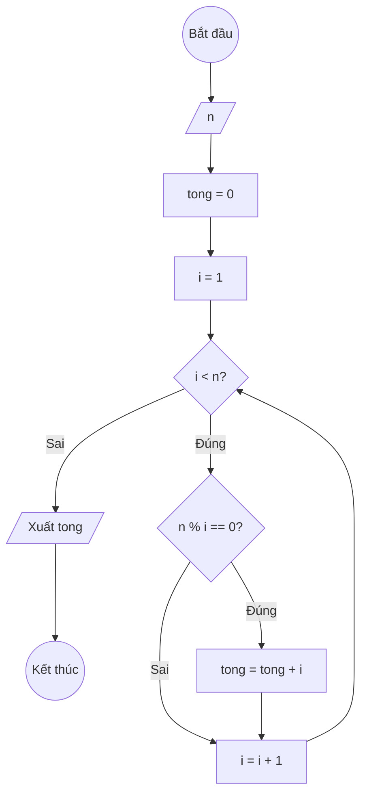

### Bài 28: Cho số nguyên dương $n$. Tính tổng các ước số nhỏ hơn chính nó

---

### **1. Lưu đồ**



---

### **2. Test Case**

- **Đầu vào (Input):** `n = 12`

- **Kết quả mong đợi (Expected Result):** `Tổng các ước số nhỏ hơn 12 là: 1 + 2 + 3 + 4 + 6 = 16`


**Mô phỏng (Simulation):**

`n = 12`
`tong = 0`
`i = 1`
Điều kiện `i < n` (1 < 12) là **Đúng**
    Điều kiện `n % i == 0` (12 % 1 == 0) là **Đúng**
        `tong = tong + i = 0 + 1 = 1`
    `i = i + 1 = 1 + 1 = 2`
Điều kiện `i < n` (2 < 12) là **Đúng**
    Điều kiện `n % i == 0` (12 % 2 == 0) là **Đúng**
        `tong = tong + i = 1 + 2 = 3`
    `i = i + 1 = 2 + 1 = 3`
...tiếp tục cho tất cả các ước số nhỏ hơn 12...
Điều kiện `i < n` (12 < 12) là **Sai**
Xuất `tong = 16`.

---

### **3. Code**

#### **Python**

```python
def tong_uoc_so_nho_hon(n):
    # Khởi tạo tổng ban đầu bằng 0
    tong = 0
    # Khởi tạo biến đếm i bắt đầu từ 1
    i = 1
    # Vòng lặp while sẽ chạy khi i còn nhỏ hơn n (không bằng n)
    while i < n:
        # Kiểm tra nếu i là ước số của n
        if n % i == 0:
            # Cộng dồn i vào tổng
            tong = tong + i
        # Tăng biến đếm i lên 1 đơn vị
        i = i + 1
    return tong

# Chương trình chính
n = int(input("Nhập vào số nguyên dương n: "))
ket_qua = tong_uoc_so_nho_hon(n)
print(f"Tổng các ước số nhỏ hơn {n} là: {ket_qua}")
```

#### **JavaScript**

```javascript
function tongUocSoNhoHon(n) {
    // Khởi tạo tổng ban đầu bằng 0
    let tong = 0;
    // Khởi tạo biến đếm i bắt đầu từ 1
    let i = 1;
    // Vòng lặp while sẽ chạy khi i còn nhỏ hơn n (không bằng n)
    while (i < n) {
        // Kiểm tra nếu i là ước số của n
        if (n % i === 0) {
            // Cộng dồn i vào tổng
            tong = tong + i;
        }
        // Tăng biến đếm i lên 1 đơn vị
        i = i + 1;
    }
    return tong;
}

// Chương trình chính
let n = parseInt(prompt("Nhập vào số nguyên dương n:"));
let ketQua = tongUocSoNhoHon(n);
console.log(`Tổng các ước số nhỏ hơn ${n} là: ${ketQua}`);
alert(`Tổng các ước số nhỏ hơn ${n} là: ${ketQua}`);
```