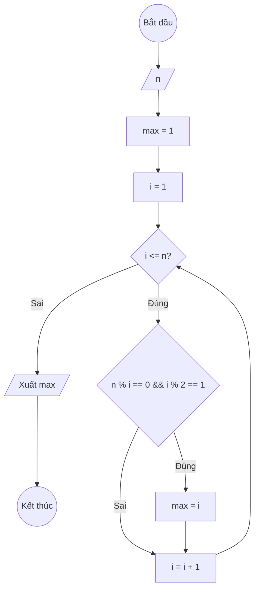

### Bài 29: Tìm ước số lẻ lớn nhất của số nguyên dương $n$. Ví dụ: $n = 100$, ước lẻ lớn nhất của 100 là 25

---

### **1. Lưu đồ**



---

### **2. Test Case**

- **Đầu vào (Input):** `n = 100`

- **Kết quả mong đợi (Expected Result):** `Ước số lẻ lớn nhất của 100 là: 25`


**Mô phỏng (Simulation):**

`n = 100`
`max_le = 0`
`i = 1`
...tìm tất cả ước số lẻ: 1, 5, 25...
Ước số lẻ lớn nhất là 25.
Xuất `max_le = 25`.

---

### **3. Code**

#### **Python**

```python
def tim_uoc_so_le_lon_nhat(n):
    # Khởi tạo ước số lẻ lớn nhất ban đầu bằng 0
    max_le = 0
    # Khởi tạo biến đếm i bắt đầu từ 1
    i = 1
    # Vòng lặp while sẽ chạy khi i còn nhỏ hơn hoặc bằng n
    while i <= n:
        # Kiểm tra nếu i là ước số của n
        if n % i == 0:
            # Kiểm tra nếu i là số lẻ
            if i % 2 == 1:
                # Cập nhật ước số lẻ lớn nhất
                max_le = i
        # Tăng biến đếm i lên 1 đơn vị
        i = i + 1
    return max_le

# Chương trình chính
n = int(input("Nhập vào số nguyên dương n: "))
ket_qua = tim_uoc_so_le_lon_nhat(n)
print(f"Ước số lẻ lớn nhất của {n} là: {ket_qua}")
```

#### **JavaScript**

```javascript
function timUocSoLeLonNhat(n) {
    // Khởi tạo ước số lẻ lớn nhất ban đầu bằng 0
    let maxLe = 0;
    // Khởi tạo biến đếm i bắt đầu từ 1
    let i = 1;
    // Vòng lặp while sẽ chạy khi i còn nhỏ hơn hoặc bằng n
    while (i <= n) {
        // Kiểm tra nếu i là ước số của n
        if (n % i === 0) {
            // Kiểm tra nếu i là số lẻ
            if (i % 2 === 1) {
                // Cập nhật ước số lẻ lớn nhất
                maxLe = i;
            }
        }
        // Tăng biến đếm i lên 1 đơn vị
        i = i + 1;
    }
    return maxLe;
}

// Chương trình chính
let n = parseInt(prompt("Nhập vào số nguyên dương n:"));
let ketQua = timUocSoLeLonNhat(n);
console.log(`Ước số lẻ lớn nhất của ${n} là: ${ketQua}`);
alert(`Ước số lẻ lớn nhất của ${n} là: ${ketQua}`);
```