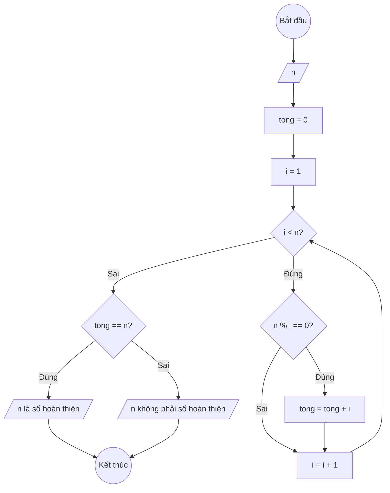

### Bài 30: Cho số nguyên dương $n$. Kiểm tra số dương $n$ có phải là số hoàn thiện hay không?

---

### **1. Lưu đồ**



---

### **2. Test Case**

- **Đầu vào (Input):** `n = 6`

- **Kết quả mong đợi (Expected Result):** `6 là số hoàn thiện (vì 1 + 2 + 3 = 6)`


**Mô phỏng (Simulation):**

`n = 6`
`tong = 0`
Các ước số nhỏ hơn 6: 1, 2, 3
`tong = 1 + 2 + 3 = 6`
Điều kiện `tong == n` (6 == 6) là **Đúng**
Xuất "6 là số hoàn thiện".

---

### **3. Code**

#### **Python**

```python
def kiem_tra_so_hoan_thien(n):
    # Khởi tạo tổng các ước số nhỏ hơn n
    tong = 0
    # Khởi tạo biến đếm i bắt đầu từ 1
    i = 1
    # Vòng lặp while sẽ chạy khi i còn nhỏ hơn n
    while i < n:
        # Kiểm tra nếu i là ước số của n
        if n % i == 0:
            # Cộng dồn i vào tổng
            tong = tong + i
        # Tăng biến đếm i lên 1 đơn vị
        i = i + 1

    # Kiểm tra nếu tổng các ước số bằng chính n
    if tong == n:
        return True
    else:
        return False

# Chương trình chính
n = int(input("Nhập vào số nguyên dương n: "))
if kiem_tra_so_hoan_thien(n):
    print(f"{n} là số hoàn thiện")
else:
    print(f"{n} không phải là số hoàn thiện")
```

#### **JavaScript**

```javascript
function kiemTraSoHoanThien(n) {
    // Khởi tạo tổng các ước số nhỏ hơn n
    let tong = 0;
    // Khởi tạo biến đếm i bắt đầu từ 1
    let i = 1;
    // Vòng lặp while sẽ chạy khi i còn nhỏ hơn n
    while (i < n) {
        // Kiểm tra nếu i là ước số của n
        if (n % i === 0) {
            // Cộng dồn i vào tổng
            tong = tong + i;
        }
        // Tăng biến đếm i lên 1 đơn vị
        i = i + 1;
    }

    // Kiểm tra nếu tổng các ước số bằng chính n
    if (tong === n) {
        return true;
    } else {
        return false;
    }
}

// Chương trình chính
let n = parseInt(prompt("Nhập vào số nguyên dương n:"));
if (kiemTraSoHoanThien(n)) {
    console.log(`${n} là số hoàn thiện`);
    alert(`${n} là số hoàn thiện`);
} else {
    console.log(`${n} không phải là số hoàn thiện`);
    alert(`${n} không phải là số hoàn thiện`);
}
```