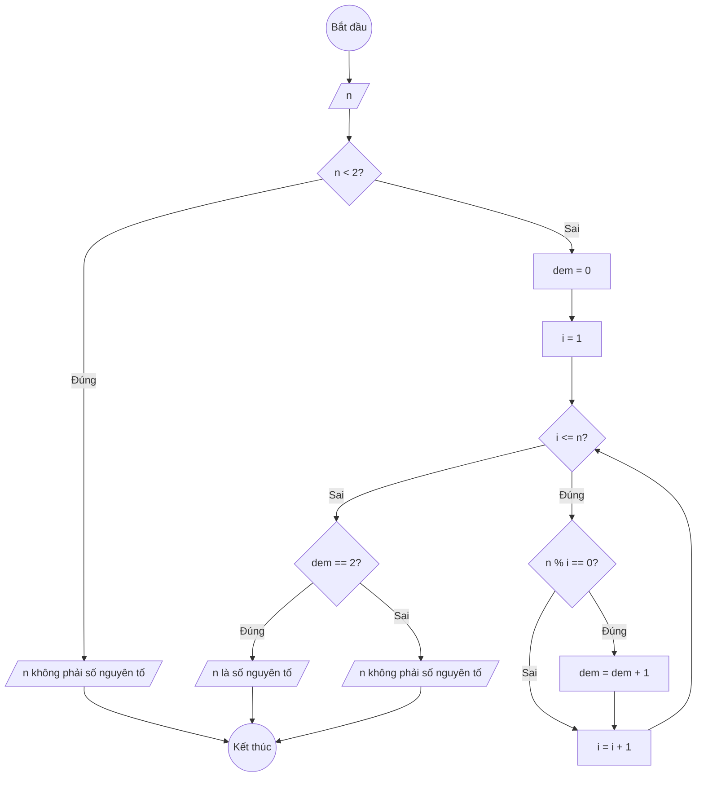

### Bài 31: Cho số nguyên dương $n$. Kiểm tra số nguyên dương $n$ có phải là số nguyên tố hay không?

---

### **1. Lưu đồ**



---

### **2. Test Case**

- **Đầu vào (Input):** `n = 7`

- **Kết quả mong đợi (Expected Result):** `7 là số nguyên tố`


**Mô phỏng (Simulation):**

`n = 7`
Điều kiện `n < 2` (7 < 2) là **Sai**
`dem = 0`
Đếm số ước số của 7: chỉ có 1 và 7
`dem = 2`
Điều kiện `dem == 2` là **Đúng**
Xuất "7 là số nguyên tố".

---

### **3. Code**

#### **Python**

```python
def kiem_tra_so_nguyen_to(n):
    # Số nhỏ hơn 2 không phải số nguyên tố
    if n < 2:
        return False

    # Đếm số lượng ước số
    dem = 0
    i = 1
    while i <= n:
        if n % i == 0:
            dem = dem + 1
        i = i + 1

    # Số nguyên tố chỉ có đúng 2 ước số: 1 và chính nó
    if dem == 2:
        return True
    else:
        return False

# Chương trình chính
n = int(input("Nhập vào số nguyên dương n: "))
if kiem_tra_so_nguyen_to(n):
    print(f"{n} là số nguyên tố")
else:
    print(f"{n} không phải là số nguyên tố")
```

#### **JavaScript**

```javascript
function kiemTraSoNguyenTo(n) {
    // Số nhỏ hơn 2 không phải số nguyên tố
    if (n < 2) {
        return false;
    }

    // Đếm số lượng ước số
    let dem = 0;
    let i = 1;
    while (i <= n) {
        if (n % i === 0) {
            dem = dem + 1;
        }
        i = i + 1;
    }

    // Số nguyên tố chỉ có đúng 2 ước số: 1 và chính nó
    if (dem === 2) {
        return true;
    } else {
        return false;
    }
}

// Chương trình chính
let n = parseInt(prompt("Nhập vào số nguyên dương n:"));
if (kiemTraSoNguyenTo(n)) {
    console.log(`${n} là số nguyên tố`);
    alert(`${n} là số nguyên tố`);
} else {
    console.log(`${n} không phải là số nguyên tố`);
    alert(`${n} không phải là số nguyên tố`);
}
```