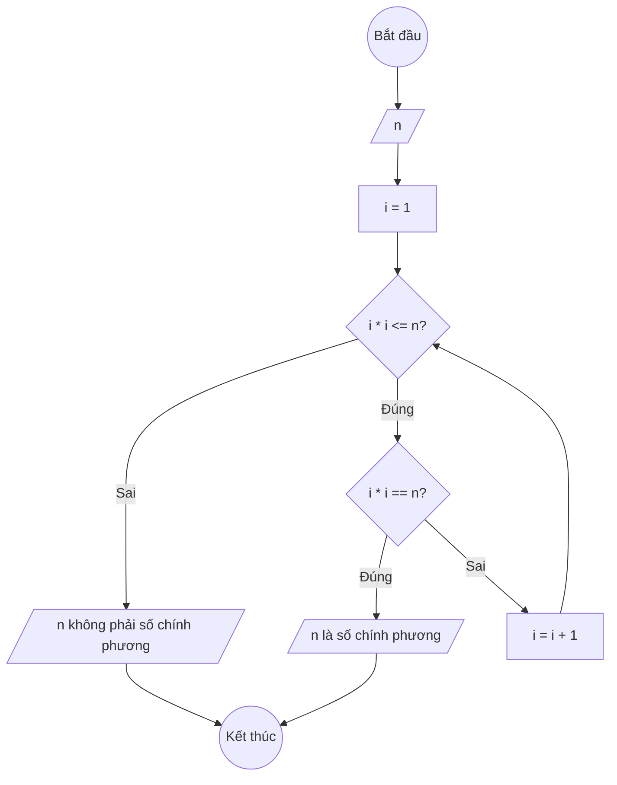

### Bài 32: Cho số nguyên dương $n$. Kiểm tra số nguyên dương $n$ có phải là số chính phương hay không?

---

### **1. Lưu đồ**



---

### **2. Test Case**

- **Đầu vào (Input):** `n = 16`

- **Kết quả mong đợi (Expected Result):** `16 là số chính phương (vì 4² = 16)`


**Mô phỏng (Simulation):**

`n = 16`
`i = 1`
Điều kiện `i * i <= n` (1 * 1 <= 16) là **Đúng**
    Điều kiện `i * i == n` (1 * 1 == 16) là **Sai**
    `i = i + 1 = 2`
...tiếp tục đến i = 4...
Điều kiện `i * i == n` (4 * 4 == 16) là **Đúng**
Xuất "16 là số chính phương".

---

### **3. Code**

#### **Python**

```python
def kiem_tra_so_chinh_phuong(n):
    # Khởi tạo biến đếm i bắt đầu từ 1
    i = 1
    # Vòng lặp while sẽ chạy khi i*i còn nhỏ hơn hoặc bằng n
    while i * i <= n:
        # Kiểm tra nếu i*i bằng n
        if i * i == n:
            return True
        # Tăng biến đếm i lên 1 đơn vị
        i = i + 1
    return False

# Chương trình chính
n = int(input("Nhập vào số nguyên dương n: "))
if kiem_tra_so_chinh_phuong(n):
    print(f"{n} là số chính phương")
else:
    print(f"{n} không phải là số chính phương")
```

#### **JavaScript**

```javascript
function kiemTraSoChinhPhuong(n) {
    // Khởi tạo biến đếm i bắt đầu từ 1
    let i = 1;
    // Vòng lặp while sẽ chạy khi i*i còn nhỏ hơn hoặc bằng n
    while (i * i <= n) {
        // Kiểm tra nếu i*i bằng n
        if (i * i === n) {
            return true;
        }
        // Tăng biến đếm i lên 1 đơn vị
        i = i + 1;
    }
    return false;
}

// Chương trình chính
let n = parseInt(prompt("Nhập vào số nguyên dương n:"));
if (kiemTraSoChinhPhuong(n)) {
    console.log(`${n} là số chính phương`);
    alert(`${n} là số chính phương`);
} else {
    console.log(`${n} không phải là số chính phương`);
    alert(`${n} không phải là số chính phương`);
}
```