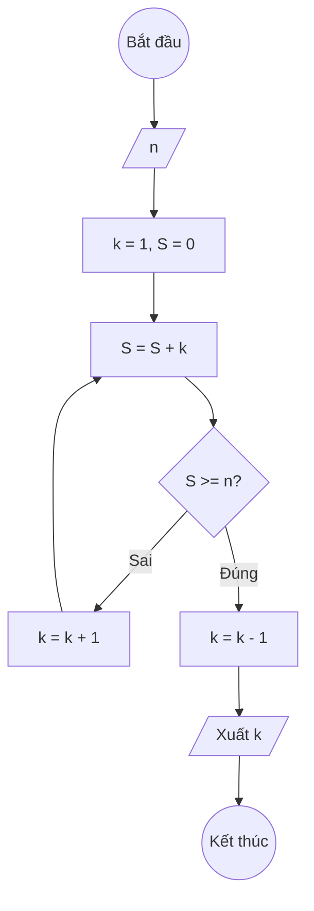

### Bài 42: Cho $n$ là số nguyên dương. Hãy tìm giá trị nguyên dương $k$ lớn nhất sao cho $S(k) < n$. Trong đó chuỗi $S(k)$ được định nghĩa như sau: $S(k) = 1 + 2 + 3 + \ldots + k$

---

### **1. Lưu đồ**



---

### **2. Test Case**

- **Đầu vào (Input):** `n = 10`

- **Kết quả mong đợi (Expected Result):** `k = 3`


**Mô phỏng (Simulation):**

`n = 10`
`k = 1`: `S = 1 < 10` (tiếp tục)
`k = 2`: `S = 1 + 2 = 3 < 10` (tiếp tục)
`k = 3`: `S = 1 + 2 + 3 = 6 < 10` (tiếp tục)
`k = 4`: `S = 1 + 2 + 3 + 4 = 10 >= 10` (dừng)
Kết quả: `k = 3`

---

### **3. Code**

#### **Python**

```python
def tim_k_lon_nhat(n):
    # Khởi tạo k = 1 và tổng S = 0
    k = 1
    S = 0
    # Tìm k lớn nhất sao cho S(k) < n
    while True:
        S = S + k
        if S >= n:
            return k - 1
        k = k + 1

# Chương trình chính
n = int(input("Nhập vào số nguyên dương n: "))
ket_qua = tim_k_lon_nhat(n)
print(f"Giá trị k lớn nhất sao cho S(k) < {n} là: {ket_qua}")

# Kiểm tra kết quả
tong_k = ket_qua * (ket_qua + 1) // 2
tong_k_plus_1 = (ket_qua + 1) * (ket_qua + 2) // 2
print(f"S({ket_qua}) = {tong_k}")
print(f"S({ket_qua + 1}) = {tong_k_plus_1}")
```

#### **JavaScript**

```javascript
function timKLonNhat(n) {
    // Khởi tạo k = 1 và tổng S = 0
    let k = 1;
    let S = 0;
    // Tìm k lớn nhất sao cho S(k) < n
    while (true) {
        S = S + k;
        if (S >= n) {
            return k - 1;
        }
        k = k + 1;
    }
}

// Chương trình chính
let n = parseInt(prompt("Nhập vào số nguyên dương n:"));
let ketQua = timKLonNhat(n);
console.log(`Giá trị k lớn nhất sao cho S(k) < ${n} là: ${ketQua}`);
alert(`Giá trị k lớn nhất sao cho S(k) < ${n} là: ${ketQua}`);

// Kiểm tra kết quả
let tongK = ketQua * (ketQua + 1) / 2;
let tongKPlus1 = (ketQua + 1) * (ketQua + 2) / 2;
console.log(`S(${ketQua}) = ${tongK}`);
console.log(`S(${ketQua + 1}) = ${tongKPlus1}`);
```