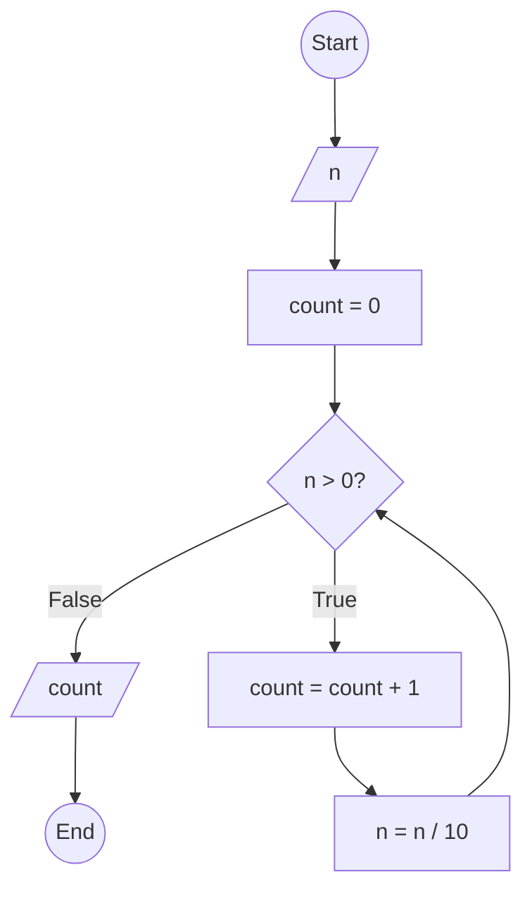

### Exercise 43 | Bài 43: Count the number of digits of a positive integer $n$ | Đếm số lượng chữ số của số nguyên dương $n$

---

### **1. Flowchart | Lưu đồ**



---

### **2. Test Case**

- **Input | Đầu vào:** `n = 12345`

- **Expected Result | Kết quả mong đợi:** `5`


**Simulation | Mô phỏng:**

`n = 12345`
`count = 0`
`n = 12345 > 0` True:
	`count = count + 1 = 0 + 1 = 1`
	`n = n / 10 = 12345 / 10 = 1234`
`n = 1234 > 0` True:
	`count = count + 1 = 1 + 1 = 2`
	`n = n / 10 = 1234 / 10 = 123`
`n = 123 > 0` True:
	`count = count + 1 = 2 + 1 = 3`
	`n = n / 10 = 123 / 10 = 12`
`n = 12 > 0` True:
	`count = count + 1 = 3 + 1 = 4`
	`n = n / 10 = 12 / 10 = 1`
`n = 1 > 0` True:
	`count = count + 1 = 4 + 1 = 5`
	`n = n / 10 = 1 / 10 = 0`
`n = 0 > 0` False:
Output | Xuất `count = 5`
End.

---

### **3. Code**

#### **Python**

```python
def count_digits(n):
    # Initialize counter variable | Khởi tạo biến đếm
    count = 0
    # Count the number of digits | Đếm số chữ số
    while n > 0:
        count = count + 1  # Increment counter | Tăng biến đếm
        n = n // 10  # Integer division to remove last digit | Chia lấy phần nguyên để loại bỏ chữ số cuối
    return count

# Main program | Chương trình chính
n = int(input("Enter a positive integer n | Nhập vào số nguyên dương n: "))
if n < 0:
    print("Please enter a positive integer | Vui lòng nhập số nguyên dương")
else:
    result = count_digits(n)
    print(f"The number of digits in {n} is | Số lượng chữ số của {n} là: {result}")
```

#### **JavaScript**

```javascript
function countDigits(n) {
    // Initialize counter variable | Khởi tạo biến đếm
    let count = 0;
    // Count the number of digits | Đếm số chữ số
    while (n > 0) {
        count = count + 1;  // Increment counter | Tăng biến đếm
        n = Math.floor(n / 10);  // Integer division to remove last digit | Chia lấy phần nguyên để loại bỏ chữ số cuối
    }
    return count;
}

// Main program | Chương trình chính
let n = parseInt(prompt("Enter a positive integer n | Nhập vào số nguyên dương n:"));
if (n < 0) {
    alert("Please enter a positive integer | Vui lòng nhập số nguyên dương");
} else {
    let result = countDigits(n);
    console.log(`The number of digits in ${n} is | Số lượng chữ số của ${n} là: ${result}`);
    alert(`The number of digits in ${n} is | Số lượng chữ số của ${n} là: ${result}`);
}
```
