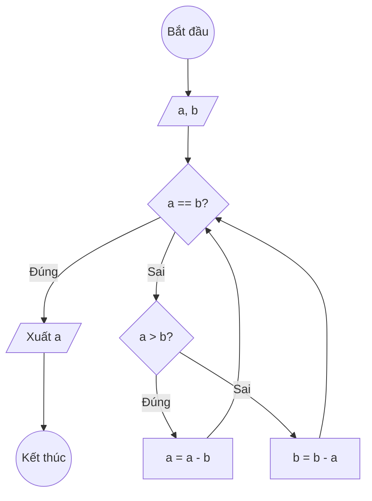

### Bài 62: Cho hai số nguyên dương $a$ và $b$. Hãy vẽ lưu đồ tìm ước chung lớn nhất của hai giá trị này

---

### **1. Lưu đồ**



---

### **2. Test Case**

- **Đầu vào (Input):** `a = 48, b = 18`

- **Kết quả mong đợi (Expected Result):** `GCD = 6`

- **Đầu vào (Input):** `a = 15, b = 25`

- **Kết quả mong đợi (Expected Result):** `GCD = 5`


**Mô phỏng (Simulation):**

`a = 48, b = 18`
`a == b` (48 == 18) là **Sai**
`a > b` (48 > 18) là **Đúng** → `a = a - b = 48 - 18 = 30`
`a == b` (30 == 18) là **Sai**
`a > b` (30 > 18) là **Đúng** → `a = a - b = 30 - 18 = 12`
`a == b` (12 == 18) là **Sai**
`a > b` (12 > 18) là **Sai** → `b = b - a = 18 - 12 = 6`
`a == b` (12 == 6) là **Sai**
`a > b` (12 > 6) là **Đúng** → `a = a - b = 12 - 6 = 6`
`a == b` (6 == 6) là **Đúng**
Xuất `a = 6`

---

### **3. Code**

#### **Python**

```python
def tim_uoc_chung_lon_nhat(a, b):
    # Thuật toán Euclid để tìm ước chung lớn nhất
    while a != b:
        if a > b:
            a = a - b  # Giảm số lớn hơn
        else:
            b = b - a  # Giảm số lớn hơn
    return a  # Khi a == b thì đó là ƯCLN

def tim_uoc_chung_lon_nhat_toi_uu(a, b):
    # Phiên bản tối ưu sử dụng phép chia lấy dư
    while b != 0:
        temp = b
        b = a % b
        a = temp
    return a

# Chương trình chính
a = int(input("Nhập vào số nguyên dương a: "))
b = int(input("Nhập vào số nguyên dương b: "))

if a <= 0 or b <= 0:
    print("Vui lòng nhập hai số nguyên dương")
else:
    gcd = tim_uoc_chung_lon_nhat(a, b)
    print(f"Ước chung lớn nhất của {a} và {b} là: {gcd}")
```

#### **JavaScript**

```javascript
function timUocChungLonNhat(a, b) {
    // Thuật toán Euclid để tìm ước chung lớn nhất
    while (a !== b) {
        if (a > b) {
            a = a - b;  // Giảm số lớn hơn
        } else {
            b = b - a;  // Giảm số lớn hơn
        }
    }
    return a;  // Khi a == b thì đó là ƯCLN
}

function timUocChungLonNhatToiUu(a, b) {
    // Phiên bản tối ưu sử dụng phép chia lấy dư
    while (b !== 0) {
        let temp = b;
        b = a % b;
        a = temp;
    }
    return a;
}

// Chương trình chính
let a = parseInt(prompt("Nhập vào số nguyên dương a:"));
let b = parseInt(prompt("Nhập vào số nguyên dương b:"));

if (a <= 0 || b <= 0) {
    alert("Vui lòng nhập hai số nguyên dương");
} else {
    let gcd = timUocChungLonNhat(a, b);
    console.log(`Ước chung lớn nhất của ${a} và ${b} là: ${gcd}`);
    alert(`Ước chung lớn nhất của ${a} và ${b} là: ${gcd}`);
}
```