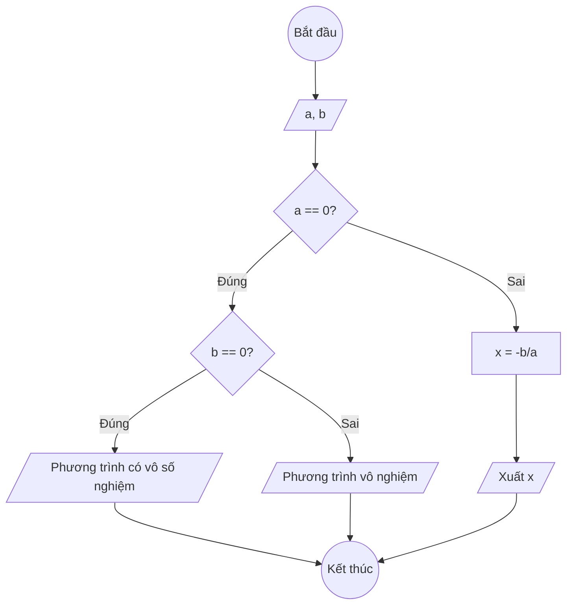

### Bài 64: Giải phương trình $ax + b = 0$

---

### **1. Lưu đồ**



---

### **2. Test Case**

- **Đầu vào (Input):** `a = 2, b = 6`

- **Kết quả mong đợi (Expected Result):** `x = -3`

- **Đầu vào (Input):** `a = 0, b = 0`

- **Kết quả mong đợi (Expected Result):** `Phương trình có vô số nghiệm`

- **Đầu vào (Input):** `a = 0, b = 5`

- **Kết quả mong đợi (Expected Result):** `Phương trình vô nghiệm`


**Mô phỏng (Simulation):**

`a = 2, b = 6`
`a == 0` (2 == 0) là **Sai**
`x = -b/a = -6/2 = -3`
Xuất `x = -3`

---

### **3. Code**

#### **Python**

```python
def giai_phuong_trinh_bac_nhat(a, b):
    # Kiểm tra các trường hợp đặc biệt
    if a == 0:
        if b == 0:
            return "Phương trình có vô số nghiệm"
        else:
            return "Phương trình vô nghiệm"
    else:
        # Tính nghiệm x = -b/a
        x = -b / a
        return f"Nghiệm của phương trình là x = {x}"

# Chương trình chính
print("Giải phương trình ax + b = 0")
a = float(input("Nhập hệ số a: "))
b = float(input("Nhập hệ số b: "))

ket_qua = giai_phuong_trinh_bac_nhat(a, b)
print(ket_qua)

# Hiển thị phương trình
if a == 0:
    if b == 0:
        print("Phương trình: 0 = 0")
    else:
        print(f"Phương trình: {b} = 0")
else:
    if b >= 0:
        print(f"Phương trình: {a}x + {b} = 0")
    else:
        print(f"Phương trình: {a}x - {abs(b)} = 0")
```

#### **JavaScript**

```javascript
function giaiPhuongTrinhBacNhat(a, b) {
    // Kiểm tra các trường hợp đặc biệt
    if (a === 0) {
        if (b === 0) {
            return "Phương trình có vô số nghiệm";
        } else {
            return "Phương trình vô nghiệm";
        }
    } else {
        // Tính nghiệm x = -b/a
        let x = -b / a;
        return `Nghiệm của phương trình là x = ${x}`;
    }
}

// Chương trình chính
console.log("Giải phương trình ax + b = 0");
let a = parseFloat(prompt("Nhập hệ số a:"));
let b = parseFloat(prompt("Nhập hệ số b:"));

let ketQua = giaiPhuongTrinhBacNhat(a, b);
console.log(ketQua);
alert(ketQua);

// Hiển thị phương trình
let phuongTrinh;
if (a === 0) {
    if (b === 0) {
        phuongTrinh = "Phương trình: 0 = 0";
    } else {
        phuongTrinh = `Phương trình: ${b} = 0`;
    }
} else {
    if (b >= 0) {
        phuongTrinh = `Phương trình: ${a}x + ${b} = 0`;
    } else {
        phuongTrinh = `Phương trình: ${a}x - ${Math.abs(b)} = 0`;
    }
}
console.log(phuongTrinh);
```