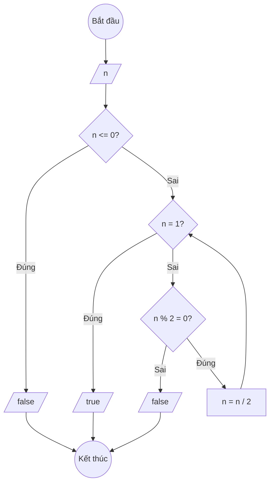

### Bài 75: Kiểm tra số nguyên 4 byte có dạng 2^k hay không?

---

### **1. Lưu đồ**



---

### **2. Test Case**

- **Đầu vào (Input):** `n = 16`

- **Kết quả mong đợi (Expected Result):** `true` (vì 16 = 2⁴)


**Mô phỏng (Simulation):**

`n = 16`
Điều kiện `n <= 0` (16 <= 0) là **Sai**
Điều kiện `n = 1` (16 = 1) là **Sai**
Điều kiện `n % 2 = 0` (16 % 2 = 0) là **Đúng**
    `n = n / 2 = 16 / 2 = 8`
Điều kiện `n = 1` (8 = 1) là **Sai**
Điều kiện `n % 2 = 0` (8 % 2 = 0) là **Đúng**
    `n = n / 2 = 8 / 2 = 4`
Điều kiện `n = 1` (4 = 1) là **Sai**
Điều kiện `n % 2 = 0` (4 % 2 = 0) là **Đúng**
    `n = n / 2 = 4 / 2 = 2`
Điều kiện `n = 1` (2 = 1) là **Sai**
Điều kiện `n % 2 = 0` (2 % 2 = 0) là **Đúng**
    `n = n / 2 = 2 / 2 = 1`
Điều kiện `n = 1` (1 = 1) là **Đúng**
Xuất `true`.

---

### **3. Code**

#### **Python**

```python
def kiem_tra_luy_thua_2(n):
    # Kiểm tra nếu n <= 0
    if n <= 0:
        return False

    # Tiếp tục chia cho 2 cho đến khi n = 1 hoặc n lẻ
    while n != 1:
        if n % 2 != 0:
            return False
        n = n // 2

    return True

def kiem_tra_luy_thua_2_cach2(n):
    # Cách khác: sử dụng bit manipulation
    # Số 2^k có duy nhất 1 bit được set
    if n <= 0:
        return False
    return (n & (n - 1)) == 0

# Chương trình chính
n = int(input("Nhập số nguyên 4 byte: "))

ket_qua1 = kiem_tra_luy_thua_2(n)
ket_qua2 = kiem_tra_luy_thua_2_cach2(n)

print(f"Số {n} có dạng 2^k không? {ket_qua1}")
print(f"Kiểm tra bằng bit manipulation: {ket_qua2}")

if ket_qua1:
    # Tìm k
    temp = n
    k = 0
    while temp > 1:
        temp = temp // 2
        k += 1
    print(f"Số {n} = 2^{k}")
```

#### **JavaScript**

```javascript
function kiemTraLuyThua2(n) {
    // Kiểm tra nếu n <= 0
    if (n <= 0) {
        return false;
    }

    // Tiếp tục chia cho 2 cho đến khi n = 1 hoặc n lẻ
    while (n !== 1) {
        if (n % 2 !== 0) {
            return false;
        }
        n = Math.floor(n / 2);
    }

    return true;
}

function kiemTraLuyThua2Cach2(n) {
    // Cách khác: sử dụng bit manipulation
    // Số 2^k có duy nhất 1 bit được set
    if (n <= 0) {
        return false;
    }
    return (n & (n - 1)) === 0;
}

// Chương trình chính
let n = parseInt(prompt("Nhập số nguyên 4 byte:"));

let ketQua1 = kiemTraLuyThua2(n);
let ketQua2 = kiemTraLuyThua2Cach2(n);

console.log(`Số ${n} có dạng 2^k không? ${ketQua1}`);
console.log(`Kiểm tra bằng bit manipulation: ${ketQua2}`);

if (ketQua1) {
    // Tìm k
    let temp = n;
    let k = 0;
    while (temp > 1) {
        temp = Math.floor(temp / 2);
        k++;
    }
    console.log(`Số ${n} = 2^${k}`);
}

alert(`Số ${n} có dạng 2^k không? ${ketQua1}`);
```