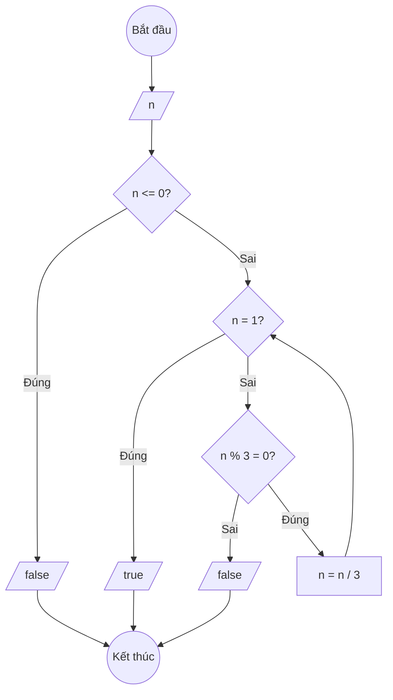

### Bài 76: Kiểm tra số nguyên 4 byte có dạng 3^k hay không?

---

### **1. Lưu đồ**



---

### **2. Test Case**

- **Đầu vào (Input):** `n = 27`

- **Kết quả mong đợi (Expected Result):** `true` (vì 27 = 3³)


**Mô phỏng (Simulation):**

`n = 27`
Điều kiện `n <= 0` (27 <= 0) là **Sai**
Điều kiện `n = 1` (27 = 1) là **Sai**
Điều kiện `n % 3 = 0` (27 % 3 = 0) là **Đúng**
    `n = n / 3 = 27 / 3 = 9`
Điều kiện `n = 1` (9 = 1) là **Sai**
Điều kiện `n % 3 = 0` (9 % 3 = 0) là **Đúng**
    `n = n / 3 = 9 / 3 = 3`
Điều kiện `n = 1` (3 = 1) là **Sai**
Điều kiện `n % 3 = 0` (3 % 3 = 0) là **Đúng**
    `n = n / 3 = 3 / 3 = 1`
Điều kiện `n = 1` (1 = 1) là **Đúng**
Xuất `true`.

---

### **3. Code**

#### **Python**

```python
def kiem_tra_luy_thua_3(n):
    # Kiểm tra nếu n <= 0
    if n <= 0:
        return False

    # Tiếp tục chia cho 3 cho đến khi n = 1 hoặc n không chia hết cho 3
    while n != 1:
        if n % 3 != 0:
            return False
        n = n // 3

    return True

def kiem_tra_luy_thua_3_cach2(n):
    # Cách khác: sử dụng logarithm
    import math
    if n <= 0:
        return False
    if n == 1:
        return True

    # Tính log_3(n) = log(n) / log(3)
    log_result = math.log(n) / math.log(3)

    # Kiểm tra xem log_result có phải số nguyên không
    return abs(log_result - round(log_result)) < 1e-10

# Chương trình chính
n = int(input("Nhập số nguyên 4 byte: "))

ket_qua1 = kiem_tra_luy_thua_3(n)
ket_qua2 = kiem_tra_luy_thua_3_cach2(n)

print(f"Số {n} có dạng 3^k không? {ket_qua1}")
print(f"Kiểm tra bằng logarithm: {ket_qua2}")

if ket_qua1:
    # Tìm k
    temp = n
    k = 0
    while temp > 1:
        temp = temp // 3
        k += 1
    print(f"Số {n} = 3^{k}")
```

#### **JavaScript**

```javascript
function kiemTraLuyThua3(n) {
    // Kiểm tra nếu n <= 0
    if (n <= 0) {
        return false;
    }

    // Tiếp tục chia cho 3 cho đến khi n = 1 hoặc n không chia hết cho 3
    while (n !== 1) {
        if (n % 3 !== 0) {
            return false;
        }
        n = Math.floor(n / 3);
    }

    return true;
}

function kiemTraLuyThua3Cach2(n) {
    // Cách khác: sử dụng logarithm
    if (n <= 0) {
        return false;
    }
    if (n === 1) {
        return true;
    }

    // Tính log_3(n) = log(n) / log(3)
    let logResult = Math.log(n) / Math.log(3);

    // Kiểm tra xem logResult có phải số nguyên không
    return Math.abs(logResult - Math.round(logResult)) < 1e-10;
}

// Chương trình chính
let n = parseInt(prompt("Nhập số nguyên 4 byte:"));

let ketQua1 = kiemTraLuyThua3(n);
let ketQua2 = kiemTraLuyThua3Cach2(n);

console.log(`Số ${n} có dạng 3^k không? ${ketQua1}`);
console.log(`Kiểm tra bằng logarithm: ${ketQua2}`);

if (ketQua1) {
    // Tìm k
    let temp = n;
    let k = 0;
    while (temp > 1) {
        temp = Math.floor(temp / 3);
        k++;
    }
    console.log(`Số ${n} = 3^${k}`);
}

alert(`Số ${n} có dạng 3^k không? ${ketQua1}`);
```