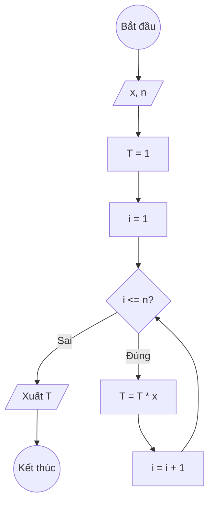

## Bài 10: Tính $T(x, n) = x^n$

---

### **1. Lưu đồ**



---

### **2. Test Case**

- **Đầu vào (Input):** `x = 2, n = 3`

- **Kết quả mong đợi (Expected Result):** `T = 2³ = 8`


**Mô phỏng (Simulation):**

`x = 2, n = 3`
`T = 1`
`i = 1`
Điều kiện `i <= n` (1 <= 3) là **Đúng**
    `T = T * x = 1 * 2 = 2`
    `i = i + 1 = 1 + 1 = 2`
Điều kiện `i <= n` (2 <= 3) là **Đúng**
    `T = T * x = 2 * 2 = 4`
    `i = i + 1 = 2 + 1 = 3`
Điều kiện `i <= n` (3 <= 3) là **Đúng**
    `T = T * x = 4 * 2 = 8`
    `i = i + 1 = 3 + 1= 4`
Điều kiện `i <= n` (4 <= 3) là **Sai**
Xuất `T = 8`.

---

### **3. Code**

#### **Python**

```python
def tinh_luy_thua(x, n):
    # Khởi tạo tích T ban đầu bằng 1
    T = 1
    # Khởi tạo biến đếm i bắt đầu từ 1
    i = 1
    # Vòng lặp while sẽ chạy khi i còn nhỏ hơn hoặc bằng n
    while i <= n:
        # Nhân T với x
        T = T * x
        # Tăng biến đếm i lên 1 đơn vị
        i = i + 1
    return T

# Chương trình chính
x = float(input("Nhập vào cơ số x: "))
n = int(input("Nhập vào số mũ n: "))
ket_qua = tinh_luy_thua(x, n)
print(f"Lũy thừa T({x}, {n}) = {x}^{n} = {ket_qua}")
```

#### **JavaScript**

```javascript
function tinhLuyThua(x, n) {
    // Khởi tạo tích T ban đầu bằng 1
    let T = 1;
    // Khởi tạo biến đếm i bắt đầu từ 1
    let i = 1;
    // Vòng lặp while sẽ chạy khi i còn nhỏ hơn hoặc bằng n
    while (i <= n) {
        // Nhân T với x
        T = T * x;
        // Tăng biến đếm i lên 1 đơn vị
        i = i + 1;
    }
    return T;
}

// Chương trình chính
let x = parseFloat(prompt("Nhập vào cơ số x:"));
let n = parseInt(prompt("Nhập vào số mũ n:"));
let ketQua = tinhLuyThua(x, n);
console.log(`Lũy thừa T(${x}, ${n}) = ${x}^${n} = ${ketQua}`);
alert(`Lũy thừa T(${x}, ${n}) = ${x}^${n} = ${ketQua}`);
```