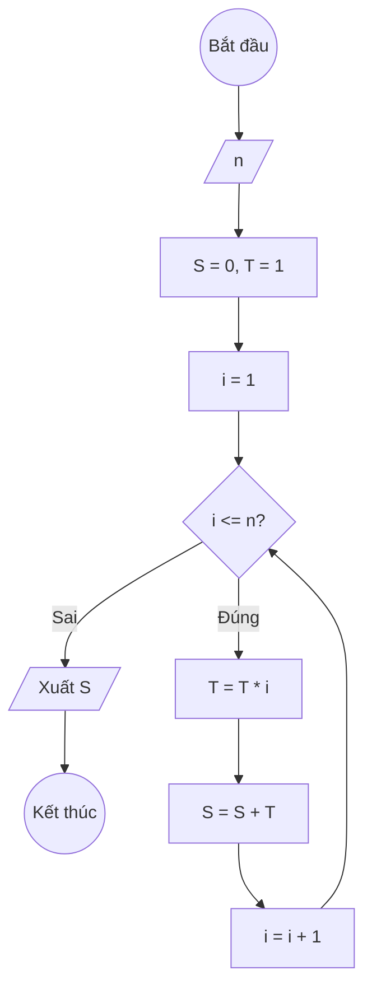

### Bài 11: Tính S(n) = 1 + 1 × 2 + 1 × 2 × 3 + ... + 1 × 2 × 3 × ... × n

---

### **1. Lưu đồ**



---

### **2. Test Case**

- **Đầu vào (Input):** `n = 3`

- **Kết quả mong đợi (Expected Result):** `S = 1 + 1*2 + 1*2*3 = 1 + 2 + 6 = 9`


**Mô phỏng (Simulation):**

`n = 3`
`S = 0, T = 1`
`i = 1`
Điều kiện `i <= n` (1 <= 3) là **Đúng**
    `T = T * i = 1 * 1`
    `S = S + T = 0 + 1 = 1`
    `i = i + 1 = 2`
Điều kiện `i <= n` (2 <= 3) là **Đúng**
    `T = T * i = 1 * 2`
    `S = S + T = 1 + 1*2`
    `i = i + 1 = 3`
Điều kiện `i <= n` (3 <= 3) là **Đúng**
    `T = T * i = 1*2*3`
    `S = S + T = 1 + 1*2 + 1*2*3`
    `i = i + 1 = 4`
Điều kiện `i <= n` (4 <= 3) là **Sai**
Xuất `S = 1 + 1*2 + 1*2*3`.

---

### **3. Code**

#### **Python**

```python
def tinh_tong(n):
    # Khởi tạo tổng S ban đầu bằng 0, T = 1
    S = 0
    T = 1
    # Khởi tạo biến đếm i bắt đầu từ 1
    i = 1
    # Vòng lặp while sẽ chạy khi i còn nhỏ hơn hoặc bằng n
    while i <= n:
        # Tính giai thừa của i
        T = T * i
        # Cộng dồn giai thừa i vào tổng S
        S = S + T
        # Tăng biến đếm i lên 1 đơn vị
        i = i + 1
    return S

# Chương trình chính
n = int(input("Nhập vào số nguyên dương n: "))
ket_qua = tinh_tong(n)
print(f"Tổng S(n) = 1 + 1×2 + ... + 1×2×...×{n} là: {ket_qua}")
```

#### **JavaScript**

```javascript
function tinhTong(n) {
    // Khởi tạo tổng S ban đầu bằng 0, T = 1
    let S = 0, T = 1;
    // Khởi tạo biến đếm i bắt đầu từ 1
    let i = 1;
    // Vòng lặp while sẽ chạy khi i còn nhỏ hơn hoặc bằng n
    while (i <= n) {
        // Tính giai thừa của i
        T = T * i;
        // Cộng dồn giai thừa i vào tổng S
        S = S + T;
        // Tăng biến đếm i lên 1 đơn vị
        i = i + 1;
    }
    return S;
}

// Chương trình chính
let n = parseInt(prompt("Nhập vào số nguyên dương n:"));
let ketQua = tinhTong(n);
console.log(`Tổng S(n) = 1 + 1×2 + ... + 1×2×...×${n} là: ${ketQua}`);
alert(`Tổng S(n) = 1 + 1×2 + ... + 1×2×...×${n} là: ${ketQua}`);
```