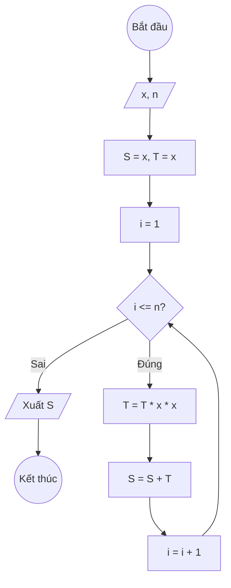

### Bài 14: Tính $S(n) = x + x^3 + x^5 + \ldots + x^{2n+1}$

---

### **1. Lưu đồ**



---

### **2. Test Case**

- **Đầu vào (Input):** `x = 2, n = 2`

- **Kết quả mong đợi (Expected Result):** `S = 2 + 2³ + 2⁵ = 2 + 8 + 32 = 42`


**Mô phỏng (Simulation):**

`x = 2, n = 2`
`S = x = 2`
`T = x = 2`
`i = 1`
Điều kiện `i <= n` (1 <= 2) là **Đúng**
	`T = T * x * x = 2 * 2^2 = 2^3`
    `S = S + T = 2 + 2^3`
    `i = i + 1 = 1 + 1 = 2`
Điều kiện `i <= n` (2 <= 2) là **Đúng**
	`T = T * x * x = 2^3 * 2^2 = 2^5`
    `S = S + T = 2 + 2^3 + 2^5 = 2 + 8 + 32 = 42`
    `i = i + 1 = 2 + 1 = 3`
Điều kiện `i <= n` (3 <= 2) là **Sai**
Xuất `S = 42`.

---

### **3. Code**

#### **Python**

```python
def tinh_tong(x, n):
    # Khởi tạo tổng S ban đầu bằng x, T = x
    S = x
    T = x
    # Khởi tạo biến đếm i bắt đầu từ 0
    i = 1
    # Vòng lặp while sẽ chạy khi i còn nhỏ hơn hoặc bằng n
    while i <= n:
	    T = T * x * x
        # Cộng dồn T vào tổng S
        S = S + T
        # Tăng biến đếm i lên 1 đơn vị
        i = i + 1
    return S

# Chương trình chính
x = float(input("Nhập vào giá trị x: "))
n = int(input("Nhập vào số nguyên dương n: "))
ket_qua = tinh_tong(x, n)
print(f"Tổng S(n) = x + x³ + ... + x^(2*{n}+1) với x = {x} là: {ket_qua}")
```

#### **JavaScript**

```javascript
function tinhTong(x, n) {
    // Khởi tạo tổng S ban đầu bằng x, T = x
    let S = x, T = x;
    // Khởi tạo biến đếm i bắt đầu từ 0
    let i = 1;
    // Vòng lặp while sẽ chạy khi i còn nhỏ hơn hoặc bằng n
    while (i <= n) {
	    T = T * x * x;
        // Cộng dồn T vào tổng S
        S = S + T;
        // Tăng biến đếm i lên 1 đơn vị
        i = i + 1;
    }
    return S;
}

// Chương trình chính
let x = parseFloat(prompt("Nhập vào giá trị x:"));
let n = parseInt(prompt("Nhập vào số nguyên dương n:"));
let ketQua = tinhTong(x, n);
console.log(`Tổng S(n) = x + x³ + ... + x^(2*${n}+1) với x = ${x} là: ${ketQua}`);
alert(`Tổng S(n) = x + x³ + ... + x^(2*${n}+1) với x = ${x} là: ${ketQua}`);
```