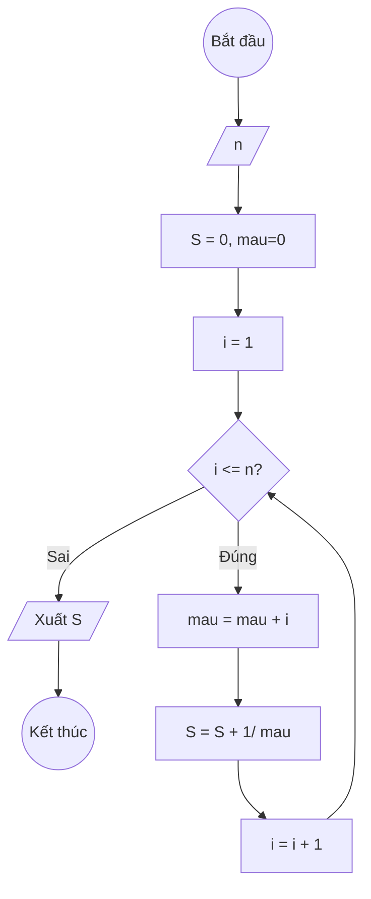

###  Bài 15: Tính $S(n) = 1 + \frac{1}{1+2} + \frac{1}{1+2+3} + \ldots + \frac{1}{1+2+3+\ldots+n}$
---

### **1. Lưu đồ**



---

### **2. Test Case**

- **Đầu vào (Input):** `n = 3`

- **Kết quả mong đợi (Expected Result):** `S = 1 + 1/(1+2) + 1/(1+2+3) = 1 + 1/3 + 1/6`


**Mô phỏng (Simulation):**

`n = 3`
`S = 0`
`i = 1`
Điều kiện `i <= n` (1 <= 3) là **Đúng**
    `mau = mau + i = 0 + 1 = 1`
    `S = S + 1/ mau = 0 + 1/1 = 0 + 1 = 1`
    `i = i + 1 = 2`
Điều kiện `i <= n` (2 <= 3) là **Đúng**
    `mau = mau + i = 1 + 2`
    `S = S + 1/ mau = 1 + 1/ (1 + 2)`
    `i = i + 1 = 3`
Điều kiện `i <= n` (3 <= 3) là **Đúng**
    `mau = mau + i = 1 + 2 + 3`
    `S = S + 1/ mau = 1 + 1/ (1 + 2) + 1/(1 + 2 + 3)`
    `i = i + 1 = 4`
Điều kiện `i <= n` (4 <= 3) là **Sai**
Xuất `S = 1 + 1/ (1 + 2) + 1/(1 + 2 + 3)`.

---

### **3. Code**

#### **Python**

```python
def tinh_tong(n):
    # Khởi tạo tổng S ban đầu bằng 0, mau = 0
    S = 0
    mau = 0
    # Khởi tạo biến đếm i bắt đầu từ 1
    i = 1
    # Vòng lặp while sẽ chạy khi i còn nhỏ hơn hoặc bằng n
    while i <= n:
        mau = mau + =i
        # Cộng dồn 1/mau vào tổng S
        S = S + 1 / mau
        # Tăng biến đếm i lên 1 đơn vị
        i = i + 1
    return S

# Chương trình chính
n = int(input("Nhập vào số nguyên dương n: "))
ket_qua = tinh_tong(n)
print(f"Tổng S(n) = 1 + 1/(1+2) + ... + 1/(1+2+...+{n}) là: {ket_qua:.6f}")
```

#### **JavaScript**

```javascript
function tinhTong(n) {
    // Khởi tạo tổng S ban đầu bằng 0, mau = 0
    let S = 0, mau = 0;
    // Khởi tạo biến đếm i bắt đầu từ 1
    let i = 1;
    // Vòng lặp while sẽ chạy khi i còn nhỏ hơn hoặc bằng n
    while (i <= n) {
        mau = mau + i;
        // Cộng dồn 1/Mau vào tổng S
        S = S + 1 / Mau;
        // Tăng biến đếm i lên 1 đơn vị
        i = i + 1;
    }
    return S;
}

// Chương trình chính
let n = parseInt(prompt("Nhập vào số nguyên dương n:"));
let ketQua = tinhTong(n);
console.log(`Tổng S(n) = 1 + 1/(1+2) + ... + 1/(1+2+...+${n}) là: ${ketQua.toFixed(6)}`);
alert(`Tổng S(n) = 1 + 1/(1+2) + ... + 1/(1+2+...+${n}) là: ${ketQua.toFixed(6)}`);
```