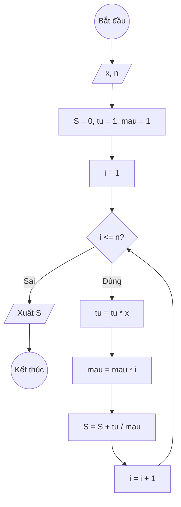

### Bài 17: Tính $S(n) = x + \frac{x^2}{2!} + \frac{x^3}{3!} + \ldots + \frac{x^n}{n!}$

---

### **1. Lưu đồ**



---

### **2. Test Case**

- **Đầu vào (Input):** `x = 2, n = 3`

- **Kết quả mong đợi (Expected Result):** `S = 2 + 2²/2! + 2³/3!`


**Mô phỏng (Simulation):**

`x = 2, n = 3`
`S = 0, tu = 1, mau = 1`
`i = 1`
Điều kiện `i <= n` (1 <= 3) là **Đúng**
    `tu = tu * x = 1 * 2 = 2`
    `mau = mau * i = 1 * 1 = 1`
    `S = S + tu / mau = 0 + 2/1 = 2`
    `i = i + 1 = 2`
Điều kiện `i <= n` (2 <= 3) là **Đúng**
    `tu = tu * x = 2 * 2 = 2^2`
    `mau = mau * i = 1 * 2 = 2!`
    `S = S + tu / mau = 2 + 2^2/2!`
    `i = i + 1 = 3`
Điều kiện `i <= n` (3 <= 3) là **Đúng**
    `tu = tu * x = 2^2 * 2 = 2^3`
    `mau = mau * i = 2! * 3 = 3!`
    `S = S + tu / mau = 2 + 2^2/2! + 2^3/3!`
    `i = i + 1 = 4`
Điều kiện `i <= n` (4 <= 3) là **Sai**
Xuất `S = 2 + 2^2/2! + 2^3/3!`.

---

### **3. Code**

#### **Python**

```python
def tinh_tong(x, n):
    # Khởi tạo tổng S ban đầu bằng 0, tu = 1, mau = 1
    S = 0
    tu = 1
    mau = 1
    # Khởi tạo biến đếm i bắt đầu từ 1
    i = 1
    # Vòng lặp while sẽ chạy khi i còn nhỏ hơn hoặc bằng n
    while i <= n:
        tu = tu * x
        mau = mau * i
        # Cộng dồn tu/mau vào tổng S
        S = S + tu / mau
        # Tăng biến đếm i lên 1 đơn vị
        i = i + 1
    return S
    
# Chương trình chính
x = float(input("Nhập vào giá trị x: "))
n = int(input("Nhập vào số nguyên dương n: "))
ket_qua = tinh_tong(x, n)
print(f"Tổng S(n) = x + x²/2! + ... + x^{n}/{n}! với x = {x} là: {ket_qua:.6f}")
```

#### **JavaScript**

```javascript
function tinhTong(x, n) {
     // Khởi tạo tổng S ban đầu bằng 0, tu = 1, mau = 1
    let S = 0, tu = 1, mau = 1;
    // Khởi tạo biến đếm i bắt đầu từ 1
    let i = 1;
    // Vòng lặp while sẽ chạy khi i còn nhỏ hơn hoặc bằng n
    while (i <= n) {
        tu = tu * x;
        mau = mau * i;
        // Cộng dồn tu/ mau vào tổng S
        S = S + tu / mau;
        // Tăng biến đếm i lên 1 đơn vị
        i = i + 1;
    }
    return S;
}

// Chương trình chính
let x = parseFloat(prompt("Nhập vào giá trị x:"));
let n = parseInt(prompt("Nhập vào số nguyên dương n:"));
let ketQua = tinhTong(x, n);
console.log(`Tổng S(n) = x + x²/2! + ... + x^${n}/${n}! với x = ${x} là: ${ketQua.toFixed(6)}`);
alert(`Tổng S(n) = x + x²/2! + ... + x^${n}/${n}! với x = ${x} là: ${ketQua.toFixed(6)}`);
```