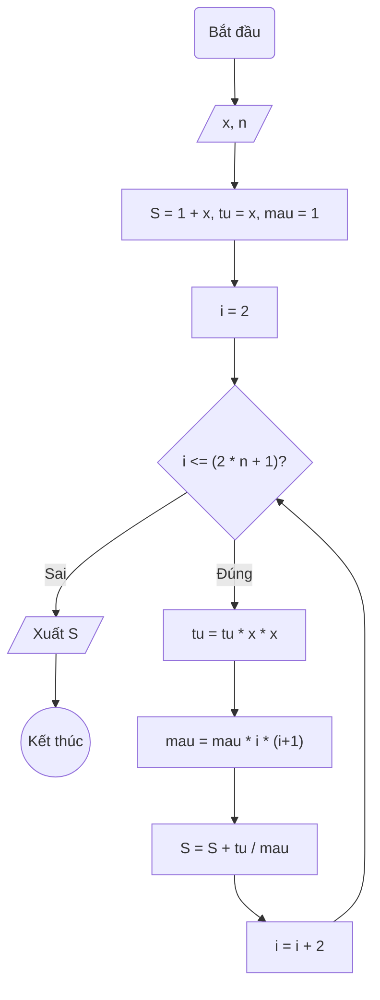

### Bài 19: Tính $S(n) = 1 + x + \frac{x^3}{3!} + \frac{x^5}{5!} + \ldots + \frac{x^{2n+1}}{(2n+1)!}$

---

### **1. Lưu đồ**



---

### **2. Test Case**

- **Đầu vào (Input):** `x = 2, n = 2`

- **Kết quả mong đợi (Expected Result):** `S = 1 + 2 + 2³/3! + 2⁵/5!`


**Mô phỏng (Simulation):**

`x = 2, n = 2`
`S = 1 + x = 1 + 2`
`tu = x = 2`
`mau = 1`
`i = 2`
Điều kiện `i <= (2 * n + 1)` (2 <= 5) là **Đúng**
    `tu = tu * x * x = 2 * 2 * 2 = 2^3`
    `mau = mau * i * (i+1) = 1 * 2 * 3 = 3! `
    `S = S + tu / mau = 1 + 2 + 2^3/3!`
    `i = i + 2 = 4`
Điều kiện `i <= (2 * n + 1)` (4 <= 5) là **Đúng**
    `tu = tu * x * x = 2^3 * 2 * 2 = 2^5`
    `mau = mau * i * (i+1) = 3! * 4 * 5 = 5! `
    `S = S + tu / mau = 1 + 2 + 2^3/3! + 2^5/5!`
    `i = i + 2 = 6`
Điều kiện `i <= n` (6 <= 5) là **Sai**
Xuất `S = 1 + 2 + 2^3/3! + 2^5/5!`.

---

### **3. Code**

#### **Python**

```python
def tinh_tong(x, n):
    # Khởi tạo tổng S với hai số hạng đầu tiên: 1 + x, tu = x, mau = 1
    S = 1 + x
    tu = x
    mau = 1
    # Khởi tạo biến đếm i bắt đầu từ 2
    i = 2
    # Vòng lặp while sẽ chạy khi i còn nhỏ hơn hoặc bằng 2 * n + 1
    while i <= (2 * n + 1):
        tu = tu * x * x
        mau = mau * i * (i+1)
        # Cộng dồn tu/mau vào tổng S
        S = S + tu / mau
        # Tăng biến đếm i lên 1 đơn vị
        i = i + 2
    return S

# Chương trình chính
x = float(input("Nhập vào giá trị x: "))
n = int(input("Nhập vào số nguyên dương n: "))
ket_qua = tinh_tong(x, n)
print(f"Tổng S(n) = 1 + x + x³/3! + ... + x^(2*{n}+1)/(2*{n}+1)! với x = {x} là: {ket_qua:.6f}")
```

#### **JavaScript**

```javascript
function tinhTong(x, n) {
    // Khởi tạo tổng S với hai số hạng đầu tiên: 1 + x, tu = x, mau = 1
    let S = 1 + x, tu = x, mau = 1;
    // Khởi tạo biến đếm i bắt đầu từ 1
    let i = 2;
    // Vòng lặp while sẽ chạy khi i còn nhỏ hơn hoặc bằng n
    while (i <= (2* n + 1)) {
        tu = tu * x * x;
        mau = mau * i * (i+1);
        // Cộng dồn tu/mau vào tổng S
        S = S + tu / mau;
        // Tăng biến đếm i lên 1 đơn vị
        i = i + 2;
    }
    return S;
}

// Chương trình chính
let x = parseFloat(prompt("Nhập vào giá trị x:"));
let n = parseInt(prompt("Nhập vào số nguyên dương n:"));
let ketQua = tinhTong(x, n);
console.log(`Tổng S(n) = 1 + x + x³/3! + ... + x^(2*${n}+1)/(2*${n}+1)! với x = ${x} là: ${ketQua.toFixed(6)}`);
alert(`Tổng S(n) = 1 + x + x³/3! + ... + x^(2*${n}+1)/(2*${n}+1)! với x = ${x} là: ${ketQua.toFixed(6)}`);
```