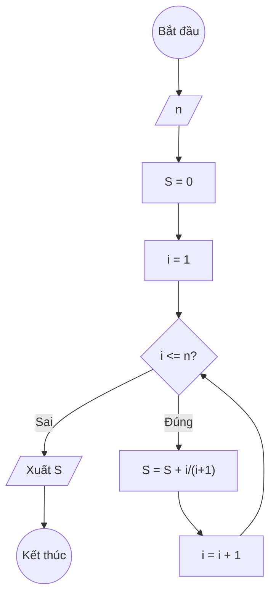

## Bài 7: Tính $S(n) = \frac{1}{2} + \frac{2}{3} + \frac{3}{4} + \ldots + \frac{n}{n+1}$

---

### **1. Lưu đồ**



---

### **2. Test Case**

- **Đầu vào (Input):** `n = 3`

- **Kết quả mong đợi (Expected Result):** `S = 1/2 + 2/3 + 3/4 = 0.5 + 0.667... + 0.75 ≈ 1.917`


**Mô phỏng (Simulation):**

`n = 3`
`S = 0`
`i = 1`
Điều kiện `i <= n` (1 <= 3) là **Đúng**
    `S = S + i/(i+1) = 0 + 1/(1+1) = 0 + 1/2 = 0.5`
    `i = i + 1 = 1 + 1 = 2`
Điều kiện `i <= n` (2 <= 3) là **Đúng**
    `S = S + i/(i+1) = 0.5 + 2/(2+1) = 0.5 + 2/3 = 1.167...`
    `i = i + 1 = 2 + 1 = 3`
Điều kiện `i <= n` (3 <= 3) là **Đúng**
    `S = S + i/(i+1) = 1.167... + 3/(3+1) = 1.167... + 3/4 = 1.917...`
    `i = i + 1 = 3 + 1= 4`
Điều kiện `i <= n` (4 <= 3) là **Sai**
Xuất `S = 1.917...`.

---

### **3. Code**

#### **Python**

```python
def tinh_tong(n):
    # Khởi tạo tổng S ban đầu bằng 0
    S = 0
    # Khởi tạo biến đếm i bắt đầu từ 1
    i = 1
    # Vòng lặp while sẽ chạy khi i còn nhỏ hơn hoặc bằng n
    while i <= n:
        # Cộng dồn i/(i+1) vào tổng S
        S = S + i/(i+1)
        # Tăng biến đếm i lên 1 đơn vị
        i = i + 1
    return S

# Chương trình chính
n = int(input("Nhập vào số nguyên dương n: "))
ket_qua = tinh_tong(n)
print(f"Tổng S(n) = 1/2 + 2/3 + 3/4 + ... + {n}/{n+1} là: {ket_qua}")
```

#### **JavaScript**

```javascript
function tinhTong(n) {
    // Khởi tạo tổng S ban đầu bằng 0
    let S = 0;
    // Khởi tạo biến đếm i bắt đầu từ 1
    let i = 1;
    // Vòng lặp while sẽ chạy khi i còn nhỏ hơn hoặc bằng n
    while (i <= n) {
        // Cộng dồn i/(i+1) vào tổng S
        S = S + i/(i+1);
        // Tăng biến đếm i lên 1 đơn vị
        i = i + 1;
    }
    return S;
}

// Chương trình chính
let n = parseInt(prompt("Nhập vào số nguyên dương n:"));
let ketQua = tinhTong(n);
console.log(`Tổng S(n) = 1/2 + 2/3 + 3/4 + ... + ${n}/${n+1} là: ${ketQua}`);
alert(`Tổng S(n) = 1/2 + 2/3 + 3/4 + ... + ${n}/${n+1} là: ${ketQua}`);
```