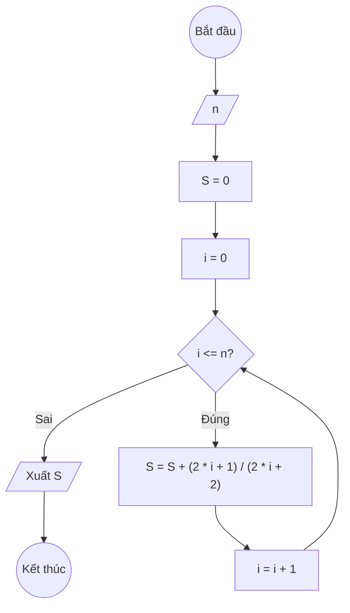

## Bài 8: Tính $S(n) = \frac{1}{2} + \frac{3}{4} + \frac{5}{6} + \ldots + \frac{2n+1}{2n+2}$

---

### **1. Lưu đồ**



---

### **2. Test Case**

- **Đầu vào (Input):** `n = 2`

- **Kết quả mong đợi (Expected Result):** `S = 1/2 + 3/4 + 5/6`


**Mô phỏng (Simulation):**

`n = 2`
`S = 0`
`i = 0`
Điều kiện `i <= n` (0 <= 2) là **Đúng**
    `S = S + (2*i+1)/(2*i+2) = 0 + (2 * 0 + 1)/(2 * 0 + 2) = 0 + 1/2`
    `i = i + 1 = 0 + 1 = 1`
Điều kiện `i <= n` (1 <= 2) là **Đúng**
    `S = S + (2*i+1)/(2*i+2) = 1/2 + (2 * 1 + 1)/(2 * 1 + 2) = 1/2 + 3/4`
    `i = i + 1 = 1 + 1 = 2`
Điều kiện `i <= n` (2 <= 2) là **Đúng**
    `S = S + (2*i+1)/(2*i+2) = 1/2 + 3/4 + (2 * 2 + 1)/(2 * 2 + 2) = 1/2 + 3/4` + 5/6`
    `i = i + 1 = 2 + 1= 3`
Điều kiện `i <= n` (3 <= 2) là **Sai**
Xuất `S = 1/2 + 3/4` + 5/6`.

---

### **3. Code**

#### **Python**

```python
def tinh_tong(n):
    # Khởi tạo tổng S ban đầu bằng 0
    S = 0
    # Khởi tạo biến đếm i bắt đầu từ 0
    i = 0
    # Vòng lặp while sẽ chạy khi i còn nhỏ hơn hoặc bằng n
    while i <= n:
        # Cộng dồn (2 * i + 1)/(2 * i + 2) vào tổng S
        S = S + (2 * i + 1)/(2 * i + 2)
        # Tăng biến đếm i lên 1 đơn vị
        i = i + 1
    return S

# Chương trình chính
n = int(input("Nhập vào số nguyên dương n: "))
ket_qua = tinh_tong(n)
print(f"Tổng S(n) = 1/2 + 3/4 + 5/6 + ... + {2*n+1}/{2*n+2} là: {ket_qua}")
```

#### **JavaScript**

```javascript
function tinhTong(n) {
    // Khởi tạo tổng S ban đầu bằng 0
    let S = 0;
    // Khởi tạo biến đếm i bắt đầu từ 1
    let i = 0;
    // Vòng lặp while sẽ chạy khi i còn nhỏ hơn hoặc bằng n
    while (i <= n) {
        // Cộng dồn (2 * i + 1)/(2 * i + 2) vào tổng S
        S = S + (2 * i + 1)/(2 * i + 2);
        // Tăng biến đếm i lên 1 đơn vị
        i = i + 1;
    }
    return S;
}

// Chương trình chính
let n = parseInt(prompt("Nhập vào số nguyên dương n:"));
let ketQua = tinhTong(n);
console.log(`Tổng S(n) = 1/2 + 3/4 + 5/6 + ... + ${2*n+1}/${2*n+2} là: ${ketQua}`);
alert(`Tổng S(n) = 1/2 + 3/4 + 5/6 + ... + ${2*n+1}/${2*n+2} là: ${ketQua}`);
```