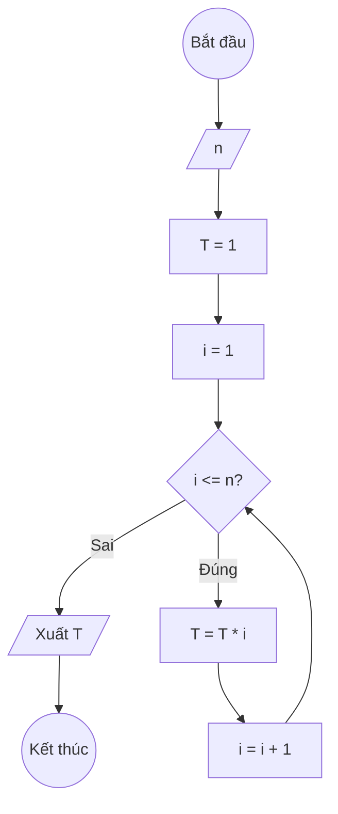

## Bài 9: Tính $T(n) = 1 \times 2 \times 3 \times \ldots \times n$

---

### **1. Lưu đồ**



---

### **2. Test Case**

- **Đầu vào (Input):** `n = 4`

- **Kết quả mong đợi (Expected Result):** `T = 1 × 2 × 3 × 4 = 24`


**Mô phỏng (Simulation):**

`n = 4`
`T = 1`
`i = 1`
Điều kiện `i <= n` (1 <= 4) là **Đúng**
    `T = T * i = 1 * 1 = 1`
    `i = i + 1 = 1 + 1 = 2`
Điều kiện `i <= n` (2 <= 4) là **Đúng**
    `T = T * i = 1 * 2 = 2`
    `i = i + 1 = 2 + 1 = 3`
Điều kiện `i <= n` (3 <= 4) là **Đúng**
    `T = T * i = 2 * 3 = 6`
    `i = i + 1 = 3 + 1 = 4`
Điều kiện `i <= n` (4 <= 4) là **Đúng**
    `T = T * i = 6 * 4 = 24`
    `i = i + 1 = 4 + 1= 5`
Điều kiện `i <= n` (5 <= 4) là **Sai**
Xuất `T = 24`.

---

### **3. Code**

#### **Python**

```python
def tinh_giai_thua(n):
    # Khởi tạo tích T ban đầu bằng 1
    T = 1
    # Khởi tạo biến đếm i bắt đầu từ 1
    i = 1
    # Vòng lặp while sẽ chạy khi i còn nhỏ hơn hoặc bằng n
    while i <= n:
        # Nhân T với i
        T = T * i
        # Tăng biến đếm i lên 1 đơn vị
        i = i + 1
    return T

# Chương trình chính
n = int(input("Nhập vào số nguyên dương n: "))
ket_qua = tinh_giai_thua(n)
print(f"Giai thừa T({n}) = {n}! = {ket_qua}")
```

#### **JavaScript**

```javascript
function tinhGiaiThua(n) {
    // Khởi tạo tích T ban đầu bằng 1
    let T = 1;
    // Khởi tạo biến đếm i bắt đầu từ 1
    let i = 1;
    // Vòng lặp while sẽ chạy khi i còn nhỏ hơn hoặc bằng n
    while (i <= n) {
        // Nhân T với i
        T = T * i;
        // Tăng biến đếm i lên 1 đơn vị
        i = i + 1;
    }
    return T;
}

// Chương trình chính
let n = parseInt(prompt("Nhập vào số nguyên dương n:"));
let ketQua = tinhGiaiThua(n);
console.log(`Giai thừa T(${n}) = ${n}! = ${ketQua}`);
alert(`Giai thừa T(${n}) = ${n}! = ${ketQua}`);
```