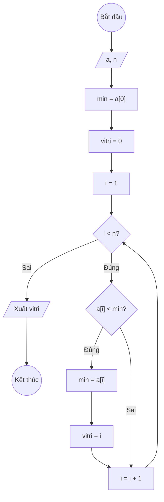

### Bài 123: Viết hàm tìm một vị trí mà giá trị tại vị trí đó là một giá trị nhỏ nhất trong mảng một chiều các số nguyên

---

### **1. Lưu đồ**



---

### **2. Test Case 1**

- **Đầu vào (Input):** Mảng a (n = 5)

| Index | 0   | 1   | 2   | 3   | n-1 |
| ----- | --- | --- | --- | --- | --- |
| **a** | 5   | 2   | 8   | 1   | 9   |

- **Kết quả mong đợi (Expected Result):** `vitri = 3`


**Mô phỏng (Simulation):**

`a = [5, 2, 8, 1, 9]`
`n = 5`
`min = a[0] = 5`
`vitri = 0`
`i = 1`
Điều kiện `i < n` (1 < 5) là **Đúng**
    Điều kiện `a[i] < min` (2 < 5) là **Đúng**
        `min = a[i] = 2`
        `vitri = i = 1`
    `i = i + 1 = 2`
Điều kiện `i < n` (2 < 5) là **Đúng**
    Điều kiện `a[i] < min` (8 < 2) là **Sai**
    `i = i + 1 = 3`
Điều kiện `i < n` (3 < 5) là **Đúng**
    Điều kiện `a[i] < min` (1 < 2) là **Đúng**
        `min = a[i] = 1`
        `vitri = i = 3`
    `i = i + 1 = 4`
Điều kiện `i < n` (4 < 5) là **Đúng**
    Điều kiện `a[i] < min` (9 < 1) là **Sai**
    `i = i + 1 = 5`
Điều kiện `i < n` (5 < 5) là **Sai**
Xuất `vitri = 3`.

---

### **3. Code**

#### **Python**

```python
def tim_vi_tri_min(a, n):
    # Khởi tạo giá trị min ban đầu là phần tử đầu tiên
    min = a[0]
    # Khởi tạo vị trí ban đầu là 0
    vitri = 0
    # Khởi tạo biến đếm i bắt đầu từ 1
    i = 1
    # Vòng lặp while sẽ chạy khi i còn nhỏ hơn n
    while i < n:
        # Nếu phần tử hiện tại nhỏ hơn min, cập nhật min và vị trí
        if a[i] < min:
            min = a[i]
            vitri = i
        # Tăng biến đếm i lên 1 đơn vị
        i = i + 1
    return vitri

# Chương trình chính
n = int(input("Nhập số lượng phần tử: "))
a = []
for i in range(n):
    x = int(input(f"Nhập phần tử thứ {i}: "))
    a.append(x)

ket_qua = tim_vi_tri_min(a, n)
print(f"Vị trí giá trị nhỏ nhất trong mảng là: {ket_qua}")
```

#### **JavaScript**

```javascript
function timViTriMin(a, n) {
    // Khởi tạo giá trị min ban đầu là phần tử đầu tiên
    let min = a[0];
    // Khởi tạo vị trí ban đầu là 0
    let vitri = 0;
    // Khởi tạo biến đếm i bắt đầu từ 1
    let i = 1;
    // Vòng lặp while sẽ chạy khi i còn nhỏ hơn n
    while (i < n) {
        // Nếu phần tử hiện tại nhỏ hơn min, cập nhật min và vị trí
        if (a[i] < min) {
            min = a[i];
            vitri = i;
        }
        // Tăng biến đếm i lên 1 đơn vị
        i = i + 1;
    }
    return vitri;
}

// Chương trình chính
let n = parseInt(prompt("Nhập số lượng phần tử:"));
let a = [];
for (let i = 0; i < n; i++) {
    let x = parseInt(prompt(`Nhập phần tử thứ ${i}:`));
    a.push(x);
}

let ketQua = timViTriMin(a, n);
console.log(`Vị trí giá trị nhỏ nhất trong mảng là: ${ketQua}`);
alert(`Vị trí giá trị nhỏ nhất trong mảng là: ${ketQua}`);
```
