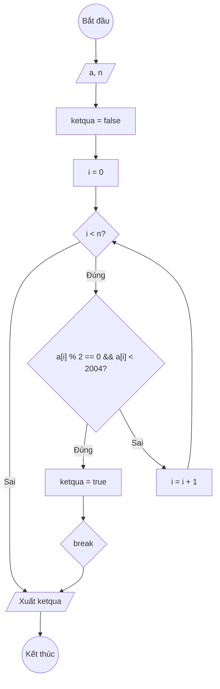

### Bài 124: Viết hàm kiểm tra trong mảng các số nguyên có tồn tại giá trị chẵn nhỏ hơn 2004 hay không?

---

### **1. Lưu đồ**



---

### **2. Test Case 1**

- **Đầu vào (Input):** Mảng a (n = 5)

| Index | 0   | 1   | 2   | 3   | n-1 |
| ----- | --- | --- | --- | --- | --- |
| **a** | 2006   | 3   | 1000   | 2005   | 8   |

- **Kết quả mong đợi (Expected Result):** `ketqua = true` (Có tồn tại)


**Mô phỏng (Simulation):**

`a = [2006, 3, 1000, 2005, 8]`
`n = 5`
`ketqua = false`
`i = 0`
Điều kiện `i < n` (0 < 5) là **Đúng**
    Điều kiện `a[i] % 2 == 0 && a[i] < 2004` (2006 % 2 == 0 (Đ) && 2006 < 2004 (S)) là **Sai**
    `i = i + 1 = 1`
Điều kiện `i < n` (1 < 5) là **Đúng**
    Điều kiện `a[i] % 2 == 0 && a[i] < 2004` (3 % 2 == 0 (S) && 3 < 2004 (Đ)) là **Sai**
    `i = i + 1 = 2`
Điều kiện `i < n` (2 < 5) là **Đúng**
    Điều kiện `a[i] % 2 == 0 && a[i] < 2004` (1000 % 2 == 0 (Đ) && 1000 < 2004 (Đ)) là **Đúng**
        `ketqua = true`
        Kết thúc.

---

### **3. Code**

#### **Python**

```python
def kiem_tra_chan_nho_hon_2004(a, n):
    # Khởi tạo kết quả ban đầu là false (Không tồn tại)
    ketqua = False 
    # Khởi tạo biến đếm i
    i = 0
    # Vòng lặp while sẽ chạy khi i còn nhỏ hơn n
    while i < n:
        # Nếu tìm thấy giá trị chẵn nhỏ hơn 2004
        if a[i] % 2 == 0 and a[i] < 2004:
            ketqua = True
            break  # Thoát khỏi vòng lặp
        # Tăng biến đếm i lên 1 đơn vị
        i = i + 1
    return ketqua

# Chương trình chính
n = int(input("Nhập số lượng phần tử: "))
a = []
for i in range(n):
    x = int(input(f"Nhập phần tử thứ {i}: "))
    a.append(x)

if kiem_tra_chan_nho_hon_2004(a, n) == True:
    print("Mảng có tồn tại giá trị chẵn nhỏ hơn 2004.")
else:
    print("Mảng không tồn tại giá trị chẵn nhỏ hơn 2004.")
```

#### **JavaScript**

```javascript
function kiemTraChanNhoHon2004(a, n) {
    // Khởi tạo kết quả ban đầu là false (Không tồn tại)
    let ketqua = false;
    // Khởi tạo biến đếm i
    let i = 0;
    // Vòng lặp while sẽ chạy khi i còn nhỏ hơn n
    while (i < n) {
        // Nếu tìm thấy giá trị chẵn nhỏ hơn 2004
        if (a[i] % 2 === 0 && a[i] < 2004) {
            ketqua = true;
            break; // Thoát khỏi vòng lặp
        }
        // Tăng biến đếm i lên 1 đơn vị
        i = i + 1;
    }
    return ketqua;
}

// Chương trình chính
let n = parseInt(prompt("Nhập số lượng phần tử:"));
let a = [];
for (let i = 0; i < n; i++) {
    let x = parseInt(prompt(`Nhập phần tử thứ ${i}:`));
    a.push(x);
}

if (kiemTraChanNhoHon2004(a, n) === true) {
    alert("Mảng có tồn tại giá trị chẵn nhỏ hơn 2004.");
} else {
    alert("Mảng không tồn tại giá trị chẵn nhỏ hơn 2004.");
}
```
