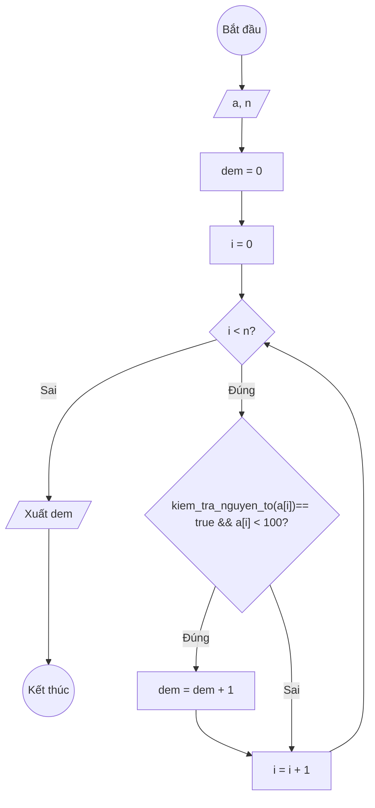

### Bài 125: Viết hàm đếm số lượng số nguyên tố nhỏ hơn 100 trong mảng

---

### **1. Lưu đồ**



---

### **2. Test Case 1**

- **Đầu vào (Input):** Mảng a (n = 6)

| Index | 0   | 1   | 2   | 3   | 4   | n-1 |
| ----- | --- | --- | --- | --- | --- | --- |
| **a** | 2   | 101 | 7   | 97  | 10  | 13  |

- **Kết quả mong đợi (Expected Result):** `dem = 4`


**Mô phỏng (Simulation):**

`a = [2, 101, 7, 97, 10, 13]`
`n = 6`
`dem = 0`
`i = 0`
Điều kiện `i < n` (0 < 6) là **Đúng**
     kiem_tra_nguyen_to(`a[i]`) == true  và `a[i] < 100` (2 là SNT và 2 < 100) là **Đúng**
        `dem = dem + 1 = 1`
    `i = i + 1 = 1`
Điều kiện `i < n` (1 < 6) là **Đúng**
    kiem_tra_nguyen_to(`a[i]`) == true  và `a[i] < 100` (101 là SNT nhưng 101 < 100 là Sai) là **Sai**
    `i = i + 1 = 2`
Điều kiện `i < n` (2 < 6) là **Đúng**
    kiem_tra_nguyen_to(`a[i]`) == true  và `a[i] < 100` (7 là SNT và 7 < 100) là **Đúng**
        `dem = dem + 1 = 2`
    `i = i + 1 = 3`
Điều kiện `i < n` (3 < 6) là **Đúng**
    kiem_tra_nguyen_to(`a[i]`) == true  và `a[i] < 100` (97 là SNT và 97 < 100) là **Đúng**
        `dem = dem + 1 = 3`
    `i = i + 1 = 4`
Điều kiện `i < n` (4 < 6) là **Đúng**
    kiem_tra_nguyen_to(`a[i]`) == true  và `a[i] < 100` (10 không là SNT) là **Sai**
    `i = i + 1 = 5`
Điều kiện `i < n` (5 < 6) là **Đúng**
    kiem_tra_nguyen_to(`a[i]`) == true  và `a[i] < 100` (13 là SNT và 13 < 100) là **Đúng**
        `dem = dem + 1 = 4`
    `i = i + 1 = 6`
Điều kiện `i < n` (6 < 6) là **Sai**
Xuất `dem = 4`.

---

### **3. Code**

#### **Python**

```python
import math

def kiem_tra_nguyen_to(num):
    if num < 2:
        return False
    for i in range(2, int(math.sqrt(num)) + 1):
        if num % i == 0:
            return False
    return True

def dem_so_nguyen_to(a, n):
    dem = 0
    i = 0
    while i < n:
        if kiem_tra_nguyen_to(a[i]) == True and a[i] < 100:
            dem += 1
        i += 1
    return dem

# Chương trình chính
n = int(input("Nhập số lượng phần tử: "))
a = []
for i in range(n):
    x = int(input(f"Nhập phần tử thứ {i}: "))
    a.append(x)

ket_qua = dem_so_nguyen_to(a, n)
print(f"Số lượng số nguyên tố nhỏ hơn 100 trong mảng là: {ket_qua}")
```

#### **JavaScript**

```javascript
function kiemTraNguyenTo(num) {
    if (num < 2) {
        return false;
    }
    for (let i = 2; i <= Math.sqrt(num); i++) {
        if (num % i === 0) {
            return false;
        }
    }
    return true;
}

function demSoNguyenTo(a, n) {
    let dem = 0;
    let i = 0;
    while (i < n) {
        if (isPrime(a[i]) && a[i] < 100) {
            dem++;
        }
        i++;
    }
    return dem;
}

// Chương trình chính
let n = parseInt(prompt("Nhập số lượng phần tử:"));
let a = [];
for (let i = 0; i < n; i++) {
    let x = parseInt(prompt(`Nhập phần tử thứ ${i}:`));
    a.push(x);
}

let ketQua = demSoNguyenTo(a, n);
alert(`Số lượng số nguyên tố nhỏ hơn 100 trong mảng là: ${ketQua}`);
```
