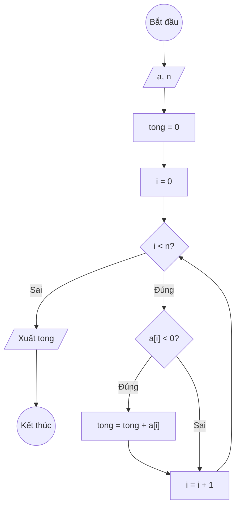

### Bài 126: Viết hàm tính tổng các giá trị âm trong mảng một chiều các số thực

---

### **1. Lưu đồ**



---

### **2. Test Case 1**

- **Đầu vào (Input):** Mảng a (n = 5)

| Index | 0   | 1   | 2   | 3   | n-1 |
| ----- | --- | --- | --- | --- | --- |
| **a** | 3.5 | -7.2 | 2.1 | -9.8 | 5.4 |

- **Kết quả mong đợi (Expected Result):** `tong = -17.0`


**Mô phỏng (Simulation):**

`a = [3.5, -7.2, 2.1, -9.8, 5.4]`
`n = 5`
`tong = 0`
`i = 0`
Điều kiện `i < n` (0 < 5) là **Đúng**
    Điều kiện `a[i] < 0` (3.5 < 0) là **Sai**
    `i = i + 1 = 1`
Điều kiện `i < n` (1 < 5) là **Đúng**
    Điều kiện `a[i] < 0` (-7.2 < 0) là **Đúng**
        `tong = tong + a[i] = 0 + (-7.2) = -7.2`
    `i = i + 1 = 2`
Điều kiện `i < n` (2 < 5) là **Đúng**
    Điều kiện `a[i] < 0` (2.1 < 0) là **Sai**
    `i = i + 1 = 3`
Điều kiện `i < n` (3 < 5) là **Đúng**
    Điều kiện `a[i] < 0` (-9.8 < 0) là **Đúng**
        `tong = tong + a[i] = -7.2 + (-9.8) = -17.0`
    `i = i + 1 = 4`
Điều kiện `i < n` (4 < 5) là **Đúng**
    Điều kiện `a[i] < 0` (5.4 < 0) là **Sai**
    `i = i + 1 = 5`
Điều kiện `i < n` (5 < 5) là **Sai**
Xuất `tong = -17.0`.

---

### **3. Code**

#### **Python**

```python
def tinh_tong_am(a, n):
    tong = 0
    i = 0
    while i < n:
        if a[i] < 0:
            tong += a[i]
        i += 1
    return tong

# Chương trình chính
n = int(input("Nhập số lượng phần tử: "))
a = []
for i in range(n):
    x = float(input(f"Nhập phần tử thứ {i}: "))
    a.append(x)

ket_qua = tinh_tong_am(a, n)
print(f"Tổng các giá trị âm trong mảng là: {ket_qua}")
```

#### **JavaScript**

```javascript
function tinhTongAm(a, n) {
    let tong = 0;
    let i = 0;
    while (i < n) {
        if (a[i] < 0) {
            tong += a[i];
        }
        i++;
    }
    return tong;
}

// Chương trình chính
let n = parseInt(prompt("Nhập số lượng phần tử:"));
let a = [];
for (let i = 0; i < n; i++) {
    let x = parseFloat(prompt(`Nhập phần tử thứ ${i}:`));
    a.push(x);
}

let ketQua = tinhTongAm(a, n);
alert(`Tổng các giá trị âm trong mảng là: ${ketQua}`);
```
