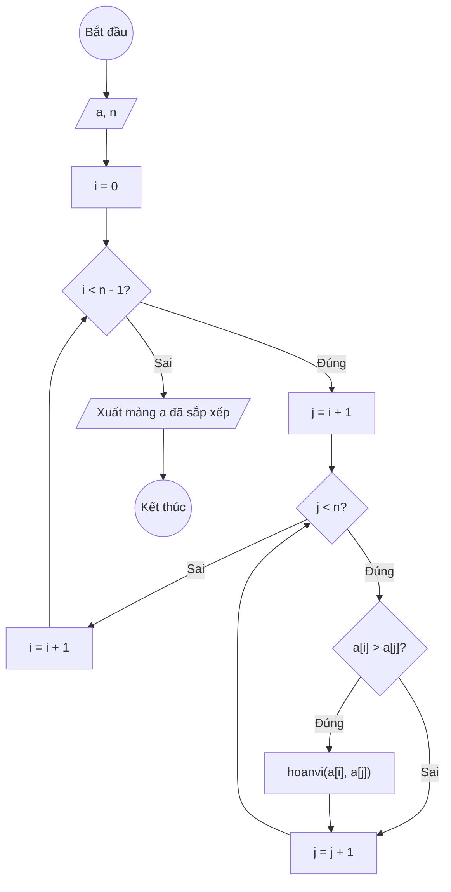

### Bài 127: Viết hàm sắp xếp mảng một chiều các số thực tăng dần

---

### **1. Lưu đồ (Sử dụng thuật toán Interchange Sort)**



---

### **2. Test Case 1**

- **Đầu vào (Input):** Mảng a (n = 5)

| Index | 0   | 1   | 2   | 3   | n-1 |
| ----- | --- | --- | --- | --- | --- |
| **a** | 7.2 | 3.5 | 9.8 | 2.1 | 5.4 |

- **Kết quả mong đợi (Expected Result):** `a = [2.1, 3.5, 5.4, 7.2, 9.8]`


**Mô phỏng (Simulation):**

`a = [7.2, 3.5, 9.8, 2.1, 5.4]`
`n = 5`

`i = 0`
  `j = 1`: `a[0] > a[1]` (7.2 > 3.5) -> hoán vị -> `a = [3.5, 7.2, 9.8, 2.1, 5.4]`
  `j = 2`: `a[0] > a[2]` (3.5 > 9.8) -> sai
  `j = 3`: `a[0] > a[3]` (3.5 > 2.1) -> hoán vị -> `a = [2.1, 7.2, 9.8, 3.5, 5.4]`
  `j = 4`: `a[0] > a[4]` (2.1 > 5.4) -> sai
Kết thúc `i = 0`, `a = [2.1, 7.2, 9.8, 3.5, 5.4]`

`i = 1`
  `j = 2`: `a[1] > a[2]` (7.2 > 9.8) -> sai
  `j = 3`: `a[1] > a[3]` (7.2 > 3.5) -> hoán vị -> `a = [2.1, 3.5, 9.8, 7.2, 5.4]`
  `j = 4`: `a[1] > a[4]` (3.5 > 5.4) -> sai
Kết thúc `i = 1`, `a = [2.1, 3.5, 9.8, 7.2, 5.4]`

`i = 2`
  `j = 3`: `a[2] > a[3]` (9.8 > 7.2) -> hoán vị -> `a = [2.1, 3.5, 7.2, 9.8, 5.4]`
  `j = 4`: `a[2] > a[4]` (7.2 > 5.4) -> hoán vị -> `a = [2.1, 3.5, 5.4, 9.8, 7.2]`
Kết thúc `i = 2`, `a = [2.1, 3.5, 5.4, 9.8, 7.2]`

`i = 3`
  `j = 4`: `a[3] > a[4]` (9.8 > 7.2) -> hoán vị -> `a = [2.1, 3.5, 5.4, 7.2, 9.8]`
Kết thúc `i = 3`, `a = [2.1, 3.5, 5.4, 7.2, 9.8]`

`i = 4`, điều kiện `i < n-1` (4 < 4) là **Sai**. Kết thúc.

---

### **3. Code**

#### **Python**

```python
def sap_xep_tang_dan(a, n):
    i = 0
    while i < n - 1:
        j = i + 1
        while j < n:
            if a[i] > a[j]:
                # Hoán vị a[i] và a[j]
                temp = a[i]
                a[i] = a[j]
                a[j] = temp
            j += 1
        i += 1
    return a

# Chương trình chính
n = int(input("Nhập số lượng phần tử: "))
a = []
for i in range(n):
    x = float(input(f"Nhập phần tử thứ {i}: "))
    a.append(x)

print("Mảng trước khi sắp xếp:", a)
ket_qua = sap_xep_tang_dan(a, n)
print("Mảng sau khi sắp xếp tăng dần:", ket_qua)
```

#### **JavaScript**

```javascript
function sapXepTangDan(a, n) {
    let i = 0;
    while (i < n - 1) {
        let j = i + 1;
        while (j < n) {
            if (a[i] > a[j]) {
                // Hoán vị a[i] và a[j]
                let temp = a[i];
                a[i] = a[j];
                a[j] = temp;
            }
            j++;
        }
        i++;
    }
    return a;
}

// Chương trình chính
let n = parseInt(prompt("Nhập số lượng phần tử:"));
let a = [];
for (let i = 0; i < n; i++) {
    let x = parseFloat(prompt(`Nhập phần tử thứ ${i}:`));
    a.push(x);
}

alert(`Mảng trước khi sắp xếp: ${a}`);
let ketQua = sapXepTangDan(a, n);
alert(`Mảng sau khi sắp xếp tăng dần: ${ketQua}`);
```
