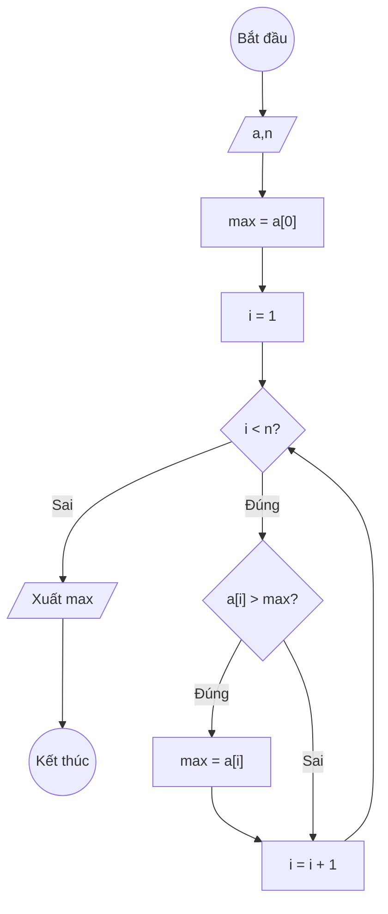

### Bài 134: Viết hàm tìm "giá trị lớn nhất" trong mảng một chiều số thực (lonnhat)

---

### **1. Lưu đồ**



---

### **2. Test Case**

- **Đầu vào (Input):** Mảng a (n = 5)

| Index | 0   | 1   | 2   | 3   | n-1 |
| ----- | --- | --- | --- | --- | --- |
| **a** | 3.5 | 7.2 | 2.1 | 9.8 | 5.4 |

- **Kết quả mong đợi (Expected Result):** `max = 9.8`


**Mô phỏng (Simulation):**

```python
a = [3.5, 7.2, 2.1, 9.8, 5.4]
n = 5
max = a[0] = 3.5
i = 1
i = 1 < n = 5 true:
	a[i] = 7.2 > max = 3.5 true:
		max = a[i] = 7.2
	i = i + 1 = 1 + 1 = 2
i = 2 < n = 5 true:
	a[i] = 2.1 > max = 7.2 false:
	i = i + 1 = 2 + 1 = 3
i = 3 < n = 5 true:
	a[i] = 9.8 > max = 7.2 true:
		max = a[i] = 9.8
	i = i + 1 = 3 + 1 = 4
i = 4 < n = 5 true:
	a[i] = 5.4 > max = 9.8 false:
	i = i + 1 = 4 + 1 = 5
i = 5 < n = 5 false:
Xuất max = 9.8
End.
```


---

### **3. Code**

#### **Python**

```python
def lon_nhat(a, n):
    # Khởi tạo giá trị max ban đầu là phần tử đầu tiên
    max_val = a[0]
    # Khởi tạo biến đếm i bắt đầu từ 1
    i = 1
    # Vòng lặp while sẽ chạy khi i còn nhỏ hơn n
    while i < n:
        # Nếu phần tử hiện tại lớn hơn max, cập nhật max
        if a[i] > max_val:
            max_val = a[i]
        # Tăng biến đếm i lên 1 đơn vị
        i = i + 1
    return max_val

# Chương trình chính
n = int(input("Nhập số lượng phần tử: "))
a = []
for i in range(n):
    x = float(input(f"Nhập phần tử thứ {i}: "))
    a.append(x)

ket_qua = lon_nhat(a, n)
print(f"Giá trị lớn nhất trong mảng là: {ket_qua}")
```

#### **JavaScript**

```javascript
function lonNhat(a, n) {
    // Khởi tạo giá trị max ban đầu là phần tử đầu tiên
    let maxVal = a[0];
    // Khởi tạo biến đếm i bắt đầu từ 1
    let i = 1;
    // Vòng lặp while sẽ chạy khi i còn nhỏ hơn n
    while (i < n) {
        // Nếu phần tử hiện tại lớn hơn max, cập nhật max
        if (a[i] > maxVal) {
            maxVal = a[i];
        }
        // Tăng biến đếm i lên 1 đơn vị
        i = i + 1;
    }
    return maxVal;
}

// Chương trình chính
let n = parseInt(prompt("Nhập số lượng phần tử:"));
let a = [];
for (let i = 0; i < n; i++) {
    let x = parseFloat(prompt(`Nhập phần tử thứ ${i}:`));
    a.push(x);
}

let ketQua = lonNhat(a, n);
console.log(`Giá trị lớn nhất trong mảng là: ${ketQua}`);
alert(`Giá trị lớn nhất trong mảng là: ${ketQua}`);
```
